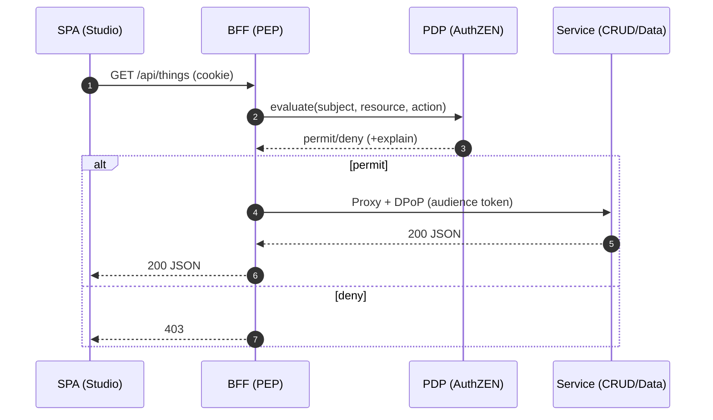

## What is OpenID AuthZEN?

OpenID AuthZEN standardizes authorization decisions: discovery, request/response semantics, and interoperability between Policy Enforcement Points (PEPs) and Policy Decision Points (PDPs). It aims to do for authorization what OIDC did for authentication.

- Read more: [Aserto AuthZEN overview](https://www.aserto.com/lp/authzen)

## Fabric architecture: PDP at the BFF

- Every API call passes through the BFF (session terminator). The BFF is the PEP, calling our AuthZEN‑compliant PDP for subject/resource/action decisions.
- Zero‑token SPA: no access tokens in the browser; policies are enforced server‑side.
- CAEP/Shared‑Signals‑style events emitted for audit and analytics.

## Migrating from OPA/Cedar

- Map inputs to AuthZEN schema; keep policy logic semantically equivalent while gaining standardized discovery and decision responses.
- Keep existing OPA/Cedar where appropriate; use PDP bridges for gradual migration.
- See also: [Open Policy Agent](https://www.openpolicyagent.org/), [AWS Cedar](https://docs.aws.amazon.com/cedar/latest/userguide/what-is-cedar.html)

## Evidence checklist

- AuthZEN discovery document exposed by PDP
- BFF logs show per‑request decision ids with allow/deny and explanations
- CAEP events emitted and consumed by analytics
- p95 PDP latency dashboard

## When to use which

- Centralize application authorization decisions via AuthZEN PDP when you want interoperable, explainable, and observable policy at runtime.
- Keep governance (reviews, SoD) in IGA; let the Fabric enforce runtime policy.

