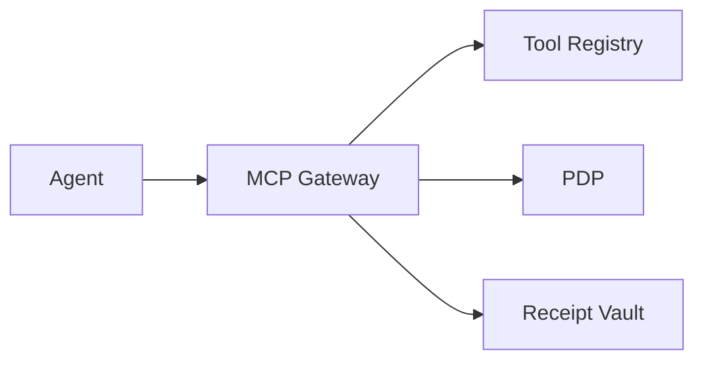

## One-liner

At the agent→tool boundary, verify Passports, enforce plan-step JWS, pin tool schemas, apply allowlists, and produce signed receipts.

## Problem

- Agents call tools off-plan; tool schemas drift; observability ≠ enforcement.

## Architecture at a glance

## How it works

1. Validate Passport & plan JWS step.
2. Enforce `{schema_version, schema_hash}` pins (with grace).
3. Params & egress allowlists; receipt on permit.
→ See `../../../services/mcp-gateway/index.md` and BFF gateway technical pages.

## Proof Library

- Schema pins → `../../../services/bff/explanation/bff_gateway_technical.md`
- Plan discipline → `../../../services/bff/explanation/bff_gateway.md`

## See also

- Website page → `../../../website_copy/product_gateway.md`

