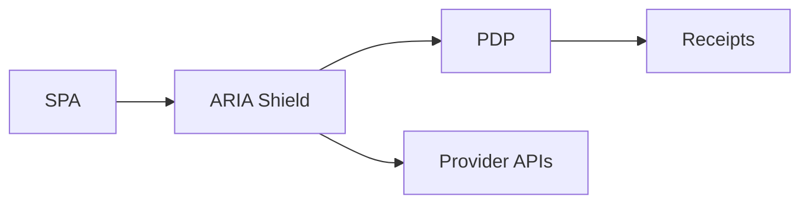

## One-liner

A BFF security gateway that terminates OAuth in the backend (no browser tokens), maps routes to PDP policy, enforces budgets/402 and streaming limits, and emits receipts.

## Problem

- Browser tokens leak; gateways observe but rarely enforce budgets/streams.
- Auditors want proof that constraints were applied in real time.

## Architecture at a glance

## How it works

1. Backend OAuth; httpOnly cookies; /api/* proxy.
2. PDP mapping per route; enforce constraints, streaming caps.
3. Budget hold/settle via call_id; receipt on permit.
→ See `../../../services/aria-shield/index.md`.

## Proof Library

- Zero-token explainer → `../../../services/aria-shield/explanation/zero-token.md`
- Budget semantics → `../../../services/aria-shield/explanation/budgets.md`

## See also

- Website page → `../../../website_copy/product_bff.md`

