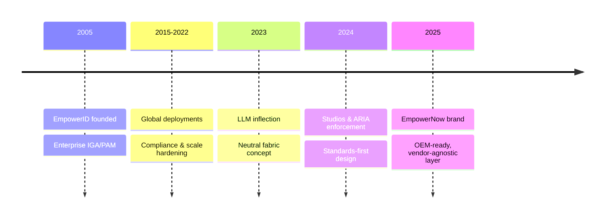

This page briefly explains the relationship between EmpowerNow and EmpowerID for stakeholders who need context. It is intentionally not linked in navigation.

## What is EmpowerNow?
- EmpowerNow is the AI-focused Identity Fabric: neutral, standards-led services for agent governance, runtime enforcement, and identity inventory.
- Built to be vendor-agnostic and OEM-friendly; integrates with any IGA/PAM and agent platform.

## Who is EmpowerID?
- EmpowerID (founded 2005) is an enterprise IGA/PAM vendor with production deployments at global brands.
- Track record: mature security/compliance posture, procurement readiness, and large-scale identity programs.

## Why EmpowerNow by EmpowerID?
- The AI/agent surge requires Layer-2 middleware that is neutral, standard, and enforceable across platforms.
- EmpowerID’s decades of identity-at-scale experience shaped EmpowerNow’s studios (Automation/Authorization/Authentication/Inventory) and enforcement (ARIA Shield, MCP Gateway, Receipts).
- Separation by design: EmpowerNow can extend EmpowerID or power any third-party IGA/PAM or agent platform.

## Timeline (high level)

## Neutrality & Trust (summary)
- Neutral layer: separate infrastructure, roadmap, and contracts
- Standards embrace: OAuth TE/RAR/DPoP, AuthZEN-style decisions, MCP
- Proof: cryptographic receipts; open verification model

## How to position
- Use “EmpowerNow by EmpowerID” in formal contexts (decks, RFPs); otherwise refer to “EmpowerNow” to keep the brand front-and-center and neutral.
- When required, cite EmpowerID’s heritage to de-risk procurement/security reviews without over-branding runtime materials.
