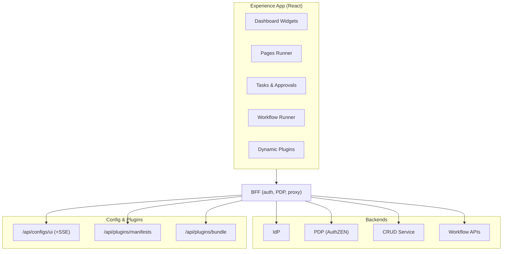

The Experience app is the unified, PDP‑aware end‑user portal for the Identity Fabric. It dynamically enables modules (IdP, PDP, Automation/CRUD, Workflows) at runtime and strictly communicates via the BFF.

What’s innovative (and why it matters):

- PDP‑aware UI: every route, widget, and action is governed by OpenID AuthZEN decisions through the BFF. Value: provable least‑privilege UX, audit‑ready.
- Runtime module activation: a BFF‑served config (`/api/configs/ui` + SSE stream) enables/disables app modules on the fly. Value: single portal for any subset of services; no rebuilds for tenants.
- Unified API and SSE layer: one client (`@api`) namespaces to `/idp`, `/pdp`, `/crud`, `/workflow` behind the BFF; SSE for live task counters and workflow status. Value: fast, consistent UX.
- Plugin model (CSP‑safe): plugins are discovered via manifests and loaded as ESM bundles through the BFF; no CSP relaxations or cross‑origin scripts. Value: extensibility without security debt.
- Zero‑token SPA: session in httpOnly cookies; no access tokens in browser; all traffic same‑origin to BFF. Value: eliminates token exfiltration class.
- Design‑system consistency: Neon Flux tokens/components ensure a premium, coherent UI. Value: faster delivery, brand quality.

Architecture (at‑a‑glance):

Competitive position:

- Versus generic portals (Okta/ForgeRock app launchers): ours is PDP‑aware at widget/action level and supports workflow/task execution—not just SSO tiles.
- Versus ITSM frontends: we provide policy‑guarded automation and inventory with full CAEP/observability, not ticket proxies.
- Versus bespoke UIs: Experience is modular, runtime‑configurable, and plugin‑extensible without copying secrets into the browser.

Proof points (source): see `experience/docs/empowernow_react_app.md` and `experience/docs/experience_plugins.md`.

Canonical plugin reference for architecture and operations: `../../services/experience/experience_plugins`

