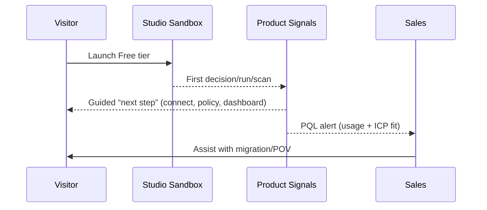

Motions:

- PLG: Free tier per Studio with instant sandbox; CTA: “Launch Studio”
- Solutions‑led: Authorization centralization (OPA/Cedar migration), BFF zero‑token rollout, Audit‑ready automation, Rapid inventory
- Channel: SI partners for migrations and automation COEs; tech alliances (ClickHouse, Kafka, Neo4j)

Campaigns:

- Secure your workflows (Automation Studio): PDP + DPoP + CAEP per node
- Centralize authorization in 30 minutes (Authorization Studio): batch eval + explainability
- No tokens in the browser (BFF): security and UX for SPAs
- Inventory anything in a weekend (Inventory Studio): dry‑run, PDP‑gated deltas, visual diffs

Enablement:

- Live demo envs, sample policies/workflows, Grafana dashboards, migration guides
- Persona decks, battle cards, pricing calculator, objection handling

KPIs:

- Time‑to‑value < 30 minutes per Studio; Free→Pro conversion > 7%; NRR > 120%; p95 PDP < 20 ms (cached)

## Funnel blueprint

