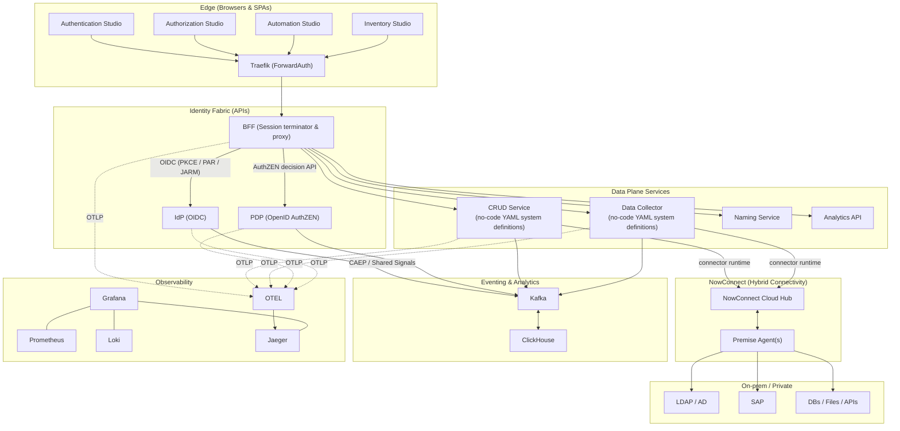
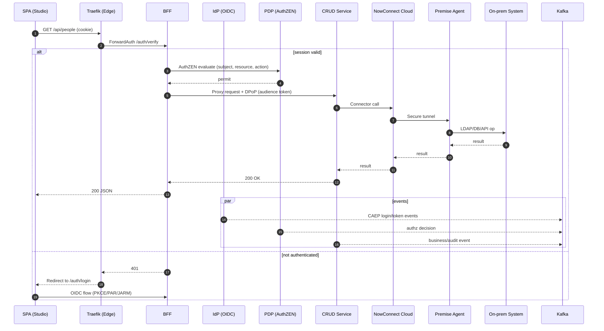
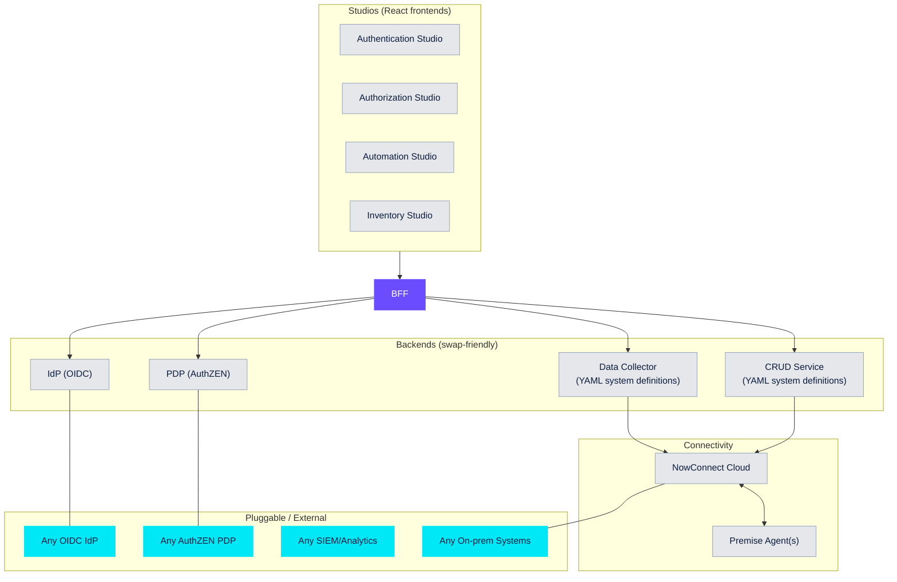

Definition (analyst‑aligned): An Identity Fabric is a standards‑based, API‑first layer that unifies authentication, authorization, governance, and automation across hybrid and multi‑cloud. It must be vendor‑agnostic, composable, and observable.

What “vendor‑agnostic” really means:

- Open protocols on every boundary: OAuth 2.1/OIDC, PAR/JAR/JARM, PKCE, DPoP or mTLS; SCIM; SAML where needed
- Standard decision APIs: OpenID AuthZEN for PDP requests, not proprietary schemas
- Event interoperability: Shared Signals/CAEP‑style events for authn/authz, consumable by any SIEM/analytics
- Bring‑your‑own components: Pluggable IdP/PDP, external queues, standard databases; no forced data residency in proprietary stores
- Portable client SDKs and infra: language‑agnostic REST; no lock‑in to custom gateways or agents

How EmpowerNow meets (and raises) the bar:

- Authorization: OpenID AuthZEN‑compliant PDP with batch evaluation and explainability
- Authentication: OIDC provider with WebAuthn/passkeys; BFF session termination—no browser tokens
- Automation: All node calls PDP‑authorized; DPoP proof and CAEP events per call
- Inventory: No‑code ingestion with PDP‑gated deltas; dry‑run safety; YAML policies
- Events & Analytics: Kafka topics for authn/authz/business events; ClickHouse analytics; OTEL/Prometheus/Loki/Jaeger
- Hybrid: Azure Relay Bridge patterns for on‑prem without inbound ports

Competitive context (how others use “fabric”):

- Many vendors market “fabric” but ship closed schemas or gateway‑only models; limited AuthZEN/CAEP support and token handling in the browser
- Our proof is in public docs/code: BFF ForwardAuth model, AuthZEN API reference, CAEP‑style eventing, SDKs in Python/TS, and self‑hostable services

Buyer‑oriented value:

- CISO: Reduce risk and audit pain with explainable decisions, standardized events, and zero tokens in browsers
- Cloud Security Architect: Composable, infra‑as‑policy via AuthZEN and standard telemetry; swap components without rewrites
- IGA/PAM leaders: Standards for lifecycle (SCIM), naming (Naming Service), reviews (Governance EA), and inventory at scale
- Automation owners: Security‑approved no‑code with PDP gates and complete traceability

Proof checklist (use in RFPs and evaluations):

- AuthZ API is OpenID AuthZEN with discovery document
- IdP issues tokens via OIDC with PKCE/PAR/JARM; supports DPoP or mTLS
- BFF pattern eliminates browser token exposure; ForwardAuth documented
- CAEP/Shared‑Signals‑style events emitted for authn/authz and consumed by Kafka/analytics
- OTEL traces, Prometheus metrics, Loki logs, Grafana/Jaeger dashboards provided
- Hybrid connectivity via Azure Relay; reference architectures published
- Self‑managed and SaaS options; no mandatory proprietary data plane

## Assurance pack (evidence & where to look)

- BFF controls and posture
  - Security model: ../services/bff/explanation/security-model.md
  - Session binding & CSRF: ../services/bff/reference/session-binding-csrf.md
  - Edge ForwardAuth: ../services/bff/reference/traefik-forwardauth.md
  - FAPI features: ../services/bff/reference/fapi-support.md
  - FIPS posture: ../services/bff/reference/fips-140-3.md
- Observability and audit
  - Logging & events: ../services/bff/reference/logging-events.md
  - Observability (OTEL/Prometheus/Loki): ../services/bff/reference/observability.md
  - Health & metrics: ../services/bff/reference/health-metrics.md
  - CAEP events (how‑to): ../services/bff/how-to/events-kafka-caep.md
- Authorization (PDP)
  - PDP reference: ../services/bff/reference/pdp-reference.md
  - Configure PDP mapping: ../services/bff/how-to/configure-pdp.md
  - PDP cache tuning: ../services/bff/how-to/pdp-cache-tuning.md
- Authentication and token lifecycle
  - BFF + IdP OAuth (E2E): ../services/bff/reference/bff-idp-oauth-e2e.md
  - Key/secret rotation (BFF): ../services/bff/how-to/secret-rotation.md
  - Switch token auth methods safely: ../services/bff/how-to/switch-auth-methods.md
  - mTLS design (CRUD): ../services/crud-service/reference/mtls_design.md
- Operations
  - Incident runbooks: ../services/bff/how-to/incident-runbooks.md
  - Prometheus/Grafana setup: ../services/bff/how-to/prometheus-grafana.md

Related persona guide: ../personas/security/intro.md

## Control crosswalk (selected)

| Control (NIST-ish) | Where implemented | Evidence docs |
| --- | --- | --- |
| Access enforcement (AC‑3) | PDP decision at BFF on every call | ../services/bff/reference/pdp-reference.md, ../services/bff/how-to/configure-pdp.md |
| Identification & authn (IA‑2) | OIDC at IdP; BFF session; no browser tokens | ../services/bff/reference/bff-idp-oauth-e2e.md, ../services/bff/explanation/security-model.md |
| Session authenticity (SC‑23) | Session binding + CSRF | ../services/bff/reference/session-binding-csrf.md |
| Transmission protection (SC‑8) | TLS, FIPS crypto, FAPI/DPoP/mTLS | ../services/bff/reference/fips-140-3.md, ../services/bff/reference/fapi-support.md, ../services/crud-service/reference/mtls_design.md |
| Audit generation (AU‑12) | Structured logs, events, metrics | ../services/bff/reference/logging-events.md, ../services/bff/reference/observability.md, ../services/bff/reference/health-metrics.md |

## PDP availability and caching

- Decisions are cached with separate TTLs for allow/deny; cache keys include subject/resource/action.
- Failure modes are configurable via endpoint policy; monitor PDP latency and error rates.
- See: ../services/bff/how-to/pdp-cache-tuning.md and ../services/bff/reference/health-metrics.md

## Key & token lifecycle (operational)

```mermaid
flowchart TB
  A[User login] --> B[BFF exchanges code (PKCE/PAR/JARM)]
  B --> C[Store session: user_id = id_token.sub]
  C --> D[SPA uses /api via cookie]
  D --> E[BFF mints/uses per‑service tokens (audience‑bound)]
  E --> F[Background refresh before expiry]
  F --> G[Rotation: switch token auth method / rotate keys]
  G --> H[Revocation/logout ends session]

  click B href "../services/bff/reference/bff-idp-oauth-e2e.md"
  click E href "../services/bff/how-to/session-to-service-token-bridging.md"
  click F href "../services/bff/reference/health-metrics.md"
  click G href "../services/bff/how-to/secret-rotation.md"
```

## Visuals

### Fabric overview (Studios → BFF only; services own connectors)



### Request flow (no tokens in browser; AuthZEN + DPoP; NowConnect hop)



### Vendor‑agnostic, swap‑out architecture




