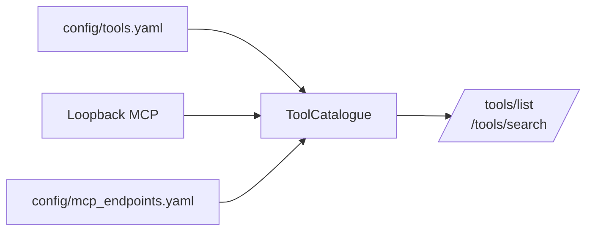

## Loopback MCP deep dive: naming, catalogue, and routing

### Naming and identity
Loopback MCP uses a namespaced identity for system tools: `provider.instance.base`. This avoids collisions across tenants and preserves schema differences across providers. Workflow tools use `workflow.<name>`.

- Cap and hash: names are compacted to ≤50 characters when generating; the ToolCatalogue enforces ≤64 characters
- Fail‑fast duplicates: pre‑cap and final name collision policies
- Per‑system identity: add `mcpInstance` (`provider`, `instance`, `instance_label`, `env`)

### Catalogue merge
Built‑ins from `config/tools.yaml`, Loopback MCP tools, and optional external MCP endpoints are merged into the ToolCatalogue and exposed via `/tools/list` and `/tools/search`.

### Routing & Virtual servers
Expose Loopback MCP through the BFF for secure access from UIs and agents:
- GET `/api/crud/mcp/tools/list` → CRUD `/mcp/tools/list`
- POST `/api/crud/mcp/jsonrpc` → CRUD `/mcp/jsonrpc`

For clients that cap catalog size, use view‑scoped endpoints:
- GET `/api/crud/mcp/{view}/tools/list` → CRUD `/mcp/{view}/tools/list`
- POST `/api/crud/mcp/{view}/jsonrpc` → CRUD `/mcp/{view}/jsonrpc`

### Stability and observability
- Structured logs with correlation IDs and durations for list/invoke
- Optional OTEL in prod; disabled in tests/local via `OTEL_DISABLED=true`

### Why this matters
- Deterministic catalogues remove UI jitter and client instability
- Namespaced tools reflect real system boundaries cleanly
- A single source of truth keeps engineering focused and reduces errors
 - Virtual servers fit client limits while preserving full catalog breadth

