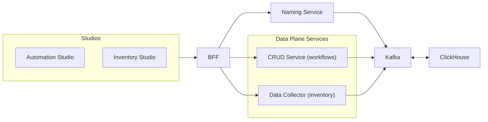

What it does:

- Generates enterprise‑grade usernames, emails, display names with YAML policies, Jinja templating, and plugin strategies
- Guarantees uniqueness with progressive fallback; robust international character handling (40+ languages)
- Pure transformation service (no provisioning) with REST API and audit trails

Why it matters for IGA:

- Eliminates naming conflicts and manual intervention in provisioning
- Ensures consistent, compliant naming across AD, email, and apps
- Fits any IGA platform; bulk and migration friendly

Fabric fit:

- Consumed by Automation/Inventory workflows; policies version‑controlled; monitored via OTEL/Prometheus; events to Kafka/Analytics

## How it fits (visual)

