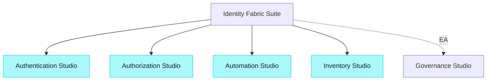

Studios and meters:

- Authentication Studio (IdP+BFF): MAUs
- Authorization Studio (PDP): Decision Units (DUs)
- Automation Studio (CRUD): Workflow Runs and Connectors
- Inventory Studio (DataCollector): Entities Scanned and Connectors
- Governance Studio (EA): Reviews and Campaigns

Cloud tiers (monthly):

- Free: 2k DUs, 500 Runs, 1 Connector, community support
- Pro ($999): 5M DUs, 100k Runs, 10 Connectors, 5k MAUs, SLA & chat
- Business ($4,999): 25M DUs, 500k Runs, 25 Connectors, 25k MAUs, SSO/SCIM, 99.9% SLA
- Enterprise (Custom): Dedicated tenancy/VPC, FIPS mode, 24/7 support

Overages/add‑ons:

- DUs $0.25/1k; Runs $1.00/1k; MAUs $0.20/MAU; Connector Pack (+5) $250/mo; Dedicated tenancy from $2,500/mo; FIPS mode from $1,500/mo

Self‑Managed (annual):

- Per‑Studio from $30k/yr (Pro‑equivalent caps); Fabric Suite from $90k/yr; enterprise add‑ons: HA/DR validation, hardened FIPS images, priority support

## Packaging visual

