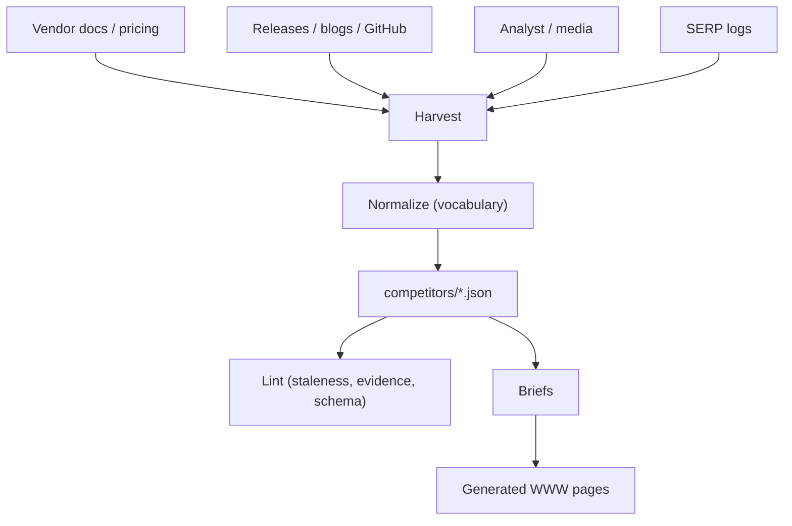

# Marketing research spine

Folder layout:

```
research/
  competitors/<product>/<vendor>.json
  serp/<product>.csv
  velocity/<product>.md
  pricing/<product>.md
  analysts/<product>.md
  templates/{competitor.json, serp.csv}
  taxonomy/{claims_vocabulary.json, claims.schema.json}
```

## Process (Mermaid)



## Jump to

- Research taxonomy: [/docs/marketing/research/taxonomy](/docs/marketing/research/taxonomy)
- PDP matrix (head-to-head): [/docs/marketing/research/matrix/pdp](/docs/marketing/research/matrix/pdp)
- SERP templates: `marketing/research/templates/serp.csv`
- Competitors data: `marketing/research/competitors/`
- ROI primer: [/docs/website_copy/primers/primer_roi_calculator](/docs/website_copy/primers/primer_roi_calculator)


