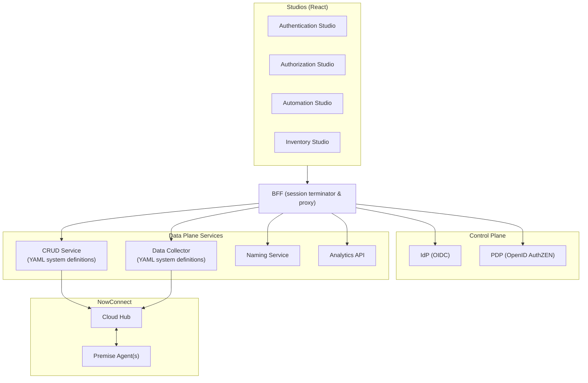

- Authentication Studio → IdP (OIDC/OAuth2) + BFF (session termination & proxy)
- Authorization Studio → PDP (OpenID AuthZEN)
- Automation Studio → CRUD Service (workflow/CRUD engine, Secrets Platform)
- Inventory Studio → DataCollector (connectors, diffing, PDP‑gated deltas)
- Governance Studio (EA) → Campaigns/reviews service (roadmap)
- Shared services → Analytics (Kafka→ClickHouse), Observability (OTEL/Prometheus/Loki/Grafana/Jaeger), NowConnect, Membership (Neo4j)

## Visual mapping

