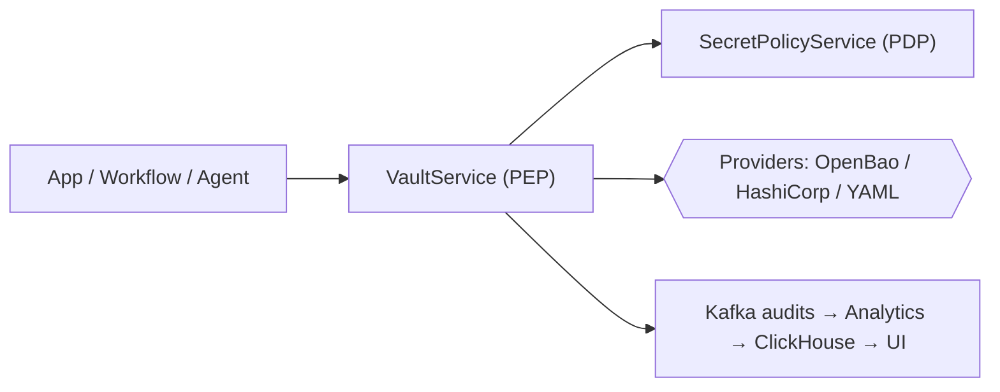

## Market primer (why this space exists)

Organizations run apps, workflows, and services across clouds. Secrets (API keys, DB creds, tokens) sprawl and are hard to rotate and audit consistently. Classic PAM platforms focus on human admin sessions; workflow tools optimize orchestration UX; cloud/dev secrets services are provider‑centric. EmpowerNow focuses on secure, per‑use authorization for programmatic secrets across providers with uniform lifecycle and audits.

## What it is

- Policy‑enforced secrets platform for apps, workflows, and agents:
  - Canonical URIs across providers (OpenBao/HashiCorp; YAML for dev)
  - PEP/PDP per‑use authorization (purpose‑bound; tenant/mount guards)
  - Versioned lifecycle (soft delete, undelete, destroy) + uniform auditing (Kafka → Analytics → ClickHouse → UI)
  - First‑class integration with CRUD /execute, graph workflows, BFF, and REST

## What it isn’t

- Not a full PAM suite (no mature session brokering/recording, endpoint privilege elevation, broad JIT for human admins)
- Secrets is a built‑in capability of the CRUD Service. CRUD provides a full workflow/orchestration engine (graph workflows, `/execute`, plugins, connectors). We compete with n8n/Make/Zapier on workflow automation; our differentiator is policy‑first execution with PDP/PEP‑enforced secrets and enterprise observability.

## Where we’re strong

- Programmatic secret use in services/workflows with per‑call authorization and non‑leaky audits
- Uniform model across providers; rotation/undelete/destroy; bulk ops; version‑pin reads
- Seamless fit for teams adopting EmpowerNow (BFF/CRUD/PDP) and Analytics

## Honest gaps

- Human admin scenarios needing session recording, jump hosts, endpoint privilege elevation → classic PAM fits better
- Massive connector catalogs and low‑code UX → n8n/Make/Zapier fit better (we can be their secure secrets backbone)

## Competitive landscape (how to position)

### PAM leaders (CyberArk, Delinea, BeyondTrust)

- Strengths: privileged password vaults, session brokering/recording, endpoint elevation, mature compliance packs
- Positioning: complement for programmatic/API/workflow secrets; not displacing their session control
- Lose‑fast flags: RFP mandates session recording, endpoint elevation, or PAM consolidation

### Workflow automation platforms (n8n, Make, Zapier)

- Strengths: massive connector catalogs and marketplaces, citizen low‑code builders, templates, very fast time‑to‑first‑flow
- How EmpowerNow (CRUD Service) competes: full workflow/orchestration engine (graph YAML, `/execute`, plugin functions), first‑class secrets with PDP/PEP on each use, canonical URIs across providers, KVv2 lifecycle (rotate/undelete/destroy), uniform Kafka audits → Analytics, strong observability and governance
- Where they may still fit better: if the primary requirement is 500+ prebuilt connectors and a marketplace‑style citizen‑developer UX, their breadth is hard to match
- Positioning: lead with governance and security at execution time, provider‑agnostic secrets, and enterprise ops (audits, traces, metrics); we can also front their automations as the secure secrets backbone when needed

### Cloud/dev secrets (AWS/GCP/Azure managers, Vault, Doppler, Bitwarden SM)

- Strengths: deep cloud integration or dev UX
- Positioning: we add per‑use policy, tenant/mount guards, cross‑provider uniformity, versioned lifecycle, Kafka/Analytics pipeline; fit multi‑service workflows

### Quick matrix

| Capability | EmpowerNow | PAM suites | Workflow tools | Cloud/dev secrets |
| --- | --- | --- | --- | --- |
| Per‑use PDP authorization for secrets | ✅ | ⚠️ (focus on human sessions) | ⚠️ (varies per connector) | ⚠️ (policy per cloud) |
| Session brokering/endpoint elevation | ❌ | ✅ | ❌ | ❌ |
| Versioned lifecycle (soft/undelete/destroy) | ✅ (KVv2) | ⚠️ | ⚠️ | ✅ (per provider) |
| Uniform auditing for programmatic use | ✅ (Kafka→Analytics) | ✅ (session events) | ⚠️ (per connector) | ⚠️ (per cloud) |
| Workflow/API integration | ✅ (graph workflows, `/execute`, plugins) | ⚠️ | ✅ | ⚠️ |

## Discovery checklist (qualify and tailor)

- Workload mix: secrets used by apps/services/workflows (yes) vs. human admin sessions (PAM)
- Current pain: token sprawl, inconsistent rotation, audit gaps, cross‑provider drift
- Compliance needs: who/what/purpose decision evidence; retention; access to audit topics
- Lifecycle: need for undelete/destroy; bulk maintenance windows; version‑pin reads
- Platform fit: using EmpowerNow BFF/CRUD/PDP/Analytics already

## Win themes

- Per‑use authorization (PDP) and obligations on every secret use (not just “can reach the vault”)
- Canonical URIs + tenant/mount guards = prevent cross‑tenant leakage by construction
- Audits that don’t leak (HMAC resource_ref) + Analytics APIs powering UI
- Built‑in workflow/automation integration (/execute, bulk, search, versions, rotate)

## Lose‑fast flags

- Mandatory session recording / endpoint privilege elevation / PAM consolidation
- Buyer prioritizes 500+ prebuilt SaaS connectors and LOB self‑serve UX as primary goal

## Pricing and packaging norms (market guidance)

- PAM: typically per privileged account/endpoint with module add‑ons (vault, session mgmt, elevation), multi‑year terms, services‑heavy
- Cloud/dev secrets: per secret version/month and/or per API call; enterprise tiers add compliance and regions
- Workflow platforms: per run/task/operation; connector packs
- Position EmpowerNow by value drivers: number of managed secrets/URIs, API/workflow volume, providers integrated, audit/analytics needs; offer Tiered (Starter/Team/Enterprise) with clear caps/entitlements. Avoid competitor price quoting; tie ROI to risk reduction and developer velocity.

Sizing cheat (talking points)

- Drivers: count of Canonical URIs/secrets, monthly API calls to `/api/secrets/*` and SDK, number of providers, audit retention needs
- Tiers: Starter (dev/YAML), Team (single provider, capped calls), Enterprise (multi‑provider, audit streams, SSO)

## Talk tracks

- “Policy at the point of use” beats “can reach the vault”: subject + purpose + obligations each call
- “One URI to rule them all”: same secret identifier across providers/environments; safer migrations
- “Audits without leakage” and Analytics dashboards: correlate who/what/when across services
- “Workflow‑ready”: rotate/undelete/destroy/search/versions/bulk with clean REST

## Objection handling

- “We need session recording/elevation.” Acknowledge; recommend PAM + EmpowerNow side‑by‑side
- “We want a low‑code connector catalog.” Acknowledge; use EmpowerNow as the secrets backbone under n8n/Make/Zapier
- “We already use Vault/AWS/GCP.” We overlay per‑use policy, lifecycle, and analytics across those providers

## Proof plan (fast demo)

- Show PDP decision with permit/deny branches; rotate and version‑pin read; undelete/destroy
- Display Kafka audit → Analytics table; click through an API/trace correlation
- Workflow call to /api/secrets/value and a bulk maintenance sample

## Persona → pains / wins / proof

| Persona | Pains | Wins with EmpowerNow | Proof |
| --- | --- | --- | --- |
| CISO/Sec | Audit gaps; token sprawl; long‑lived creds | Per‑use PDP decisions; non‑leaky audits; rotation lifecycle | Kafka event → Analytics table with resource_ref |
| Platform/DevOps | Cross‑provider drift; rotation ops | Canonical URIs; KVv2 lifecycle; bulk ops; HA OpenBao | Rotate + versions + undelete; OpenBao HA guide |
| App Dev Lead | Env drift; complex auth to providers | Simple `/value` reads; version‑pin; same URIs across envs | Dev guide quick start; `/value?version=N` demo |
| SecOps/Audit | Incident evidence trails | Correlated logs/traces/audits; HMAC ref | Trace + audit correlation click‑through |

## CTAs and deep links

- Executive overview: `../services/crud-service/secrets/01-executive-overview.md`
- Authorization model: `../services/crud-service/secrets/11-authorization-model-authzen.md`
- Rotation: `../services/crud-service/secrets/14-rotation.md`
- Developer guide: `../services/crud-service/secrets/08-developer-guide.md`
- DevOps guide: `../services/crud-service/secrets/SECRETS_DEVOPS_GUIDE.md`
- OpenBao HA: `../services/crud-service/secrets/SECRETS_HA_OPENBAO.md`

## Land and expand

- Land with one high‑value workflow/service; enable Canonical URIs + audits
- Expand to more services, strict PDP, scope enforcement, more providers; roll out Analytics dashboards org‑wide

---
id: sales
title: Sales — BFF + PDP + IdP Battlecard
sidebar_label: Sales
tags: [persona:sales, audience:field, service:bff]
---

Use this page in discovery and early shaping calls. It positions our BFF together with our PDP and IdP against common alternatives (Curity, Okta/Auth0, Ping, and “gateway‑only” approaches).

## Elevator pitch (business)

The BFF is the secure front door for SPAs: one origin for the browser, server‑side OAuth, centralized authorization (PDP), and pragmatic routing to new and legacy services. Paired with our IdP and PDP, it reduces risk, speeds delivery, and standardizes user access across apps.

## When to lead with it

- Multiple SPAs hitting many APIs, inconsistent auth, or CORS pain
- Compliance pressure (no tokens in the browser, CSRF, auditability)
- Legacy services that must remain while new UIs ship
- Need for centrally governed permissions across teams/services

## What prospects do today (and gaps)

- SPA libraries from IdPs (Okta/Auth0/Ping/Curity) doing OAuth in the browser → tokens in JS, per‑service CORS, fragmented authZ
- API gateway only (Kong/Apigee/Traefik) → great L7 features but no app‑aware sessions/CSRF or per‑user composition
- Bespoke per‑service proxies → duplicated logic and policy drift

## Our differentiation

- Server‑side OAuth boundary: tokens never reach the browser; HttpOnly session + CSRF
- Embedded PDP: path/method → resource/action mapping with decision caching
- Same‑origin developer experience: call `/api/**`; consistent headers/errors/observability
- First‑class EmpowerID: workflows/WebUI catalog with client‑credentials handled server‑side
- Legacy bridge: resilience (circuit breaker/cache/limits) for C# services while modernizing

## Competitive context (positioning)

| Topic | Our BFF + PDP + IdP | Curity/Okta/Auth0/Ping (IdP SDK in SPA) | Gateway‑only (no BFF) |
| --- | --- | --- | --- |
| Browser tokens | None (HttpOnly cookie) | Yes (JS manages tokens) | Varies; often yes |
| CSRF/session | Built‑in, standardized | App‑by‑app | Not provided |
| Authorization | PDP per endpoint | App‑by‑app; often scope‑based | Policy at L7 only |
| Dev UX | Same‑origin `/api/**` | CORS per API | CORS/routing per API |
| Legacy coverage | Proxy w/ CB + cache | N/A | Possible, but no sessions/PDP |
| Time to value | Quick: config + a few routes | App integration per SPA | Infra‑heavy + app work |

Notes

- We integrate with any IdP (including Okta/Auth0/Ping/Curity). The BFF replaces SPA‑token flows with a safer session model and adds PDP‑based authorization.

## Discovery questions

- Which SPAs and APIs are in scope? How many origins and CORS exceptions exist today?
- Where do tokens live now? Any past incidents or audit findings?
- How are permissions decided per endpoint? Is there a central policy (PDP)?
- What legacy services must remain? Uploads/streaming needs? Rate limits?

## Objection handling

- “Our IdP SDK works already.”
  - Keep IdP; we move tokens server‑side, add CSRF/session, and centralize authZ via PDP.
- “We have a gateway.”
  - Great for TLS/rate limits. The BFF adds application‑aware sessions, CSRF, PDP, composition, and legacy resiliency.
- “GraphQL solves aggregation.”
  - Still needs sessions/CSRF/PDP; the BFF can front GraphQL too.

## Proof points / next step

- Golden Path demo: login → call `/api/**` with cookie + CSRF
- Show PDP deny→allow via `pdp.yaml:endpoint_map`
- Call an EmpowerID workflow via `/api/v1/empowerid/workflow`

## Packaging (suggested)

- Starter: BFF + IdP; PDP optional
- Enterprise: BFF + IdP + PDP with predefined mappings and EmpowerID catalog

For visuals to present, open: `Services / BFF / Explanations / BFF — Executive Overview` or `Visual Guide`.

