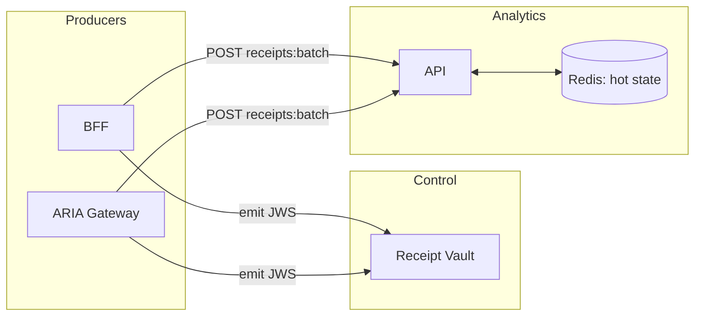

Analytics treats signed JWS receipts as the source of truth. Producers (BFF, ARIA) emit receipts after decisions; Analytics verifies, derives cost, maintains hot counters, and serves budgets.

Principles
- Receipts as truth (tamper‑evident, minimal fields; no prompts)
- Non‑blocking ingest (failures never break request path)
- Simple budgets for UI/tripwires; PDP uses BudgetState PIP for enforcement

See also
- Receipt chains: `services/aria-shield/receipt-chains.md`
- PDP Effective Budgets: `services/pdp/reference/effective-budgets.md`

