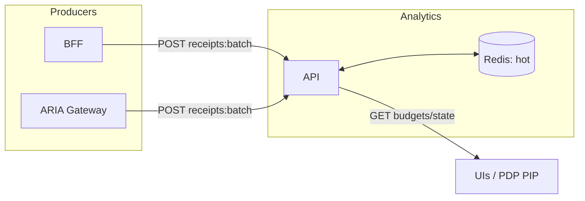

## Overview

Analytics ingests signed receipts from BFF and ARIA Gateway, verifies integrity, derives spend, and serves runtime budgets/state for UIs and tripwires. It keeps Redis for hot counters and exposes simple HTTP APIs.

### What it provides
- Receipt ingest (`/api/v1/analytics/receipts:batch`)
- Runtime budgets (`/api/v1/analytics/budgets/*`)
- Hot spend counters (`/api/v1/analytics/runtime/hot`)

### See also
- BFF bridging how‑to: `services/bff/how-to/analytics-audience-bridged-via-bff.md`
- PDP Effective Budgets: `services/pdp/reference/effective-budgets.md`

