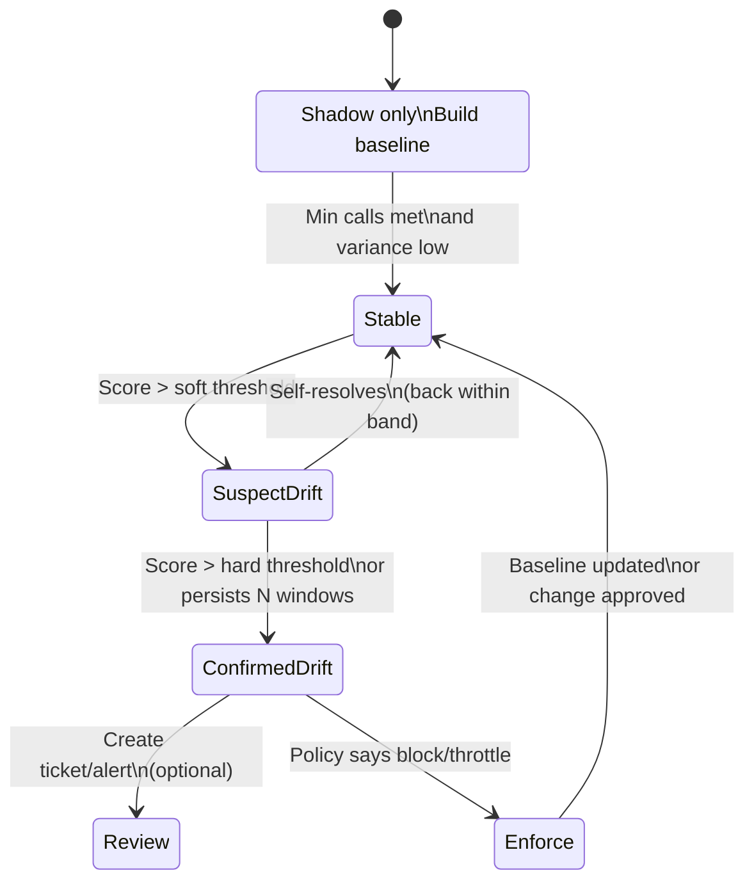
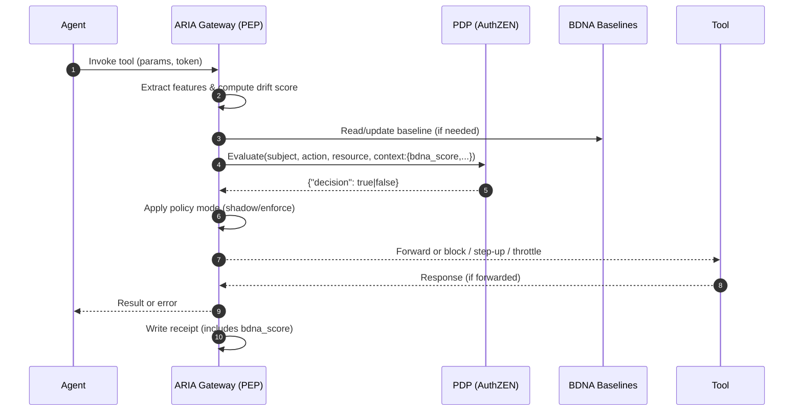

# Behavioral DNA (BDNA) Monitoring — Deep Intro & How-It-Works (for PMs)

## One-liner

**BDNA** learns each agent’s “normal” way of operating (which tools it calls, in what order, how fast, with what error profile) and **flags drift** that looks like compromise, misuse, or runaway spend—**before** it becomes an incident.

---

## Why this matters (business + risk)

* **Early compromise detection:** Catch hijacked or injected agents by spotting behavior that doesn’t fit their learned “fingerprint.”
* **Spend protection:** Identify runaway loops, excessive retries, or suddenly expensive call patterns.
* **Operational safety:** Detect silent vendor/tool changes that alter behavior, even when schemas remain compatible.
* **Audit confidence:** Every allow/deny decision is recorded with a BDNA score so you can prove why ARIA intervened.

---

## Plain-language concept

Think of BDNA like **behavioral biometrics** for agents:

* It watches **which tools** an agent uses, **in what sequences**, **how quickly**, and **how often errors happen**.
* From this, it builds a **baseline** for that agent (and optionally per tenant, per capability, or per user).
* When new behavior **drifts** from the baseline beyond a threshold, ARIA can **alert, throttle, or block**—depending on policy.

**Important:** BDNA uses **metadata only** (tool IDs, timings, error codes, sizes)—**never prompt or data contents**.

---

## Where BDNA lives in ARIA

```mermaid
graph TB
  subgraph Agent Runtime
    AG[Agent]
  end

  subgraph ARIA Gateway (PEP)
    IN[Call Intake]
    FX[Feature Extraction]
    SC[BDNA Scorer]
    MODE[Policy Mode<br/>(shadow / enforce)]
    ACT[Enforcement Actions]
    RC[Receipt Writer]
  end

  subgraph Control Plane
    BASE[BDNA Baselines Store]
    REG[Tool Registry & Attestations]
    PDP[PDP (OpenID AuthZEN)]
  end

  AG --> IN
  IN --> FX --> SC --> MODE
  MODE --> ACT --> IN
  SC --> BASE
  MODE --> RC
  IN --> PDP
  REG --> FX
```

* **PEP (ARIA) data plane**: Extracts features, scores drift, decides actions.
* **Baselines Store**: Keeps per-agent (and per segment) “normal” profiles.
* **PDP (AuthZEN)**: Receives a **BDNA score** in `context` for boolean allow/deny.
* **Receipts**: Persist the BDNA score alongside the decision for forensics.

---

## How BDNA works (pipeline)

```mermaid
flowchart TD
  A[Incoming Tool Call] --> B[Feature Extraction<br/>• tool id<br/>• step index<br/>• sequence window<br/>• inter-call latency<br/>• error code rate<br/>• response size/cost]
  B --> C[Baseline Lookup<br/>(agent, tenant, capability)]
  C --> D[Drift Scoring<br/>(distance vs. baseline)]
  D --> E{Score > Threshold?}
  E -- No --> F[Allow & Update Online Stats]
  E -- Yes --> G[Policy Mode Check]
  G -->|Shadow| H[Allow + Flag + Receipt w/score]
  G -->|Enforce| I[Throttle / Step-Up / Block]
  F --> J[Write Receipt (score)]
  I --> J
```

### Feature families (no code)

* **Sequence:** N-gram of recent tool invocations (e.g., `search → filter → book`).
* **Timing:** Inter-call intervals; burstiness.
* **Reliability:** Error code ratios, retry patterns.
* **Footprint:** Request/response size, estimated cost envelope.
* **Contextual tags:** Tenant/region, agent version, tool category.

---

## Lifecycle & states (how it matures)



* **ColdStart:** Learn without blocking; minimum sample size.
* **Stable:** Normal operations with continuous learning.
* **SuspectDrift:** Heads-up flags in dashboards.
* **ConfirmedDrift:** Automatic actions per policy (throttle/step-up/block).

---

## Enforcement actions (configurable)

* **Shadow:** Log only; add BDNA score to receipts and metrics.
* **Step-up:** Require a plan contract, human approval, or read-only mode for this call.
* **Throttle/Rate-limit:** Slow the agent to reduce blast radius.
* **Quarantine:** Restrict to low-risk capabilities until drift clears or is approved.
* **Block:** Fail closed for high-risk patterns (e.g., unexpected admin tool usage).

> **Note:** **PDP stays boolean** (OpenID AuthZEN draft-04). ARIA includes `bdna_score` in the PDP **context**; policies may deny if above threshold. Graduated actions (throttle/step-up) are executed **by ARIA (PEP)**.

---

## A typical call with BDNA (sequence)



---

## How BDNA cooperates with other ARIA controls

* **User-Bound Identities:** BDNA fingerprints are scoped to the **agent-for-user** identity; prevents cross-user leakage in learning.
* **Tool Schema Attestation:** A schema change can legitimately shift behavior; attestation events can **temporarily widen BDNA thresholds** during rollout.
* **Capability Proofs:** If drift involves **new capabilities**, ARIA still demands a valid proof; drift alone never grants power.
* **Plan Contracts:** If drift appears mid-plan, ARIA can require **step-up** or **re-plan**; plan fingerprints help explain the anomaly.
* **Context-Root Binding:** Ensures the **context** the agent used is the one ARIA validated; BDNA evaluates behavior atop a trusted context.
* **Receipts:** Every decision stores the BDNA score → easy triage and audit.

---

## Tuning & operations (what PMs should lock for v1)

* **Segmentation:** Start with per-agent baselines; optionally segment by tenant and high-risk capability categories (e.g., payment/admin).
* **Thresholds:** Two levels—**soft** (flag) and **hard** (enforce). Defaults can be global; overrides per tenant/capability.
* **Rollouts:** When a tool or agent version changes, **auto-widen** thresholds for a short window; tighten after stability.
* **Cold-start policy:** Always **shadow** until a minimum number of calls and a stable variance are reached.
* **Explainability:** Dashboard tiles showing which features triggered drift (e.g., “new tool order” or “+300% error rate”).
* **Privacy:** Retain only necessary **metadata**; no prompts or payloads. Time-bound retention for raw event windows.

---

## KPIs (internal)

* **Drift detection lead time** (time from change to first flag).
* **False positive rate** (flags that self-resolve vs. confirmed incidents).
* **Intervention effectiveness** (how often step-up/throttle prevents incidents/spend).
* **Stability after rollout** (time to re-baseline post change).
* **Coverage** (% of agent calls scored with BDNA).

---

## How others try to solve this & why ARIA’s BDNA is different

* **Generic rate-limits / APM anomalies:** Catch volume spikes but **miss sequence-level misuse** and per-agent quirks.
* **Rule lists:** Brittle against emergent behavior; high maintenance; poor at “unknown unknowns.”
* **Model-only safety:** Helpful, but doesn’t watch **real tool-use behavior** or link to **authorization**.

**ARIA’s BDNA** is:

* **Authorization-aware:** Scores are fed into the PDP **context** for policy decisions.
* **Agent-aware:** Baselines respect **user-bound identities** and capability scope.
* **Plan-aware:** Understands where an action sits in a plan; can require **step-up** precisely at the risky step.
* **Audit-ready:** Scores are written into **receipts**, creating verifiable provenance without exposing content.

---

## What to include in the PRD

* **Modes:** Shadow → Enforce, with per-tenant overrides.
* **Two thresholds:** `soft_alert_threshold`, `hard_block_threshold`.
* **Signals:** Minimum feature set for v1 (sequence window, timing, error ratio, size/cost envelope).
* **Integrations:** Receipt pipeline; PDP context field `bdna_score`; tool/agent rollout hooks to temporarily widen tolerance.
* **Guardrails:** No content capture; retention policy for raw events; deterministic hashing of identities/tags.

---

### Bottom line

**BDNA Monitoring** gives agents a safety net based on how they actually behave in production. It’s lightweight (metadata-only), standards-aligned (PDP gets a simple score), and designed to **stop costly or risky drifts early**—without hand-writing brittle rules.
