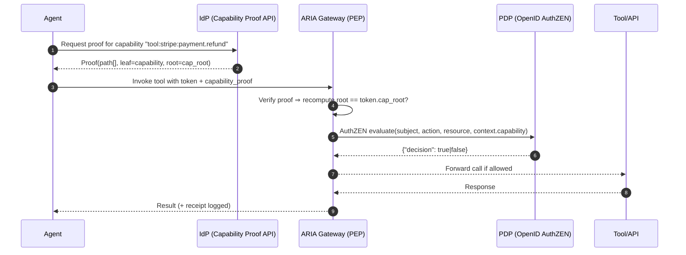
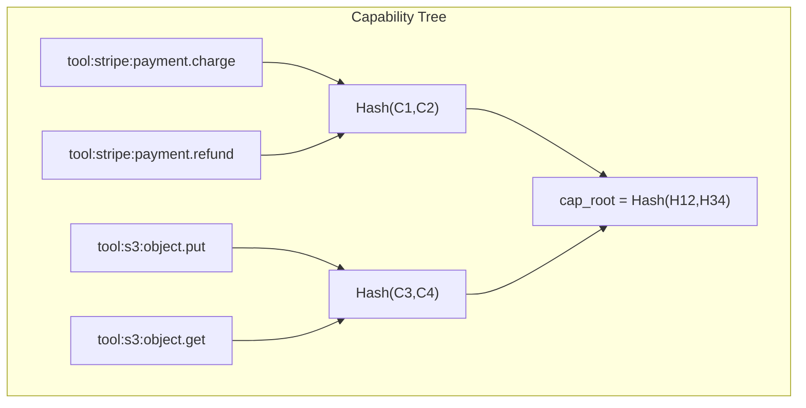

# Privacy-Preserving Capability Proofs — Deep Intro & How-It-Works (for PMs)

## One-liner

Agents prove they hold *exactly the permission they need* for this call—without revealing the rest of their powers—so tokens stay compact, private, and safer to operate at scale.

---

## Why this matters (business + risk)

* **Spending control:** Agents can’t “accidentally” exercise adjacent powers (e.g., *refund* because they had *charge*). Each call must carry a proof for the **one** capability it uses.
* **Privacy & safety:** An attacker or downstream service can’t learn the agent’s full permission set from a token. We disclose the minimum required to complete the task.
* **Operational scale:** Permissions for hundreds of tools no longer bloat tokens or headers. You carry a single cryptographic **root** and present tiny per-call proofs.
* **Governance clarity:** Every allow/deny decision is traceable to a specific capability, visible in receipts and dashboards.

---

## Core concept in plain language

Think of the agent’s permissions as a **sealed deck**. The token carries one secure “deck ID” (a cryptographic root). When the agent needs to use a specific card—say, `tool:stripe:payment.refund`—it presents a **small proof** that this card belongs to that deck *without revealing the other cards*. ARIA checks the proof against the deck ID. If it matches, we proceed; if not, we fail closed.

---

## How it works end-to-end

### 1) Issuance (IdP)

* The IdP compiles the approved capability list (from Membership/Graph) into a **capability tree** and signs a token containing:

  * Pairwise agent binding (user-bound principal)
  * `cap_root` (the cryptographic fingerprint of the full capability set)
  * References to approved tool attestations (by ID)
  * Standard OAuth/OIDC claims

### 2) Proof (Agent)

* For each call, the agent requests a **capability proof** for the one capability it intends to use (e.g., via the IdP’s capability-proof endpoint) or builds it locally if it has the tree.
* That proof is a short list of hashes that reconstruct the `cap_root` **only if** the capability is truly in the set.

### 3) Enforcement (ARIA Gateway + PDP)

* ARIA verifies:

  * User-binding, tool attestation, budget/plan, and
  * **Capability proof → cap\_root** match.
* ARIA calls the **PDP (OpenID AuthZEN)** with the exercised capability in `context.capability` and tool info in `resource.properties`.
* PDP replies **boolean only** (per AuthZEN draft-04). ARIA enforces the decision and emits a receipt.

---

## Sequence: one call with a capability proof



---

## Verification logic at ARIA (high-level)

```mermaid
flowchart TD
    A[Start] --> B{Proof present?}
    B -- No --> X1[Deny • Missing capability proof]
    B -- Yes --> C{Proof → root == token.cap_root?}
    C -- No --> X2[Deny • Invalid capability proof]
    C -- Yes --> D{Capability matches the tool/action?}
    D -- No --> X3[Deny • Capability mismatch]
    D -- Yes --> E[Call PDP (AuthZEN)]
    E -->|decision=false| X4[Deny • PDP policy]
    E -->|decision=true| F[Allow • Emit receipt]
```

---

## What’s in the “capability tree” (no code, just concepts)

* **Leaves**: canonical capability strings (e.g., `tool:<vendor>:<domain>.<action>`), optionally *domain-separated* by tenant/environment to prevent cross-tenant reuse.
* **Internal nodes**: hashes that summarize children.
* **Root**: a single hash (the deck ID) placed in the token.

> The proof is just the siblings needed to re-compute the root—small, fast to verify, and revealing nothing else.



---

## Alignment with **OpenID AuthZEN** & PDPs

* **Where proofs live:** ARIA verifies the proof locally (PEP responsibility). No spec change is needed.
* **How PDP sees it:** ARIA calls the PDP using **AuthZEN draft-04**, passing:

  * `subject`: the agent principal (user-bound)
  * `action`: operation name (e.g., `execute`)
  * `resource`: the tool, with properties like `tool_id`, `attestation_id`
  * `context`: `capability` = the exact capability proven, plus any budgets, drift scores, or context roots
* **Response contract:** PDP returns **only** `{"decision": true|false}`. ARIA handles obligations (e.g., receipts, budgets) on its side.
* **Why split roles:**

  * **PEP (ARIA):** cryptographic verification, runtime enforcement, auditing.
  * **PDP:** policy (who may do what, when, where) using the *already-verified* capability as input.

---

## What buyers get (value for CIO/CISO/FinOps/Developers)

* **Least disclosure & least privilege by construction**
  Every call proves *one* permission; nothing else is exposed on the wire.
* **Compact, scalable tokens**
  Add hundreds of capabilities without inflating the token—only the root travels; tiny per-call proofs ride alongside.
* **Clear cost controls**
  Because each call names a specific capability, it lines up cleanly with budgets, plan steps, and spend policies.
* **Interoperable & standards-friendly**
  Works with OAuth 2.0 / OIDC tokens and AuthZEN PDPs—no proprietary protocol required.

---

## How this pairs with other ARIA controls

* **Tool Schema Attestation:** Ensures the *tool* you’re calling is the approved version; capability proof ensures you’re the *right actor* to call it.
* **Plan Contracts:** Even with the right capability, the call must match the approved step (params, budgets).
* **Receipts:** Each decision logs `tool_id`, `capability`, and `attestation_id`—a clean audit trail.
* **User-Bound Identities:** Proofs are only valid within the user-bound agent context; they can’t be replayed across bindings/tenants.

---

## PM decisions to lock for v1

* **Canonical capability namespace** (e.g., `tool:<vendor>:<domain>.<action>`).
* **Where proofs come from**

  * On-demand from IdP’s proof endpoint, or
  * Pre-fetched & cached client-side, or
  * Embedded with the token for a small default set.
* **Replay protections**
  Bind proofs to a call ID or DPoP key when appropriate (PEP validates).
* **Rotation & lifecycle**
  How often the tree (and root) rotate when capability sets change; what error UX agents see if proofs are stale.

---

## KPIs to watch (no invented numbers—track internally)

* % of agent calls with valid capability proofs (coverage).
* PDP denials due to capability mismatch (policy drift signal).
* Token size trend vs. capability count (operational scalability).
* Time-to-recover when capability sets change (DX & resiliency).

---

## Non-goals (to avoid confusion)

* **Not** a replacement for authorization policy. Proofs show *you can*; PDP decides *whether you may* given context.
* **Not** an API schema validator. That’s handled by Tool Schema Attestation.
* **Not** a budget mechanism. Budgets/plan contracts still apply independently.

---

### Bottom line

Privacy-Preserving Capability Proofs give you **just-enough disclosure** on every call: strong cryptographic evidence for the one permission being exercised, nothing else. That keeps tokens small, policies clean, audits crisp—and spending and risk under control—while staying fully aligned with OpenID AuthZEN and your existing PDP.
