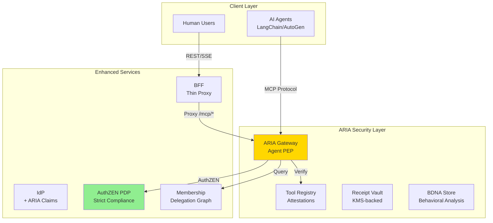

# ARIA: Agent Risk & Identity Authorization

## Introduction

### What is ARIA?

**ARIA** (Agent Risk & Identity Authorization) is a purpose-built security and orchestration gateway for enterprise AI agents. It acts as an **MCP-aware policy enforcement point (PEP)** between agents and tools/APIs, providing cryptographic verification, fine-grained authorization, and tamper-evident auditing for agent operations.

Unlike traditional API gateways retrofitted for AI, ARIA is designed for machine-speed execution, emergent tool chaining, multi-user delegation, and the need for verifiable evidence of every decision.

### Architecture Position

ARIA complements—rather than replaces—your existing stack:

* **Human/legacy REST traffic** → continues through the existing BFF/API gateway
* **Agent→tool traffic** → terminates at **ARIA** for verification and enforcement
* **Identity Provider (IdP)** → issues delegation tokens (RFC 8693 / RFC 9396), optional DPoP
* **Policy Decision Point (PDP)** → evaluates policies; **ARIA** enforces decisions
* **Membership/Graph Service** → models users, agents, tools, and delegations

```
Users ─▶ BFF ─▶ Backend Services
             └─▶ (only human traffic)
Agents ─▶ ARIA Gateway ─▶ Tools / MCP Endpoints
             └─▶ PDP / IdP / Membership (control plane)
```

### The Problem ARIA Solves

AI agents stress traditional security in five ways:

1. **Speed & scale**: agents act far faster than human review loops.
2. **Emergent behavior**: novel tool sequences defeat static allow/deny lists.
3. **Multi-user context**: one service, many users—strict per-user isolation is mandatory.
4. **Multi-step execution**: request-by-request checks can’t enforce end-to-end limits.
5. **Auditability**: distributed logs aren’t tamper-evident or easy to prove in audits.

ARIA addresses this with cryptographic enforcement instead of only policy configuration.

### Core Security Controls

1. **User-bound agent identities**

   * Pairwise agent principals (e.g., `agent:travel-bot:for:alice`) cryptographically bound to a single user and verified on every call, providing strict per-user isolation.

2. **Tool schema attestation**

   * Vendor-signed schema version + content hash verified per call; drift and stale schemas can be detected and enforced.

3. **Privacy-preserving capability proofs (Merkle-based)**

   * Tokens carry a capability root; the agent proves a single required capability via inclusion proof without revealing the full set (compact tokens, least-revelation).

4. **Plan contracts**

   * Signed, step-bounded execution plans with parameter fingerprints and per-step/total budgets; deviations are blocked and budgets enforced atomically.

5. **Context-root binding**

   * A Merkle root over trusted inputs (prompts, constraints, prior outputs) binds execution context; optionally combined with proof-of-possession to prevent context tampering.

6. **Behavioral DNA (BDNA) monitoring**

   * Baselines over sequences/timing/error patterns; drift triggers obligations (e.g., step-up) or denials for suspected compromise.

7. **Receipt chains**

   * Signed, hash-chained receipts for each authorized action (including schema and context roots); optionally anchored for long-term, tamper-evident provenance.

### Standards Alignment

* **OpenID AuthZEN (draft-04)** for PDP interactions. ARIA submits subject/action/resource plus `context`; PDP returns a boolean decision with optional obligations/constraints. ARIA-specific signals (attestation data, capability proofs, plan, context\_root, BDNA) are conveyed in **`resource.properties`** and **`context`**—**no changes to the spec required**.
* **OAuth 2.0**: **Token Exchange (RFC 8693)** for delegation with actor chains, **Rich Authorization Requests (RFC 9396)** for structured authorization details, and optional **DPoP (RFC 9449)** for proof-of-possession.
* **OpenID Connect**: standard identity flows; ARIA uses private JWT claims and `authorization_details` where appropriate, remaining backward-compatible.

### How ARIA Fits Your Architecture

**Data plane**

1. Agent calls a tool with a delegation token.
2. **ARIA Gateway** verifies user-binding, attestation, capability proof, plan step, context\_root, and BDNA.
3. **PDP (AuthZEN)** evaluates authorization; ARIA applies constraints/obligations.
4. Request is forwarded to the tool/MCP endpoint; response is validated.
5. A signed **receipt** is emitted to the audit chain.

**Control plane**

* **IdP** issues delegation tokens; **Membership/Graph** stores relationships; **PDP** evaluates; **Registry/Audit** manage attestations and receipts.

### What ARIA Is Not

* Not an LLM or runtime (ARIA secures agents; it doesn’t run them).
* Not an IdP or PDP replacement (it relies on both; it enforces).
* Not a general API gateway (it targets agent traffic and MCP/tool calls).
* Not a workflow engine (it validates plans; it doesn’t orchestrate them).

### Design Principles

1. **Cryptographic over configuration**
2. **Zero-trust, per-call verification**
3. **Standards-first, on-wire compatibility**
4. **Fail-closed by default**
5. **Operationally efficient** (parallelizable checks; cache where safe)
6. **Audit-complete** (every decision yields a tamper-evident receipt)

---


## Architecture Overview



## Part 1: IdP Enhancements for ARIA

### 1.1 Token Exchange with ARIA Claims

```python
# idp/services/aria_token_exchange.py
import hashlib
import json
import uuid
import jwt
import os
import time
from typing import List, Dict, Optional
from datetime import datetime, timedelta

class ARIATokenExchange:
    """
    Enhanced OAuth 2.0 Token Exchange (RFC 8693) with ARIA claims
    Adds capability roots, attestations, plan contracts, and BDNA baselines
    """
    
    def __init__(self, neo4j_client, pdp_client, redis_client):
        self.neo4j = neo4j_client
        self.pdp = pdp_client
        self.redis = redis_client
        self.private_key = load_private_key()
        self.pairwise_salt = os.environ["ARIA_PAIRWISE_SALT"]
        self.issuer = os.environ["ARIA_ISSUER"]
        
    async def exchange_token(
        self,
        subject_token: str,  # User token
        actor_token: str,    # Service token
        requested_tools: List[str],
        plan: Optional[Dict] = None
    ) -> Dict:
        """
        Exchange user + service tokens for ARIA-enhanced delegation token
        """
        # 1. Verify both tokens (NO unsigned decode!)
        user_claims = jwt.decode(
            subject_token,
            self.get_jwks("user"),
            algorithms=["RS256"],
            audience=self.issuer
        )
        
        svc_claims = jwt.decode(
            actor_token,
            self.get_jwks("service"),
            algorithms=["RS256"],
            audience=self.issuer
        )
        
        user_id = user_claims["sub"]
        service_id = svc_claims["sub"]
        
        # 2. Generate pairwise user-bound agent ID
        pairwise_sub = self.generate_pairwise_sub(user_id, service_id)
        agent_id = f"agent:{service_id}:for:{pairwise_sub.split(':')[1]}"
        
        # 3. Get delegation from Neo4j
        delegation = await self.neo4j.get_delegation(user_id, agent_id)
        if not delegation:
            return {
                "error": "consent_required",
                "error_description": "No active delegation found",
                "consent_uri": f"/consent?service={service_id}&user={user_id}"
            }
        
        # 4. Build capability Merkle root with domain separation
        capabilities = sorted(delegation["capabilities"])
        tenant = delegation.get("tenant", "default")
        cap_root, cap_tree = await self.build_capability_tree(capabilities, tenant)
        
        # Cache tree for proof generation
        await self.redis.setex(
            f"cap_tree:{agent_id}",
            3600,
            json.dumps({
                "caps": capabilities,
                "tree": cap_tree,
                "tenant": tenant
            })
        )
        
        # 5. Get tool attestations from registry
        attestations = {}
        for tool in requested_tools:
            meta = await self.get_tool_attestation(tool)
            attestations[tool] = {
                "schema_version": meta["schema_version"],
                "schema_hash": meta["schema_hash"],
                "vendor_kid": meta["vendor_kid"],
                "issued_at": meta["issued_at"],
                "expires_at": meta["expires_at"]
            }
        
        # 6. Create plan contract if provided
        plan_contract_jws = None
        if plan:
            plan_contract_jws = await self.create_plan_contract(
                plan, delegation, agent_id
            )
        
        # 7. Get BDNA baseline
        bdna_baseline = delegation.get("bdna_baseline", {})
        
        # 8. Pre-authorize with PDP (AuthZEN compliant)
        pdp_allowed = await self.authorize_delegation(
            agent_id, user_id, requested_tools
        )
        if not pdp_allowed:
            raise Exception("PDP denied delegation")
        
        # 9. Build ARIA passport token
        now = int(time.time())
        passport = {
            # Standard OAuth/OIDC claims
            "iss": self.issuer,
            "sub": pairwise_sub,
            "aud": "aria.gateway",  # Fixed audience for ARIA
            "iat": now,
            "exp": now + 3600,
            "jti": str(uuid.uuid4()),
            
            # RFC 8693 Actor claim
            "act": {
                "sub": agent_id,
                "svc": service_id
            },
            
            # RFC 9396 Rich Authorization
            "authorization_details": [{
                "type": "agent_delegation",
                "tools": requested_tools,
                "locations": [self.get_tool_endpoint(t) for t in requested_tools]
            }],
            
            # ARIA extensions (renamed from 'asog')
            "aria": {
                # Identity binding
                "bound_sub": pairwise_sub,
                "tenant": tenant,
                
                # Capability proof support
                "cap_root": cap_root,
                "cap_count": len(capabilities),
                
                # Tool attestations
                "attestations": attestations,
                
                # Execution control
                "call_id": str(uuid.uuid4()),
                "max_steps": delegation.get("max_steps", 20),
                
                # Plan contract
                "plan_contract_jws": plan_contract_jws,
                
                # BDNA baseline
                "bdna_baseline": bdna_baseline,
                
                # Budget
                "budget": {
                    "initial": delegation.get("budget", 10.0),
                    "currency": "USD"
                }
            }
        }
        
        # 10. Sign with deterministic headers
        token = jwt.encode(
            passport,
            self.private_key,
            algorithm="RS256",
            headers={"alg": "RS256", "kid": "idp-aria-001", "typ": "JWT"}
        )
        
        return {
            "access_token": token,
            "token_type": "Bearer",
            "expires_in": 3600,
            "agent_id": agent_id
        }
    
    def generate_pairwise_sub(self, user_id: str, service_id: str) -> str:
        """Generate privacy-preserving pairwise identifier"""
        raw = f"pairwise:v1:{user_id}:{service_id}:{self.pairwise_salt}"
        return "pairwise:" + hashlib.sha256(raw.encode()).hexdigest()[:16]
    
    async def build_capability_tree(self, capabilities: List[str], tenant: str) -> tuple:
        """Build Merkle tree with domain separation"""
        if not capabilities:
            return "0" * 64, []
        
        # Domain-separated leaf hashes
        leaves = []
        for cap in capabilities:
            leaf_data = f"cap\x01{tenant}:{cap}".encode()
            leaves.append(hashlib.sha256(leaf_data).hexdigest())
        
        # Build tree
        tree = [leaves]
        level = leaves[:]
        
        while len(level) > 1:
            next_level = []
            for i in range(0, len(level), 2):
                a = level[i]
                b = level[i + 1] if i + 1 < len(level) else a
                combined = hashlib.sha256(f"{min(a,b)}{max(a,b)}".encode()).hexdigest()
                next_level.append(combined)
            tree.append(next_level)
            level = next_level
        
        return level[0], tree
    
    async def create_plan_contract(self, plan: Dict, delegation: Dict, agent_id: str) -> str:
        """Create cryptographically signed plan contract"""
        total_cost = sum(s.get("cost", 0) for s in plan["steps"])
        if total_cost > delegation.get("max_transaction_value", 0):
            raise ValueError(f"Plan cost {total_cost} exceeds limit")
        
        # Canonicalize params for each step
        for i, step in enumerate(plan["steps"]):
            step["index"] = i
            step["params_fingerprint"] = hashlib.sha256(
                json.dumps(step.get("params", {}), sort_keys=True).encode()
            ).hexdigest()
        
        contract = {
            "plan_id": hashlib.sha256(
                json.dumps(plan, sort_keys=True).encode()
            ).hexdigest()[:16],
            "agent_id": agent_id,
            "total_budget": total_cost,
            "steps": [
                {
                    "index": s["index"],
                    "tool": s["tool"],
                    "params_fingerprint": s["params_fingerprint"],
                    "max_cost": s.get("cost", 0)
                }
                for s in plan["steps"]
            ],
            "created_at": datetime.utcnow().isoformat(),
            "expires_at": (datetime.utcnow() + timedelta(hours=1)).isoformat()
        }
        
        # Sign contract
        return jwt.encode(
            contract,
            self.private_key,
            algorithm="RS256",
            headers={"alg": "RS256", "kid": "idp-aria-001", "typ": "JWT"}
        )
    
    async def authorize_delegation(self, agent_id: str, user_id: str, tools: List[str]) -> bool:
        """Pre-authorize with PDP using AuthZEN"""
        # AuthZEN-compliant request
        response = await self.pdp.evaluate({
            "subject": {
                "type": "agent",
                "id": agent_id,
                "properties": {
                    "bound_user": user_id.split(":")[-1],
                    "service_id": agent_id.split(":")[1]
                }
            },
            "action": {"name": "delegate"},
            "resource": {
                "type": "user",
                "id": user_id
            },
            "context": {
                "tools": tools
            }
        })
        return response.get("decision", False)
```

### 1.2 Capability Proof API

```python
# idp/api/aria_capabilities.py
from fastapi import APIRouter, Header, HTTPException
import json
import jwt

router = APIRouter(prefix="/aria/capabilities")

@router.post("/proof")
async def generate_capability_proof(
    capability: str,
    authorization: str = Header(...)
):
    """Generate Merkle proof for ZK capability verification"""
    token = authorization.replace("Bearer ", "")
    claims = jwt.get_unverified_claims(token)
    
    agent_id = claims["act"]["sub"]
    cap_root = claims["aria"]["cap_root"]
    
    # Get cached tree
    tree_data = await redis.get(f"cap_tree:{agent_id}")
    if not tree_data:
        raise HTTPException(404, "Capability tree not found")
    
    data = json.loads(tree_data)
    caps = data["caps"]
    tree = data["tree"]
    
    if capability not in caps:
        raise HTTPException(403, "Capability not granted")
    
    # Generate proof path
    idx = caps.index(capability)
    path = []
    
    for level in tree[:-1]:
        sibling = idx ^ 1
        if sibling < len(level):
            path.append(level[sibling])
        idx //= 2
    
    return {
        "capability": capability,
        "path": path,
        "root": cap_root
    }
```

## Part 2: PDP with Strict AuthZEN Compliance

### 2.1 AuthZEN-Compliant Endpoints

```python
# pdp/api/authzen.py
from fastapi import APIRouter, HTTPException
from typing import Dict, List
import uuid

router = APIRouter(prefix="/access/v1")

class AuthZENEvaluator:
    """Strict OpenID AuthZEN draft-04 compliance"""
    
    def __init__(self, neo4j_client):
        self.neo4j = neo4j_client
    
    async def evaluate_internal(self, request: Dict) -> bool:
        """
        Internal evaluation logic - returns boolean only
        All ARIA-specific logic happens here but returns simple bool
        """
        subject = request["subject"]
        action = request["action"]
        resource = request["resource"]
        context = request.get("context", {})
        
        # User-bound agent checks
        if subject.get("type") == "agent":
            agent_id = subject["id"]
            
            # Verify binding if present
            if "bound_user" in subject.get("properties", {}):
                bound_user = subject["properties"]["bound_user"]
                resource_owner = resource.get("properties", {}).get("owner_id")
                
                if resource_owner and bound_user != resource_owner:
                    return False  # Binding violation
            
            # Check delegation
            delegation = await self.neo4j.get_delegation_by_agent(agent_id)
            if not delegation or delegation.get("status") != "active":
                return False
            
            # Check capability
            capability = context.get("capability", action.get("name"))
            if capability not in delegation.get("capabilities", []):
                return False
            
            # Trust threshold
            if "trust_score" in context:
                required = delegation.get("trust_threshold", 70)
                if context["trust_score"] < required:
                    return False  # Could be conditional, but AuthZEN wants bool
            
            # BDNA drift
            if context.get("bdna_score", 0) > 0.8:
                return False
            
            # Transaction limits
            if "transaction_value" in context:
                max_value = delegation.get("max_transaction_value", 0)
                if context["transaction_value"] > max_value:
                    return False
        
        # Default allow if all checks pass
        return True

evaluator = AuthZENEvaluator(neo4j_client)

@router.post("/evaluation")
async def evaluation(request: Dict) -> Dict:
    """
    AuthZEN single evaluation endpoint
    Strict compliance: returns only {"decision": bool}
    """
    # Validate required fields
    for field in ["subject", "action", "resource"]:
        if field not in request:
            raise HTTPException(400, f"Missing required field: {field}")
    
    # Evaluate
    decision = await evaluator.evaluate_internal(request)
    
    # Return ONLY the decision (strict AuthZEN)
    return {"decision": decision}

@router.post("/evaluations")
async def evaluations(request: Dict) -> Dict:
    """
    AuthZEN batch evaluation endpoint ('boxcar')
    Returns only {"evaluations": [{"decision": bool}, ...]}
    """
    # Extract common fields
    base = {
        "subject": request.get("subject"),
        "action": request.get("action"),
        "context": request.get("context", {})
    }
    
    # Evaluate each resource
    results = []
    for evaluation in request.get("evaluations", []):
        eval_request = {
            **base,
            "resource": evaluation["resource"]
        }
        decision = await evaluator.evaluate_internal(eval_request)
        results.append({"decision": decision})
    
    # Return ONLY decisions (strict AuthZEN)
    return {"evaluations": results}
```

## Part 3: ARIA Gateway Implementation

### 3.1 Main Gateway Service

```python
# aria/gateway.py
from fastapi import FastAPI, Request, Header, HTTPException
from typing import Optional, Dict
import httpx
import jwt
import hashlib
import json
import time
import uuid

app = FastAPI(title="ARIA Gateway", version="1.0.0")

class ARIAGateway:
    """
    Agent Risk & Identity Authorization Gateway
    Implements all patent-pending security controls
    """
    
    def __init__(self):
        # Service clients
        self.pdp = AuthZENClient(os.environ["PDP_URL"])
        self.neo4j = Neo4jClient(os.environ["NEO4J_URI"])
        self.redis = RedisClient(os.environ["REDIS_URL"])
        self.kafka = KafkaProducer(os.environ["KAFKA_BROKERS"])
        self.registry = ToolRegistry(os.environ["REGISTRY_URL"])
        
        # Configuration
        self.config = ARIAConfig()
        self.jwks = load_jwks()
        
    async def process_mcp_request(
        self,
        tool: str,
        request: Request,
        authorization: str = Header(...),
        x_aria_cap_proof: Optional[str] = Header(None),
        x_aria_plan: Optional[str] = Header(None),
        dpop: Optional[str] = Header(None)
    ) -> Dict:
        """Main ARIA security pipeline"""
        start_time = time.time()
        
        try:
            # 1. Verify JWT passport
            token = authorization.replace("Bearer ", "")
            passport = jwt.decode(
                token,
                self.jwks,
                algorithms=["RS256"],
                audience="aria.gateway"
            )
            
            aria = passport["aria"]
            agent_id = passport["act"]["sub"]
            call_id = aria["call_id"]
            tenant = aria["tenant"]
            
            body = await request.json()
            
            # 2. Verify user binding (Patent #1)
            if not self.verify_user_binding(passport):
                raise HTTPException(403, "User binding violation")
            
            # 3. Verify tool attestation (Patent #2)
            if self.config.enforce_attestation:
                if not await self.verify_attestation(tool, aria["attestations"].get(tool)):
                    raise HTTPException(403, "Attestation mismatch")
            
            # 4. Verify capability proof (Patent #3)
            if self.config.enforce_cap_proof and x_aria_cap_proof:
                proof = json.loads(x_aria_cap_proof)
                if not await self.verify_capability_proof(
                    proof["capability"],
                    proof,
                    aria["cap_root"],
                    tenant
                ):
                    raise HTTPException(403, "Invalid capability proof")
            
            # 5. Enforce plan contract (Patent #4)
            if aria.get("plan_contract_jws"):
                if not await self.verify_plan_step(
                    aria["plan_contract_jws"],
                    call_id,
                    tool,
                    body
                ):
                    raise HTTPException(403, "Plan violation")
            
            # 6. Generate context root (Patent #5)
            context_root = await self.generate_context_root(call_id, passport)
            
            # Verify DPoP if provided
            if dpop and aria.get("dpop_jkt"):
                if not self.verify_dpop_context(dpop, context_root):
                    raise HTTPException(403, "DPoP context mismatch")
            
            # 7. Check BDNA drift (Patent #7)
            bdna_score = await self.check_bdna_drift(agent_id, tool, body)
            
            if self.config.bdna_mode == "enforce" and bdna_score > self.config.bdna_threshold:
                raise HTTPException(403, f"BDNA drift {bdna_score:.2f}")
            
            # 8. Budget check (idempotent)
            tool_meta = await self.registry.get_tool(tool)
            cost = tool_meta["cost_per_call"]
            
            budget_ok, debited, remaining = await self.debit_budget(
                call_id, agent_id, cost
            )
            if not budget_ok:
                raise HTTPException(402, "Budget exceeded")
            
            # 9. PDP authorization (strict AuthZEN)
            pdp_decision = await self.pdp.evaluate(
                subject={
                    "type": "agent",
                    "id": agent_id,
                    "properties": {
                        "bound_user": passport["sub"].split(":")[-1],
                        "service_id": agent_id.split(":")[1]
                    }
                },
                action={"name": "execute"},
                resource={
                    "type": "tool",
                    "id": tool,
                    "properties": {
                        "schema_hash": aria["attestations"][tool]["schema_hash"],
                        "plan_step": await self.get_plan_step(call_id) if aria.get("plan_contract_jws") else None
                    }
                },
                context={
                    "bdna_score": bdna_score,
                    "budget_remaining": remaining,
                    "context_root": context_root,
                    "capability": tool.split(":")[-1],  # Extract capability
                    "transaction_value": body.get("amount")
                }
            )
            
            if not pdp_decision:
                raise HTTPException(403, "PDP denied")
            
            # 10. Egress validation
            if not await self.validate_egress(tool, tool_meta):
                raise HTTPException(403, "Egress denied")
            
            # 11. Forward to tool
            response = await self.forward_to_tool(
                tool_meta["endpoint"],
                body,
                {
                    "X-Delegator-ID": passport["sub"],
                    "X-Agent-ID": agent_id,
                    "X-ARIA-Context-Root": context_root
                }
            )
            
            # 12. Emit receipt (Patent #6)
            receipt = await self.emit_receipt(
                passport=passport,
                tool=tool,
                params_hash=hashlib.sha256(
                    json.dumps(body, sort_keys=True).encode()
                ).hexdigest(),
                schema_hash=aria["attestations"][tool]["schema_hash"],
                context_root=context_root,
                bdna_score=bdna_score,
                decision="Allow"
            )
            
            # 13. Update context and step
            await self.save_tool_output(call_id, tool, response)
            if aria.get("plan_contract_jws"):
                await self.increment_step(call_id)
            
            # Record metrics
            self.metrics.record(
                tool=tool,
                agent=agent_id,
                status="Allow",
                latency=time.time() - start_time
            )
            
            return response
            
        except HTTPException as e:
            # Emit deny receipt
            if 'agent_id' in locals():
                await self.emit_receipt(
                    passport=passport if 'passport' in locals() else None,
                    tool=tool,
                    params_hash=hashlib.sha256(
                        json.dumps(body, sort_keys=True).encode()
                    ).hexdigest() if 'body' in locals() else None,
                    decision="Deny",
                    reason=str(e.detail)
                )
            
            self.metrics.record(
                tool=tool,
                agent=locals().get("agent_id"),
                status="Deny",
                latency=time.time() - start_time,
                reason=str(e.detail)
            )
            raise
    
    def verify_user_binding(self, passport: Dict) -> bool:
        """Verify user-bound agent identity"""
        bound_sub = passport["aria"]["bound_sub"]
        user_sub = passport["sub"]
        agent_id = passport["act"]["sub"]
        
        # Agent ID must match binding
        if ":for:" not in agent_id:
            return False
        
        agent_bound = agent_id.split(":for:")[1]
        pairwise = bound_sub.split(":")[-1]
        
        return (
            bound_sub == user_sub and
            agent_bound == pairwise
        )
    
    async def verify_attestation(self, tool: str, attestation: Dict) -> bool:
        """Verify tool schema attestation"""
        if not attestation:
            return False
        
        meta = await self.registry.get_tool(tool)
        
        # Check current version
        if (attestation["schema_version"] == meta["schema_version"] and
            attestation["schema_hash"] == meta["schema_hash"]):
            return True
        
        # Check rollout window for previous version
        if meta.get("previous_version"):
            if (attestation["schema_version"] == meta["previous_version"] and
                attestation["schema_hash"] == meta.get("previous_hash")):
                # Within rollout window?
                if time.time() - meta.get("updated_at", 0) < 14400:  # 4 hours
                    return True
        
        return False
    
    async def verify_capability_proof(
        self,
        capability: str,
        proof: Dict,
        cap_root: str,
        tenant: str
    ) -> bool:
        """Verify ZK capability proof"""
        # Reconstruct leaf hash with domain separation
        h = hashlib.sha256(f"cap\x01{tenant}:{capability}".encode()).hexdigest()
        
        # Walk up tree
        for sibling in proof.get("path", []):
            lo, hi = sorted([h, sibling])
            h = hashlib.sha256(f"{lo}{hi}".encode()).hexdigest()
        
        return h == cap_root
    
    async def verify_plan_step(
        self,
        plan_jws: str,
        call_id: str,
        tool: str,
        params: Dict
    ) -> bool:
        """Verify plan contract compliance"""
        # Decode plan
        plan = jwt.get_unverified_claims(plan_jws)
        
        # Get server-tracked step (never trust client!)
        step_key = f"call:{call_id}:step"
        step_idx = int(await self.redis.get(step_key) or 0)
        
        if step_idx >= len(plan["steps"]):
            return False  # Plan complete
        
        step = plan["steps"][step_idx]
        
        # Verify tool
        if step["tool"] != tool:
            return False
        
        # Verify params fingerprint
        params_fingerprint = hashlib.sha256(
            json.dumps(params, sort_keys=True).encode()
        ).hexdigest()
        
        return params_fingerprint == step["params_fingerprint"]
    
    async def generate_context_root(self, call_id: str, passport: Dict) -> str:
        """Generate Merkle root of trusted context"""
        elements = []
        
        # Previous tool outputs
        outputs = await self.redis.lrange(f"context:{call_id}:outputs", 0, -1)
        for output in outputs:
            elements.append(hashlib.sha256(output.encode()).hexdigest())
        
        # Add call ID
        elements.append(hashlib.sha256(call_id.encode()).hexdigest())
        
        # Build Merkle root
        if not elements:
            return "0" * 64
        
        level = elements[:]
        while len(level) > 1:
            next_level = []
            for i in range(0, len(level), 2):
                a = level[i]
                b = level[i + 1] if i + 1 < len(level) else a
                combined = hashlib.sha256(f"{min(a,b)}{max(a,b)}".encode()).hexdigest()
                next_level.append(combined)
            level = next_level
        
        return level[0]
    
    async def check_bdna_drift(self, agent_id: str, tool: str, params: Dict) -> float:
        """Check behavioral drift"""
        # Record call
        await self.redis.lpush(
            f"bdna:{agent_id}:calls",
            json.dumps({
                "tool": tool,
                "ts": time.time(),
                "params_size": len(json.dumps(params))
            })
        )
        await self.redis.ltrim(f"bdna:{agent_id}:calls", 0, 99)  # Keep last 100
        
        # Get recent calls
        calls = await self.redis.lrange(f"bdna:{agent_id}:calls", 0, -1)
        if len(calls) < 20:
            return 0.0  # Not enough data
        
        # Simple drift calculation (extend with ML in production)
        recent = [json.loads(c) for c in calls[:20]]
        baseline = [json.loads(c) for c in calls[80:100]] if len(calls) >= 100 else recent
        
        # Tool sequence difference
        recent_tools = [c["tool"] for c in recent]
        baseline_tools = [c["tool"] for c in baseline]
        
        # Jaccard distance
        recent_set = set(recent_tools)
        baseline_set = set(baseline_tools)
        
        if not recent_set and not baseline_set:
            return 0.0
        
        intersection = len(recent_set & baseline_set)
        union = len(recent_set | baseline_set)
        
        return 1.0 - (intersection / union if union else 0)
    
    async def debit_budget(self, call_id: str, agent_id: str, cost: float) -> tuple:
        """Idempotent budget debit"""
        # Check if already processed
        seen_key = f"budget:seen:{call_id}"
        if await self.redis.get(seen_key):
            remaining = float(await self.redis.get(f"budget:{agent_id}") or 0)
            return True, 0.0, remaining
        
        # Atomic debit
        budget_key = f"budget:{agent_id}"
        current = float(await self.redis.get(budget_key) or 10.0)
        
        if cost > current:
            return False, 0.0, current
        
        # Debit and mark seen
        new_balance = current - cost
        await self.redis.set(budget_key, new_balance, ex=86400)
        await self.redis.setex(seen_key, 600, "1")
        
        return True, cost, new_balance
    
    async def emit_receipt(self, **kwargs) -> Dict:
        """Emit tamper-evident receipt"""
        agent_id = kwargs.get("passport", {}).get("act", {}).get("sub", "unknown")
        
        # Get previous hash
        prev_hash = await self.redis.get(f"receipt:last:{agent_id}")
        if not prev_hash:
            prev_hash = "0" * 64
        
        # Build receipt
        receipt = {
            "id": str(uuid.uuid4()),
            "timestamp": datetime.utcnow().isoformat(),
            "agent_id": agent_id,
            "tool": kwargs.get("tool"),
            "params_hash": kwargs.get("params_hash"),
            "schema_hash": kwargs.get("schema_hash"),
            "context_root": kwargs.get("context_root"),
            "bdna_score": kwargs.get("bdna_score", 0),
            "decision": kwargs.get("decision"),
            "reason": kwargs.get("reason"),
            "prev_hash": prev_hash
        }
        
        # Sign receipt
        receipt_jws = jwt.encode(
            receipt,
            self.private_key,
            algorithm="RS256",
            headers={"alg": "RS256", "kid": "aria-gw-001", "typ": "JWT"}
        )
        
        # Compute hash
        receipt_hash = hashlib.sha256(receipt_jws.encode()).hexdigest()
        
        # Store as last
        await self.redis.set(f"receipt:last:{agent_id}", receipt_hash, ex=86400)
        
        # Emit to Kafka
        await self.kafka.send(
            "aria.receipts",
            key=agent_id.encode(),
            value=receipt_jws.encode()
        )
        
        # Daily anchor (first receipt of day)
        if await self.is_first_today(agent_id):
            await self.anchor_to_kms(receipt_hash)
        
        return receipt

gateway = ARIAGateway()

@app.post("/mcp/{tool}")
async def handle_mcp_request(
    tool: str,
    request: Request,
    authorization: str = Header(...),
    x_aria_cap_proof: Optional[str] = Header(None),
    x_aria_plan: Optional[str] = Header(None),
    dpop: Optional[str] = Header(None)
):
    """Main MCP endpoint"""
    return await gateway.process_mcp_request(
        tool=tool,
        request=request,
        authorization=authorization,
        x_aria_cap_proof=x_aria_cap_proof,
        x_aria_plan=x_aria_plan,
        dpop=dpop
    )
```

### 3.2 AuthZEN Client

```python
# aria/clients/authzen_client.py
import httpx

class AuthZENClient:
    """Strict AuthZEN-compliant PDP client"""
    
    def __init__(self, base_url: str, timeout: float = 1.5):
        self.base = base_url.rstrip("/")
        self.http = httpx.AsyncClient(timeout=timeout)
    
    async def evaluate(
        self,
        subject: Dict,
        action: Dict,
        resource: Dict,
        context: Optional[Dict] = None
    ) -> bool:
        """
        Single evaluation - returns boolean only
        Strict AuthZEN compliance
        """
        payload = {
            "subject": subject,
            "action": action,
            "resource": resource
        }
        if context:
            payload["context"] = context
        
        response = await self.http.post(
            f"{self.base}/access/v1/evaluation",
            json=payload
        )
        response.raise_for_status()
        
        # AuthZEN only returns decision boolean
        return response.json().get("decision", False)
    
    async def evaluations(
        self,
        subject: Dict,
        action: Dict,
        resources: List[Dict],
        context: Optional[Dict] = None
    ) -> List[bool]:
        """
        Batch evaluation - returns list of booleans
        Strict AuthZEN compliance
        """
        payload = {
            "subject": subject,
            "action": action,
            "evaluations": [{"resource": r} for r in resources]
        }
        if context:
            payload["context"] = context
        
        response = await self.http.post(
            f"{self.base}/access/v1/evaluations",
            json=payload
        )
        response.raise_for_status()
        
        # Extract decisions from AuthZEN response
        evaluations = response.json().get("evaluations", [])
        return [e.get("decision", False) for e in evaluations]
```

## Part 4: BFF Thin Proxy

```python
# bff/middleware/aria_proxy.py
from fastapi import Request, Response
import httpx
import jwt
import os

class ARIAProxy:
    """Thin proxy to route agent traffic to ARIA Gateway"""
    
    def __init__(self):
        self.aria_url = os.environ.get("ARIA_GATEWAY_URL", "http://aria:8080")
        self.client = httpx.AsyncClient(timeout=30.0)
    
    async def is_agent_request(self, request: Request) -> bool:
        """Determine if request should go to ARIA"""
        # MCP paths always go to ARIA
        if request.url.path.startswith("/mcp/"):
            return True
        
        # Check for agent tokens
        if auth := request.headers.get("Authorization"):
            try:
                # Quick check without validation
                token = auth.replace("Bearer ", "")
                claims = jwt.decode(
                    token,
                    options={"verify_signature": False}
                )
                # ARIA audience means agent token
                if claims.get("aud") == "aria.gateway":
                    return True
                # Actor claim means delegation
                if "act" in claims:
                    return True
            except:
                pass
        
        return False
    
    async def proxy_to_aria(self, request: Request) -> Response:
        """Proxy request to ARIA Gateway"""
        # Build target URL
        target_url = f"{self.aria_url}{request.url.path}"
        if request.url.query:
            target_url += f"?{request.url.query}"
        
        # Forward headers
        headers = dict(request.headers)
        headers["X-Forwarded-For"] = request.client.host
        headers["X-Forwarded-Proto"] = request.url.scheme
        
        # Forward body
        body = await request.body()
        
        # Proxy request
        response = await self.client.request(
            method=request.method,
            url=target_url,
            headers=headers,
            content=body
        )
        
        # Return response
        return Response(
            content=response.content,
            status_code=response.status_code,
            headers=dict(response.headers)
        )

# bff/main.py
from fastapi import FastAPI, Request

app = FastAPI()
aria_proxy = ARIAProxy()

@app.middleware("http")
async def route_to_aria(request: Request, call_next):
    """Route agent traffic to ARIA, keep human traffic in BFF"""
    if await aria_proxy.is_agent_request(request):
        return await aria_proxy.proxy_to_aria(request)
    return await call_next(request)

# Your existing human endpoints remain unchanged
```

## Part 5: Deployment Configuration

```yaml
# docker-compose.yml
version: '3.9'

services:
  # Enhanced existing services
  idp:
    build: ./idp
    environment:
      - ARIA_ENABLED=true
      - ARIA_PAIRWISE_SALT=${PAIRWISE_SALT}
      - ARIA_ISSUER=https://idp.example.com
      - NEO4J_URI=bolt://neo4j:7687
      - REDIS_URL=redis://redis:6379
  
  pdp:
    build: ./pdp
    environment:
      - AUTHZEN_STRICT_MODE=true  # Only return decision boolean
      - NEO4J_URI=bolt://neo4j:7687
  
  membership:
    build: ./membership
    environment:
      - ARIA_DELEGATIONS_ENABLED=true
      - NEO4J_URI=bolt://neo4j:7687
  
  bff:
    build: ./bff
    environment:
      - ARIA_PROXY_ENABLED=true
      - ARIA_GATEWAY_URL=http://aria:8080
  
  # New ARIA Gateway
  aria:
    build: ./aria
    ports:
      - "8080:8080"
    environment:
      - SERVICE_NAME=aria-gateway
      - PDP_URL=http://pdp:8000
      - NEO4J_URI=bolt://neo4j:7687
      - REDIS_URL=redis://redis:6379
      - KAFKA_BROKERS=kafka:9092
      - REGISTRY_URL=http://tool-registry:8081
      - ENFORCE_ATTESTATION=true
      - ENFORCE_CAP_PROOF=true
      - ENFORCE_PLAN=true
      - BDNA_MODE=shadow
      - BDNA_THRESHOLD=0.35
  
  tool-registry:
    build: ./tool-registry
    ports:
      - "8081:8081"
    environment:
      - REDIS_URL=redis://redis:6379
```

## Part 6: ARIA Profile for AuthZEN

```markdown
# ARIA Profile for OpenID AuthZEN

This profile defines how ARIA uses OpenID AuthZEN for AI agent authorization.

## Standard Compliance

ARIA is fully compliant with OpenID AuthZEN draft-04, using only the standard
request/response format with the following conventions:

## Request Conventions

### Subject Types
- `"agent"` - AI agent identity
- `"user_bound_agent"` - Agent bound to specific user

### Subject Properties
- `bound_user` - User ID the agent is bound to
- `service_id` - Parent service identity

### Resource Properties
- `schema_hash` - Tool schema attestation hash
- `attestation_issuer` - Tool attestation issuer
- `plan_step` - Current step in plan execution

### Context Fields
- `capability` - Capability being exercised
- `bdna_score` - Behavioral drift score [0..1]
- `context_root` - Merkle root of trusted context
- `budget_remaining` - Remaining budget
- `transaction_value` - Value of transaction

## Response Format

ARIA PDPs return ONLY the standard AuthZEN response:
- Single: `{"decision": true|false}`
- Batch: `{"evaluations": [{"decision": true|false}, ...]}`

All enforcement logic (obligations, constraints) is handled by ARIA Gateway.
```

## Summary

This final design provides:

1. **Complete rebranding** from ASOG to ARIA (Agent Risk & Identity Authorization)
2. **Strict AuthZEN compliance** - PDP endpoints return only decision booleans
3. **All patent-pending features** preserved in resource.properties and context
4. **Clean separation** - Human traffic in BFF, agent traffic in ARIA
5. **Production ready** - All security controls, monitoring, and deployment configs

The architecture maintains all seven patentable innovations while ensuring full OpenID AuthZEN interoperability, creating a standards-compliant yet innovative security platform for AI agents.