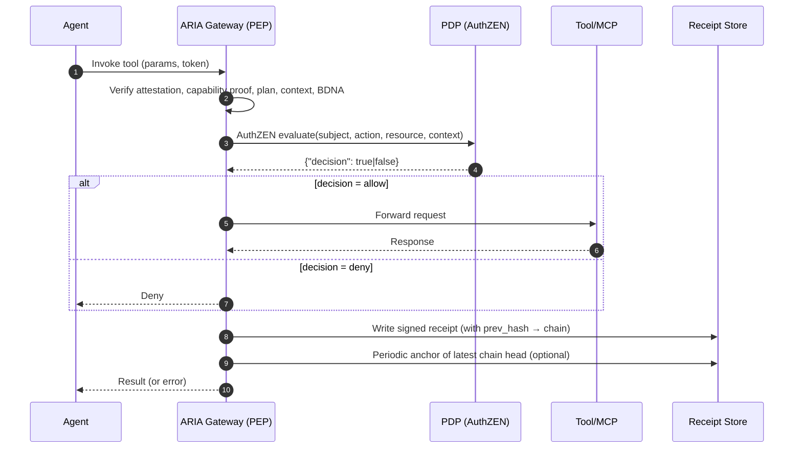
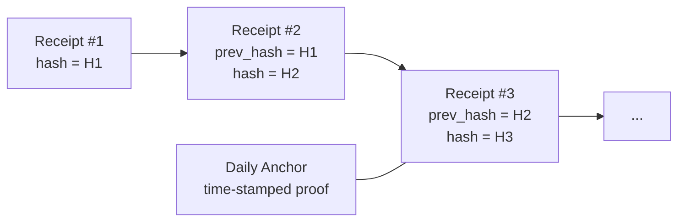
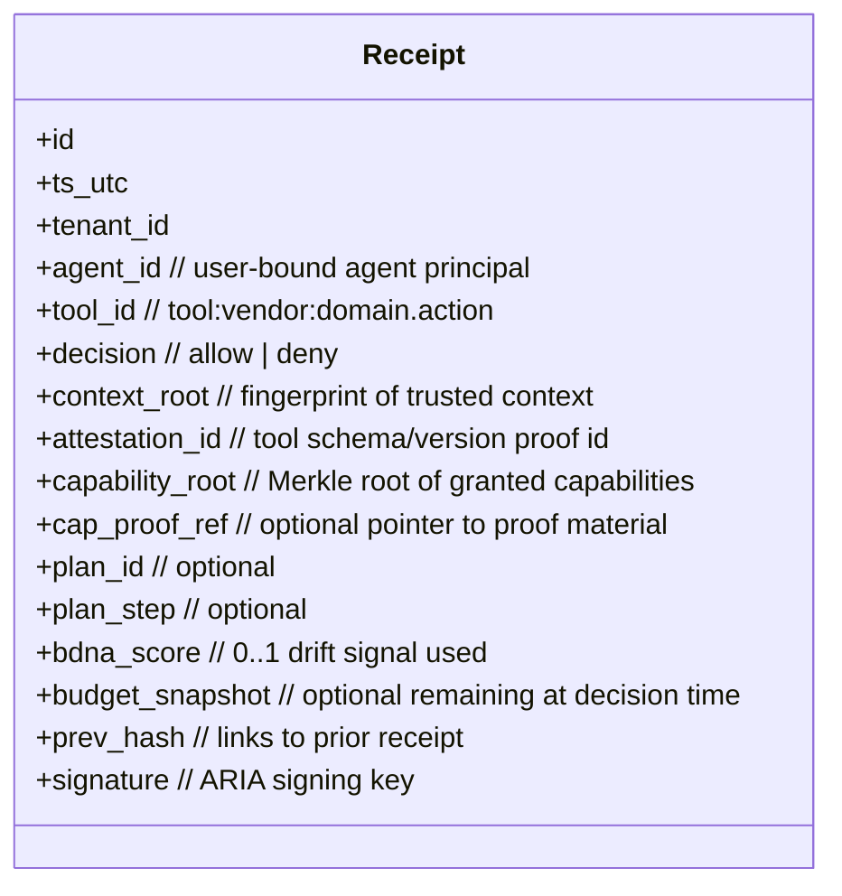

# Receipt Chains (Immutable Audit) — Deep Intro & How-It-Works (for PMs)

## One-liner

**Receipt Chains** turn every allowed or denied agent action into a **signed, hash-linked receipt**. The result is a **tamper-evident, end-to-end audit trail** you can search, verify, and defend.

---

## Why this matters (business first)

* **Provable accountability:** “Who did what, when, under which policy?” answered in seconds—not days of log-spelunking.
* **Regulator-ready evidence:** Immutability + provenance + minimal disclosure helps satisfy common audit controls (e.g., integrity, non-repudiation, traceability).
* **Spend & risk visibility:** Link each tool call to its **plan step**, **budget state**, and **decision**—so Finance, Security, and Engineering see the same facts.
* **Vendor & incident resolution:** When something goes wrong, receipts show *exactly* what schema/version was used and why the PDP allowed/denied.

> Key theme: **facts over narratives**—cryptographic receipts replace “best-effort logs.”

---

## What a “receipt” is (plain language)

A compact record stamped by ARIA at decision time:

* **Who**: agent instance (user-bound), tenant, service
* **What**: tool/capability invoked (canonical ID)
* **When**: precise timestamp (UTC)
* **Why**: PDP decision (boolean) and decision inputs (non-sensitive)
* **Integrity hooks**:

  * **prev\_hash**: links to the prior receipt (makes a chain)
  * **context\_root**: fingerprint of trusted context (no content)
  * **attestation\_id**: which tool schema/version was verified
  * **capability\_root / proof ref**: permission provenance (no scope dump)
  * **plan\_id / step**: which step of the pre-approved plan
  * **bdna\_score**: behavior drift signal used at decision time
* **Signature**: signed by ARIA (KMS/HSM-backed keys) for authenticity

> Note: We store **hashes/fingerprints**, not prompts or payloads. Minimal data by design.

---

## Where it sits in the flow



* **PDP stays standards-pure** (OpenID AuthZEN draft-04): returns only a boolean.
* ARIA (the PEP) records **what was evaluated** and **why the final decision happened**—then mints the receipt.

---

## How the chain works (intuitive)



* Each receipt’s **hash covers** its fields + the **previous receipt’s hash**.
* Any tampering breaks the chain immediately.
* Optionally, we **periodically anchor the chain head** (e.g., sealed timestamp via HSM/time-stamping authority), adding an external root-of-trust.

---

## What’s inside a receipt (human-readable model)



> Every field is either an identifier, a hash, or a small scalar—**no secrets** and no content bodies.

---

## How receipts relate to OpenID AuthZEN & the PDP

* **AuthZEN:** The PDP returns **only** `{"decision": true|false}`.
* **Receipts:** ARIA logs the **inputs** (as fingerprints/IDs) it sent to the PDP and the **boolean decision** it received—nothing proprietary added to the on-wire AuthZEN contract.
* **Policy explainability:** When an auditor asks “why was this allowed?”, you show the receipt with:

  * the **capability root + proof ref**,
  * the **attestation id** of the tool schema,
  * the **context root** used for that decision, and
  * the **BDNA score** if it influenced policy.

---

## Storage & retrieval (how teams use it)

```mermaid
graph TB
  subgraph Data Plane
    PEP[ARIA PEP]
    Q[Append-only Topic/Queue]
  end
  subgraph Control Plane
    IDX[Search Index]
    DW[Immutable Store (WORM)]
    ANCHOR[Anchor Journal]
  end
  PEP --> Q --> DW
  Q --> IDX
  DW --> ANCHOR

  Analysts[Sec/FinOps/Compliance UI] --> IDX
  Forensics[IR/Legal Export] --> DW
```

* **Fast search** via index for day-to-day ops (“Show all denies for `tool:stripe:payment.refund` last 24h”).
* **Immutable store** (append-only/WORM) for retention & e-discovery.
* **Anchor journal** holds periodic chain heads for third-party verifiability.

---

## Actions & workflows powered by receipts

* **Spend & plan traceability:** From a bill or ledger entry, jump to the exact receipts showing **when**, **under which plan step**, and **remaining budget** at that moment.
* **Change management:** Prove that calls were made against **approved tool schemas** (attestation id matches registry) during a rollout.
* **Security incident triage:** Filter by **high BDNA score** or **deny reasons** to find suspect bursts quickly.
* **Delegation reviews:** Show a timeline of everything an agent did **on behalf of a user**—without revealing sensitive content.

---

## Privacy & data-minimization by design

* **No prompts/PII** are stored—only hashes, ids, and small scalars.
* **Tenant scoping** on every receipt for clean separation.
* **Key management** via enterprise KMS/HSM; rotation supported.
* **Retention policies**: index hot, WORM cold, and export controls.

---

## How others attempt this & the gap we close

* **Plain logs in app/tool silos:** Hard to correlate, easy to scrub, no proof of integrity.
* **SIEM aggregation:** Better visibility, but still **no chain of custody** and no cryptographic guarantees.
* **API gateway logs:** Useful, but lack **agent-aware context** (capability proofs, plan ids, context roots, BDNA).

**Receipt Chains** unify runtime security signals **with** standards-based authorization outcomes into a **single, verifiable artifact**—per action.

---

## PM-level “How it works” checklist (v1 scope)

1. **Always-on receipts** for both **allow** and **deny**.
2. **Hash-chain per agent** (and optionally per call) with **prev\_hash**.
3. **Canonical fields only** (no raw params; use fingerprints).
4. **KMS-signed** receipts; **key rotation** without chain break.
5. **Periodic anchoring** to an independent time-source.
6. **Search UI**: by agent, tool, decision, attestation, BDNA, plan step.
7. **Export**: verifiable bundle (receipts + anchor proofs).
8. **Operational safety**: async write; local buffering on back-pressure; decision path never blocked by the audit pipeline.

---

## KPIs to track

* **Coverage:** % of agent actions with a valid receipt.
* **Verification rate:** % of receipts that validate against chain + anchor.
* **Time-to-explain:** Median time to answer “why allowed/denied?”.
* **Anchor freshness:** Max age of latest anchored chain head.
* **Cross-system reconciliation:** % of finance/security tickets resolved using receipts alone.

---

## Example user stories

* **CISO:** “Prove that no calls used unapproved schema versions during last week’s rollout.”
* **CFO/FinOps:** “Show every refund over \$X with the plan step and remaining budget at decision time.”
* **Compliance:** “Export verifiable evidence for this audit period—no raw data, just receipts and anchors.”
* **SRE/SecOps:** “Alert when deny receipts spike for `tool:*.admin.*` with high BDNA scores.”

---

## Bottom line

Receipt Chains convert ephemeral agent activity into a **cryptographically provable ledger of decisions**. They’re **lightweight**, **privacy-preserving**, and **standards-aligned** with AuthZEN and our PDP model—giving Security, Finance, and Compliance a single source of truth that’s **easy to query and hard to dispute**.
