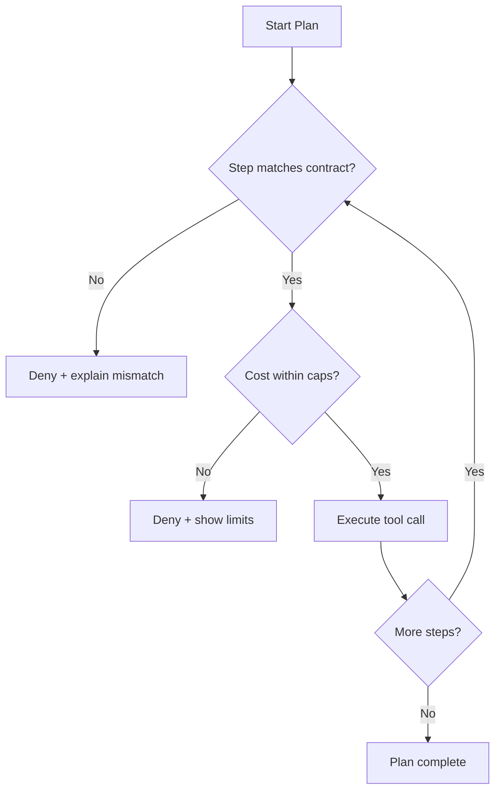

# ARIA’s Seven Controls — Plain-Language Overview

*A no-code guide for PMs: what each control is, why it matters, and how it works*

---

### Big picture

ARIA wraps every agent action in seven, purpose-built safeguards. Each control solves a different failure mode (privacy, drift, tool changes, overspend, audit gaps). They’re lightweight, standards-aligned, and designed to work together without changing your tools or identity systems.

```mermaid
flowchart LR
    A[Agent] --> G[ARIA Gateway]
    subgraph Checks (in this order)
      UB[1. User-Bound Identity]
      CAP[2. Capability Proof]
      PLAN[3. Plan Contract]
      CTX[4. Context Binding]
      ATT[5. Tool Schema Attestation]
      BDNA[6. Behavioral DNA]
    end
    G --> UB --> CAP --> PLAN --> CTX --> ATT --> BDNA --> P[PDP (AuthZEN boolean)]
    P -- allow --> T[Tool/API]
    G --> R[7. Receipt Chain (signed)]
```

---

## 1) User-Bound Agent Identities

**One agent instance = one person. Always.**

* **What it is**
  Every agent instance is tied to a single end user with a tamper-proof ID. If the agent is “for Alice,” it cannot see or act as Bob.

* **Why it matters**
  Prevents cross-user data leakage and “who did this?” confusion. Keeps privacy and compliance simple.

* **How it works (plain)**
  Think of a valet ticket that only works for your car. The agent presents a ticket that proves who it’s acting for; ARIA refuses the call if the ticket and user don’t match.

* **PM levers**
  Decide the scope: per person, per tenant, or per project—so analytics & budgets roll up cleanly.

* **Signals to track**
  Denials for binding violations (should trend to near-zero after rollout).

---

## 2) Tool Schema Attestation

**Only call tools that match the version you approved.**

* **What it is**
  ARIA checks that the tool/API being called matches a known, signed description (version + schema hash).

* **Why it matters**
  Vendors and internal teams ship changes. A silent parameter change can break flows or loosen constraints.

* **How it works (plain)**
  Like boarding the right flight: ARIA checks both the flight number and gate. If the tool’s “ticket” (its schema) changed, the call is blocked until you accept the new version.

* **PM levers**
  Define rollout windows (e.g., allow previous version for 4 hours). Choose who can approve new versions.

* **Signals to track**
  “Attestation mismatch” denials by tool/version. Time-to-accept new versions.

---

## 3) Zero-Knowledge Capability Proofs

**Show you can do *this* action without revealing *all* you can do.**

* **What it is**
  Agents prove they hold a specific permission (e.g., “refund.issue”) without listing their entire permission set.

* **Why it matters**
  Least-privilege by default, smaller tokens, and less sensitive metadata floating around.

* **How it works (plain)**
  Like showing one stamp from a full stamp book. The agent reveals just the stamp needed for this action, not the whole book.

* **PM levers**
  Define the capability catalog and naming (consistent, human-readable). Map tools → capabilities.

* **Signals to track**
  Proof failures (usually mis-mapped capability names), token size trends.

---

## 4) Plan Contracts (Spend Guard included)

**Pre-approve the steps, inputs, and budgets—then enforce them.**

* **What it is**
  A short, signed checklist: which steps an agent may take, in what order/parallel, with parameter fingerprints and per-step/total budgets.

* **Why it matters**
  Eliminates “off-script” behavior and surprise spend. You know the maximum exposure before anything runs.

* **How it works (plain)**
  Like a pre-authorized purchase order. If a step, parameter, or cost doesn’t match the contract, ARIA denies the call before the tool sees it.

* **PM levers**
  Provide plan templates (refund flow, booking flow, provisioning flow). Set defaults for per-step caps and total budget.

* **Signals to track**
  Denials by reason (off-script, step cap exceeded, total budget exceeded), remaining budget, burn rate.



---

## 5) Context-Root Binding

**Lock the agent’s decision to the exact inputs you trust.**

* **What it is**
  ARIA fingerprints the trusted context (request, system instructions, prior tool outputs) and ties each decision to that fingerprint.

* **Why it matters**
  Prevents prompt-injection and “someone changed the instructions mid-flight” attacks. Makes investigations straightforward.

* **How it works (plain)**
  Like sealing a document packet with a wax stamp. If anything inside changes, the stamp no longer matches and ARIA refuses to proceed.

* **PM levers**
  Decide which context elements are “trusted” (e.g., system prompts, policy text, approved knowledge sources).

* **Signals to track**
  Context mismatch denials; top sources of untrusted context.

---

## 6) Behavioral DNA (BDNA) Monitoring

**Spot unusual agent behavior before it causes damage.**

* **What it is**
  ARIA builds a baseline of how each agent usually behaves (sequence, timing, tool mix) and scores drift from that baseline.

* **Why it matters**
  Compromised or misconfigured agents act differently. Early drift is an early warning.

* **How it works (plain)**
  Like fraud detection on a credit card: if patterns deviate (new tools, odd timing, unusual volumes), ARIA can deny or ask for re-authorization.

* **PM levers**
  Start in “observe” mode, then enforce above a drift threshold. Decide escalation paths (alert vs. block vs. require fresh plan).

* **Signals to track**
  Drift score distribution by agent/tool; enforcement rate; time-to-baseline for new agents.

---

## 7) Intent Receipts (Receipt Chains)

**Every decision is documented and tamper-evident.**

* **What it is**
  Each allow/deny creates a signed receipt with what was attempted, under which plan and context, and why it was allowed or stopped—linked together in a chain.

* **Why it matters**
  Instant, trustworthy audit; easier incident response; clean evidence for compliance and chargebacks.

* **How it works (plain)**
  Like numbered, sealed pages in a ledger—remove or edit one and the page numbers break. The chain proves completeness.

* **PM levers**
  Decide where receipts go (SIEM, data lake, finance system), and the retention policy.

* **Signals to track**
  Receipt volume, denial reasons, reconciliation with finance/FinOps.

---

## How the seven controls reinforce each other

* **Identity (1)** guarantees *who* the agent is for.
* **Capabilities (2)** guarantee *what* it’s allowed to do.
* **Plan (3)** guarantees *how and how much* it can do.
* **Context (4)** guarantees *why* the decision is valid (the inputs).
* **Attestation (5)** guarantees *which tool* and *which version* you’re calling.
* **BDNA (6)** watches *how it behaves over time*.
* **Receipts (7)** prove *what actually happened*.

If any piece doesn’t match, ARIA fails closed before the tool call.

---

## What to spec for v1 (PM checklist)

* Clear capability names and mapping to tools.
* Plan templates per top workflows, with default caps.
* Rollout window for new tool versions (e.g., 4 hours).
* BDNA initial “observe” thresholds and alerting.
* Receipt destinations and required fields for audit/FinOps.
* KPIs: deny rate by reason, budget overrun attempts prevented, time-to-approve new tool versions, drift incidents, audit time saved.

---

## Who benefits and how

* **CIO/CISO**: isolation, integrity, and provable control without slowing delivery.
* **CFO/FinOps**: hard spend limits and defensible evidence.
* **Platform/AI teams**: ship agents faster with reusable guardrails instead of bespoke checks per tool.
* **Compliance/Legal**: instant, tamper-evident trail for any question.

> **Bottom line:** These seven controls make agent operations predictable, private, and provable—so you can scale agents with confidence, not anxiety.
