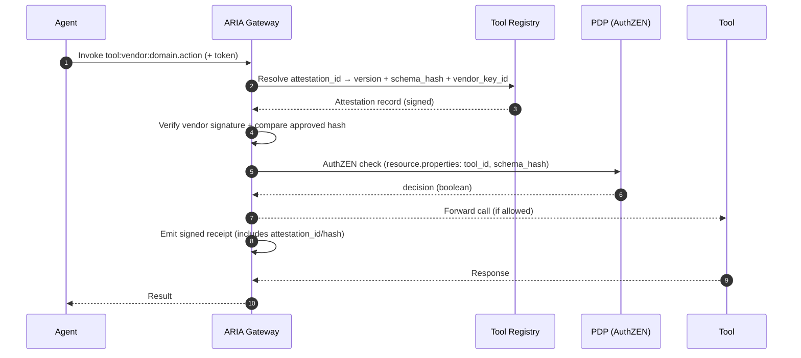
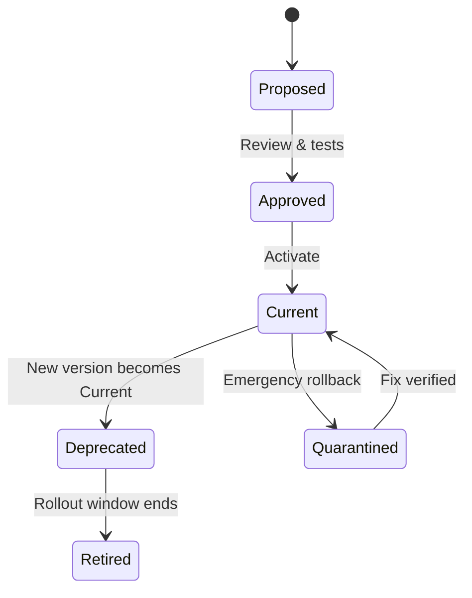
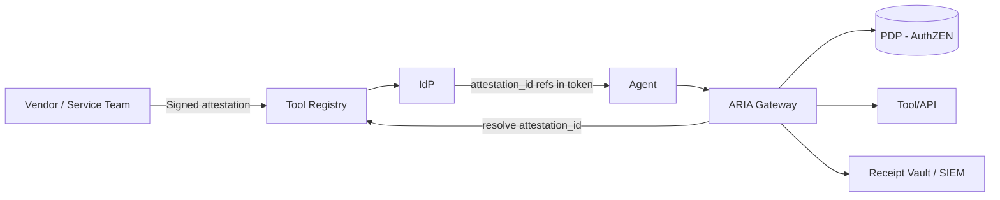

# Tool Schema Attestation — Deep Intro & How-It-Works (for PMs)

## What it is (in one line)

A cryptographic “truth stamp” for every tool/API your agents call. If the live tool doesn’t match the version you approved, the call is blocked *before* money is spent or data is touched.

---

## Why CIOs and PMs care

**Spending control & change risk**

* Silent API changes (a parameter default, a new required field, a pricing toggle) can spike spend or break flows.
* Attestation turns “we hope nothing changed” into “we refuse to run on unapproved changes.”

**Operational resilience**

* You’ll know exactly *which* version each call used, and you can roll forward/back safely with a defined window.

**Compliance & audit**

* Every decision is tied to a signed, vendor-keyed record—easy to prove what you allowed and when.

---

## Plain-language definition

A **tool schema attestation** is a signed record that says:

* **Tool identity:** `tool:<vendor>:<domain>.<action>` (e.g., `tool:stripe:payment.refund`).
* **Version & hash:** canonical description of inputs, outputs, constraints, and pricing metadata (hashed).
* **Signature:** created with the vendor’s private key; verified with their published key.
* **Lifecycle:** issued\_at / expires\_at, previous\_version pointer, rollout guidance.

ARIA will only execute a tool call when the **attested hash** equals the **approved hash** for that version (or an explicitly allowed previous version during a short rollout window).

---

## What “schema” actually covers (so we catch real risk)

* **Request/response shape** (fields, types, required/optional).
* **Constraints** (min/max amounts, enum values, formatting, units).
* **Behavioral flags** (idempotent?, retries allowed?, side-effects category).
* **Pricing metadata** (cost/call, cost/unit, billable dimensions) for FinOps visibility.
* **Rate/quotas** (documented ceilings included for sanity checks).
* **Security hooks** (DPoP required? mTLS? tenant headers?).

> If any of these change, the hash changes. If the hash changes without approval, **ARIA fails closed.**

---

## End-to-end flow (at a glance)



---

## Enforcement logic (decision tree)

```mermaid
flowchart TD
    A[Start] --> B{Attestation ref present?}
    B -- No --> X[Deny • Missing attestation]
    B -- Yes --> C{Vendor signature valid?}
    C -- No --> X1[Deny • Invalid signature]
    C -- Yes --> D{Hash == Approved?}
    D -- No --> E{Within rollout window<br/>(prev version allowed)?}
    E -- No --> X2[Deny • Unapproved change]
    E -- Yes --> F[Allow • Flag owners for review]
    D -- Yes --> G{Attestation expired?}
    G -- Yes --> X3[Deny • Expired attestation]
    G -- No --> H[Proceed → PDP → Tool]
```

---

## Version lifecycle (so upgrades don’t break prod)



* **Proposed**: New attestation arrives (vendor or internal publisher).
* **Approved**: Security/PM sign-off; policies generated.
* **Current**: ARIA enforces *this* hash.
* **Deprecated**: Temporarily allow previous version for safe cutover (short window).
* **Quarantined**: Fast stop if issues appear; traffic reverts to last safe version.

---

## How this protects spend (and works with ARIA’s other controls)

1. **Price/limit drift is visible**
   Pricing metadata changes? Hash changes → calls stop (or route to review if you enable a safe fallback).

2. **Pairs with Plan Contracts & Budgets**
   Even with correct schema, calls still must fit a pre-approved plan and budget caps.
   *(Attestation = tool truth; Plan = *how* it’s used; Budget = *how much* it can cost.)*

3. **Auditable receipts**
   Every allow/deny includes `attestation_id`, `schema_hash`, and `tool_id`—ready for FinOps and compliance.

---

## How others try to solve this (and gaps)

* **Plain OpenAPI validation**: checks shape, but not **who attested** the shape or whether it’s **current + approved**.
* **Monitoring/alerts after deploy**: reactive; cost or data exposure may occur before alarms.
* **Manual release notes**: easy to miss, not machine-enforced, and rarely tied to runtime decisions.
* **Gateway “schema caching”**: often unsigned and lacks lifecycle controls (no rollout window, no quarantine).

**ARIA’s difference:** vendor-signed, version-pinned, policy-aware, and enforced *at call time* with clear rollback semantics.

---

## What PMs need to specify for v1

**Scope & sources**

* Which tools/apis require attestation on day one (payment, procurement, data export, provisioning)?
* Source of truth: vendor JWKS for signatures, or internal signing for your own services.

**Policies**

* Rollout window length (e.g., accept previous version for *N* hours).
* Quarantine rules (who gets paged, auto-revert yes/no).
* Expiration policy (force refresh of attestations at defined intervals).

**Data model**

* Minimum required schema sections (inputs/outputs, constraints, pricing, security hooks).
* Naming standard for tool IDs.

**Experience**

* What the deny message says to developers/agents.
* Where review tasks are created when a new version arrives (ticketing/inbox).
* Where receipts land (SIEM, data lake, FinOps).

**KPIs (no invented numbers—measure your own)**

* Attestation mismatch rate (by tool/version).
* Time-to-approve new versions.
* Incidents tied to tool changes (target = decreasing trend).
* % traffic on Current vs Deprecated (healthy funnel).

---

## Example lifecycle in practice (narrative)

1. Vendor ships `v2.1.0` of `tool:acme:billing.charge` and publishes a signed attestation.
2. Registry ingests it → **Proposed**.
3. PM/Sec review: see a new optional `currency` default. Approve with a 4-hour **rollout window**, mark **Current**.
4. During cutover, both `v2.0.3` (Deprecated) and `v2.1.0` (Current) are allowed.
5. If any mismatches appear, **Quarantine** instantly reverts to `v2.0.3` while owners investigate.
6. After the window, `v2.0.3` moves to **Retired**; ARIA blocks it thereafter.

---

## Visual: components & responsibilities



* **Vendor/Service Team**: publishes signed attestation with version/hash.
* **Registry**: stores attestation, tracks lifecycle & previous\_version.
* **IdP**: issues agent tokens with **references** to approved attestations (keeps tokens small).
* **ARIA Gateway**: enforces signature/hash/version; handles rollout/quarantine.
* **PDP**: gets tool\_id + schema\_hash in `resource.properties` and returns a boolean decision.
* **Audit**: receives signed receipts for every decision.

---

## Risks & mitigations

* **Vendor can’t sign yet** → Use an interim “proxy attestation” signed by your registry, flagged as higher risk; enforce strict rollout/quarantine.
* **Frequent minor bumps** → Auto-approve patches that don’t change constraints/pricing; still log and receipt them.
* **Performance concerns** → Cache attestations; verify signatures on change; include attestation references in tokens to avoid extra lookups.
* **Key rotation** → Track `vendor_key_id` in the attestation; support dual-published keys during rotation.

---

## Success criteria to align on

* 100% of high-risk tools covered by attestation.
* All agent calls include a resolvable `attestation_id`.
* Defined, enforced rollout windows and quarantine path.
* Receipts show `tool_id`, `schema_hash`, `attestation_id` for every decision.
* Measured reduction in change-related incidents and spend surprises.

---

**Bottom line:** Tool Schema Attestation turns API change risk into a governed, auditable process—so your agents only run on known-good versions, spend stays predictable, and audits stop being fire drills.
