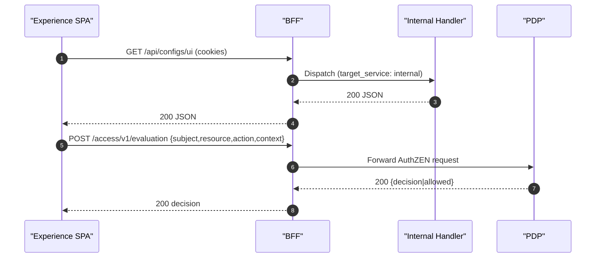

## Source of truth

- `ServiceConfigs/BFF/config/routes.yaml`: defines all public and internal endpoints, upstream targets, and auth requirements
- `ServiceConfigs/BFF/config/settings.yaml`: CORS, allowed origins, redirect origins, and other runtime settings

## Internal routes (target_service: internal)

- Internal endpoints are dispatched directly to FastAPI handlers (no HTTP loopback), preserving session context
- Keep `auth: session` on Experience internal endpoints so they remain cookie/session protected

## Required endpoints for Experience

- PDP:
  - `POST /access/v1/evaluation`
  - `POST /access/v1/evaluations`
- UI Config:
  - `GET /api/configs/ui` (JSON)
  - `GET /api/configs/stream` (SSE)
- Plugins:
  - `GET /api/plugins/manifests`
  - `GET /api/plugins/bundle`

## CORS and redirect origins

- Add `https://experience.ocg.labs.empowernow.ai` to `cors.allow_origins`
- Add `http://localhost:5177` to `cors.dev_origins`
- Add Experience host to `ALLOWED_REDIRECT_ORIGINS`

## Traefik expectations

- Experience SPA router excludes API/auth/stream/PDP routes to avoid intercepting API traffic
- Separate routers on the BFF service for Experience `Host()` that forward `/api/`, `/auth/`, `/access/v1/`, and stream paths to the BFF app

## Payload behavior for AuthZEN

- The BFF does not rewrite SPA AuthZEN payloads
- Minimal normalization only: provide a default `resource.id` for collection‑level checks when omitted

## Observability and troubleshooting

- Inspect logs for PDP forwards to verify payloads
- Common misconfigurations:
  - Experience origin missing from CORS → browser preflight failures
  - Routes missing or not `auth: session` → 404/401
  - ForwardAuth enabled for BFF API paths → cookies stripped (disable for these routers)
 - Headers to expect:
   - Allow‑list violation → `X-Allowlist-Violation: 1` (403)
   - Plugin quarantined → `X-Plugin-Quarantined: 1` (bundle/API/SSE blocked)
   - Response hygiene → `Vary: Cookie, X-Plugin-Id` on manifests/bundles

## Health checklist

- Internal routes load without validation errors
- CORS origins include Experience
- `/api/configs/ui` and `/api/plugins/manifests` return 200 with a valid session
- PDP responds 200 for allow and deny test cases through BFF

## Routing flows

## See also

- Experience → Authorization (AuthZEN): `../../experience/authorization-authzen`
- Experience → Plugin System: `../../experience/plugins`
- BFF → ForwardAuth and security model: `../explanation/security-model`

