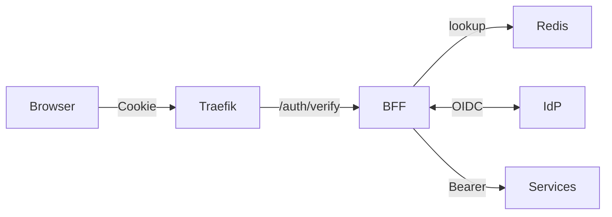

---
title: Architecture
---

The EmpowerNow BFF uses a hybrid‑edge pattern:

- Traefik handles routing, security headers, optional ForwardAuth, and rate limiting
- The BFF terminates OAuth (PKCE/PAR/DPoP), manages sessions and CSRF, and authorizes requests via the PDP
- Backend services receive proxied requests with the right auth context



Why this design

- Security: tokens never reach the browser; session validation happens at the edge
- Performance: 1ms session checks and PDP decision caching reduce latency
- Simplicity for SPAs: call `/api/**` on the same origin; no SDK token plumbing

Key configuration

- Traefik dynamic config: `CRUDService/traefik/dynamic.yml`
- BFF routes/config: `ServiceConfigs/BFF/config/routes.yaml`, `pdp.yaml`, `idps.yaml`

## How `/api/**` is routed

- Edge: Traefik router matches `PathPrefix(/api/*)` for SPA hosts and forwards to the BFF (ForwardAuth is disabled for these; the BFF handles auth and returns JSON 401/403 when needed).
- BFF: consults `routes.yaml` where `path` is the client path and `upstream_path` is the backend path (templated with `{path}` for wildcards).

Example

```text
Client: GET /api/myapp/items/42
BFF → routes.yaml: 
  path "/api/myapp/items/*" → target_service "my_service" (base_url http://my-service:8080)
  upstream_path "/items/{path}"
BFF → calls GET http://my-service:8080/items/42 (adds auth/context headers) → returns JSON
```

Headers contract (edge and downstream)

- ForwardAuth request → BFF: includes `Cookie` (session), may include `X-Forwarded-*` headers
- ForwardAuth response ← BFF: sets `X-Session-ID`, `X-Auth-Time`, and `X-Correlation-ID`; Traefik uses 200/401 to allow/deny
- Downstream from BFF to services:
  - Always includes `X-Correlation-ID`
  - Includes `X-Original-User` when ARN/subject is available
  - Adds `Authorization: Bearer ...` for service calls when required by the target
