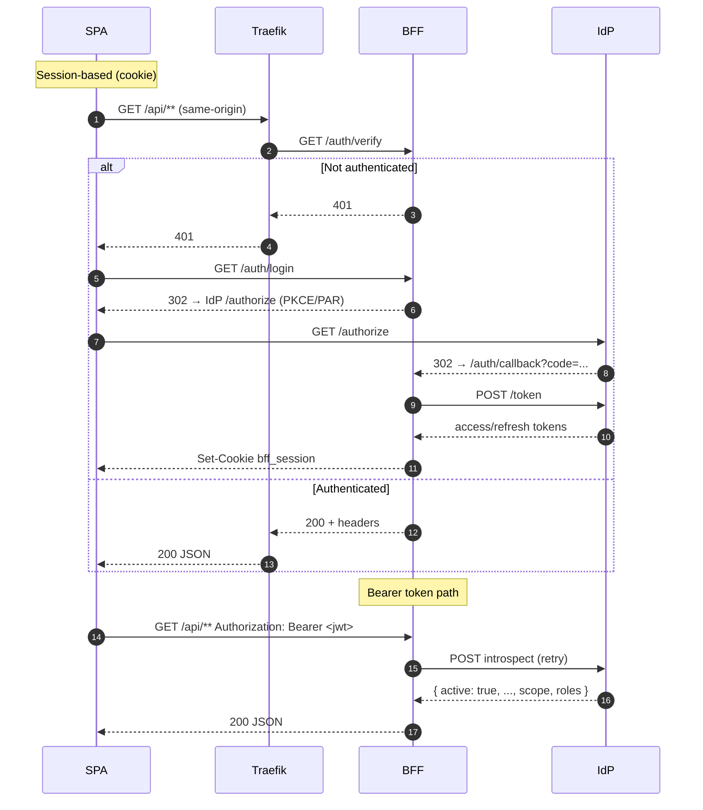

What we support (verified)

- Browser SPAs use a secure session with a single HttpOnly cookie (`bff_session`).
- Service/API callers can use bearer tokens; the BFF validates via IdP introspection when configured.
- IdP configuration is externalized in `ServiceConfigs/BFF/config/idps.yaml` (issuer, audience, JWKS/introspection URLs, client credentials, claims mapping).

Two flows in one system



Where it’s implemented

- Bearer validation is in `utils/auth.py` (`get_current_user`): decodes issuer from JWT, loads `idps.yaml`, retries `introspect_token`, builds `EnhancedTokenClaims` with normalized roles/permissions.
- Unique identity is represented as `auth:{entity_type}:{idp}:{subject}` (see `utils/arn.py` and `UniqueIdentity` in `utils/auth.py`).

Key behaviors

- Session path: tokens never reach the browser; Traefik calls `/auth/verify` (alias `/auth/forward`) to gate requests; BFF sets/clears `bff_session` and issues CSRF token for state‑changing calls.
- Bearer path: `HTTPBearer` extracts the token; we do unverified decode to read `iss`, then introspection with Basic auth using IdP client credentials; we normalize roles/permissions via claims mapping.

CSRF in SPAs (contract)

- Header: `X-CSRF-Token` (or query param `csrf` for GET logout flow)
- Cookie name: `_eid_csrf_v1` (readable by JS; HttpOnly=false)
- Required for: POST, PUT, DELETE, PATCH to BFF paths (safe methods like GET/HEAD/OPTIONS skip validation)
- Example fetch usage:
  ```ts
  await apiClient.post('/api/crud/execute', body, {
    headers: { 'X-CSRF-Token': getCookie('_eid_csrf_v1') }
  });
  ```

Cookies

- Session cookie name: `bff_session` (HttpOnly, Secure, SameSite=Lax, domain per env)
- CSRF cookie name: `_eid_csrf_v1` (readable by JS, SameSite=Strict/Lax per config)
- Domain guidance: set `BFF_COOKIE_DOMAIN` to your apex (e.g., `.ocg.labs.empowernow.ai`) to enable SSO across SPAs

Callback origins

- Dynamic callback can echo the request origin when `BFF_DYNAMIC_CALLBACK=true`; otherwise `BFF_CALLBACK_URL` is used. In dev, set `VITE_BFF_BASE_URL` and use same‑origin where possible.

Security notes

- Claims mapping supports sources from `roles`, `groups`, Keycloak `resource_access` client roles, and space‑delimited `scope`. See `claims_mapping` in `idps.yaml`.
- Retries/backoff for introspection use `tenacity` (transient errors won’t result in immediate 401s).


