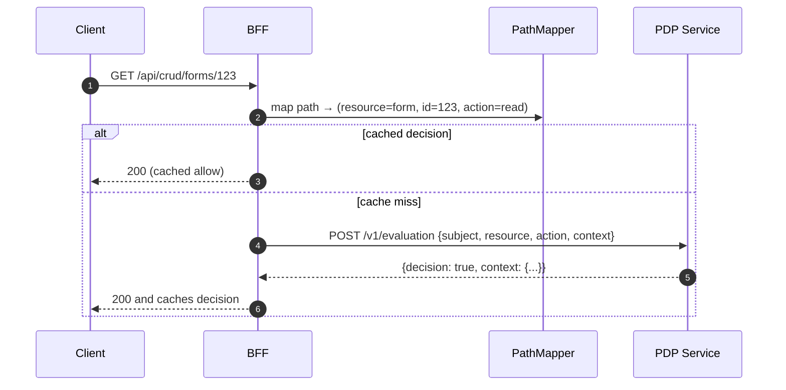

What the BFF authorizes

- Protects API calls using a Policy Decision Point (PDP) following AuthZEN semantics
- Maps incoming requests to resource/action using config rules
- Caches allow/deny decisions with separate TTLs to reduce latency and load

High‑level flow

Where it’s implemented

- Mapping: `services/path_mapper.py` reads `endpoint_map` from `ServiceConfigs/BFF/config/pdp.yaml`, compiles regex rules, and extracts URL params and JSON body fields (via simple `$.field` JSONPath) into `props`.
- Decision: `services/pdp_client.py` builds an AuthZEN request, retrieves a bearer token, calls PDP, handles errors, and caches results in Redis when configured.
- Enforcement: `core/permissions.py` provides dependencies (`has_permission`, `requires_auth`) and helpers to assemble the authorization context (headers, query, body subset, roles/permissions, correlation ID).

Caching

- Allow and deny decisions are cached with separate TTLs from `pdp.yaml` (`cache.ttl_allow`, `cache.ttl_deny`).
- Keys include subject, subject type, resource type/ID, and action; special characters are base64‑encoded.

