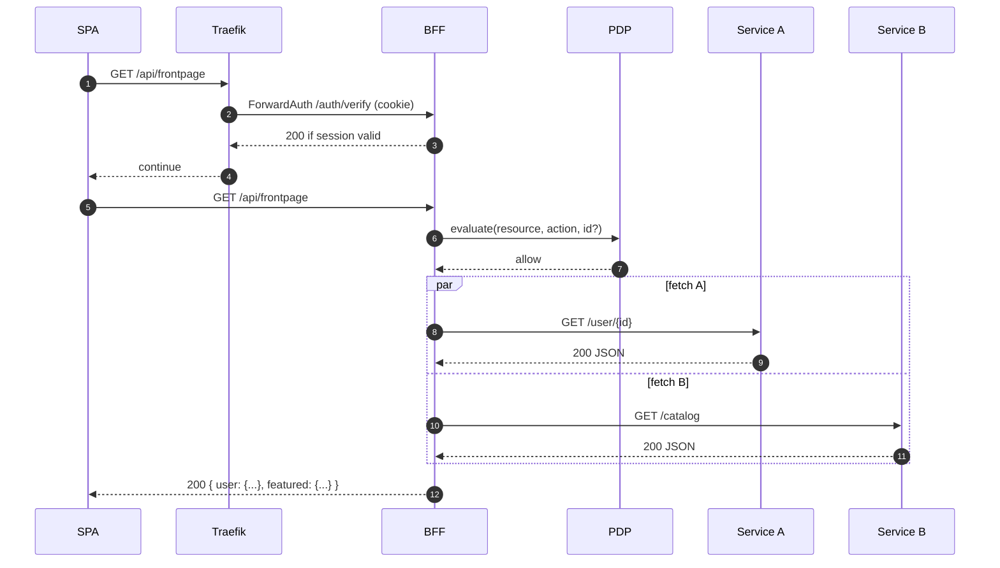

## The problem a BFF solves

Modern UIs (web SPAs, mobile, desktop) often need to call multiple services with different data shapes, error models, and auth semantics. Typical pain points:

- Chattiness and over/under‑fetching: multiple round‑trips and large, general‑purpose payloads per screen
- Inconsistent security: tokens in the browser, per‑service CORS, varying authZ policies
- Coupling and coordination overhead: backend teams become a bottleneck shaping responses for multiple UI clients

## Our approach

EmpowerNow’s BFF is an application‑aware gateway that sits between UIs and services. It provides a secure session boundary, centralized authorization (PDP), pragmatic routing, and optional composition when needed.

- Secure session boundary: OAuth/OIDC terminates server‑side; the browser only holds an HttpOnly session cookie (+ CSRF)
- Central authorization: per‑request PDP decisions mapped from path/method/body via `pdp.yaml`
- Pragmatic routing: canonical `/api/<app>/**` front door defined in `routes.yaml`
- Composition when needed: add custom BFF endpoints to aggregate, reshape, or validate data across services

What this is not: a replacement for global edge concerns (WAF/DDOS, productization/monetization) or a mandate to move all domain logic into the BFF.

## How it works (at a glance)

- SPA calls same‑origin `/api/**`
- Edge (Traefik) optionally invokes `/auth/verify` (ForwardAuth)
- BFF authenticates the session, evaluates PDP (if configured), then proxies to upstream with per‑service tokens
- For custom endpoints, the BFF can call multiple upstreams and shape a single response



## Minimal composition example (custom endpoint)

When you need to aggregate data from multiple services into one response, create a small BFF handler. Example shape only (your codebase contains the building blocks; see links below):

```python
# app/endpoints/frontpage.py
from typing import Dict, Any
from fastapi import APIRouter, Depends

router = APIRouter()

@router.get("/api/frontpage")
def get_frontpage(current_session = Depends(require_session)) -> Dict[str, Any]:
    user = users_client.get_user(current_session.user_id)
    catalog = catalog_client.get_featured()
    return {
        "user": {
            "id": user.id,
            "name": user.name,
            "email": user.email,
        },
        "featured": catalog.featured,
    }
```

Route and authorization are still governed by the same configuration surfaces:

- `routes.yaml`: define `/api/frontpage` with `auth: session`
- `pdp.yaml`: map `/api/frontpage` (GET) to your resource/action so PDP is evaluated consistently

## Configuring a BFF

- Routing and security: see `Reference → YAML proxy (routes.yaml)`
- PDP mapping: see `Reference → PDP mapping`
- SPA wiring and DX: see `Tutorials → React SPA + BFF — Golden Path`
- Admin setup (login → callback → verify): see `Tutorials → Admin Quickstart`

## When to use this pattern

Use a BFF when you want:

- One secure front door for a UI: session cookie + CSRF, no tokens in the browser
- Centralized, per‑endpoint authorization and audit
- Stable client paths (`/api/<app>/**`) decoupled from service internals
- Occasional composition/reshaping without pushing that burden to every service

Prefer direct, single‑service proxy routes (no custom code) when:

- The UI can consume a single upstream as‑is with stable latency and payloads
- You don’t need cross‑service composition for the user journey

Not a fit:

- Pure machine‑to‑machine traffic without a browser
- Global edge responsibilities (WAF, bot protection, API monetization) — keep them at the edge

## See also

- Explanations:
  - BFF for SPAs — How It Works
  - BFF Gateway Architecture (scenarios & comparison)
  - Executive Overview
- Reference:
  - YAML proxy (routes.yaml)
  - PDP mapping (pdp.yaml)
- Tutorials:
  - Admin Quickstart
  - React SPA + BFF — Golden Path


