Who this is for

- React SPA developers new to the Backend‑for‑Frontend (BFF) model.

What the BFF does

- Terminates OAuth in the backend; the browser never sees access tokens
- Issues a secure session cookie; SPAs call the BFF at `/api/...`
- Enforces authZ per request via PDP (AuthZEN) using `pdp.yaml` + path mapping
- Proxies requests to backend services defined in `routes.yaml`

End‑to‑end flow

```mermaid
sequenceDiagram
  autonumber
  participant UI as React SPA
  participant BFF
  participant IdP
  participant PDP
  participant SVC as Backend Services
  rect rgb(30,30,50)
    note over UI,BFF: Login
    UI->>BFF: GET /auth/login
    BFF->>IdP: Redirect to authorize
    IdP-->>BFF: Callback with code
    BFF->>IdP: Token exchange (server-side)
    BFF-->>UI: Set session cookie (httpOnly, secure)
  end
  rect rgb(20,40,60)
    note over UI,BFF: API call
    UI->>BFF: GET /api/crud/forms/123
    BFF->>PDP: evaluate(subject, resource=form, id=123, action=read)
    alt decision cached
      BFF-->>UI: 200 JSON
    else cache miss
      PDP-->>BFF: allow/deny
      BFF->>SVC: GET /forms/123
      SVC-->>BFF: 200 JSON
      BFF-->>UI: 200 JSON
    end
  end
```



### How SPA-local paths route

- Think of `/api` as the BFF’s front door. The SPA never talks directly to backend services.
- Traefik routes `/api/**` to the BFF. The BFF reads `routes.yaml` and translates the client path to a backend path.

Example translation

```text
GET /api/crud/forms/123  →  BFF → GET http://crud_service/forms/123
```

In dev, `VITE_BFF_BASE_URL` can be an absolute BFF origin; in prod, it’s usually same‑origin `/api`.

Automation Studio (Visual Designer) specifics

- Front end for CRUDService.
- SPA calls:
  - `/api/crud/...` (CRUD + SSE)
  - `/access/v1/evaluation` and `/access/v1/evaluations` (PDP, preserved path to `pdp_service`)
- Traefik forwards to the BFF; BFF proxies per `routes.yaml`.
- Include cookies: fetch `credentials: 'include'`, axios `withCredentials: true`.

See also

- Reference → `SPA PDP usage` for which SPAs call the PDP, where, and with what payloads.

Where things are configured

- App API surface: `ServiceConfigs/BFF/config/routes.yaml`
- PDP mapping + performance: `ServiceConfigs/BFF/config/pdp.yaml`
- SPA wiring: `src/main.tsx` uses `AuthProvider` and `setBaseUrl` from `@empowernow/bff-auth-react`

Key properties for SPAs

- No Authorization header needed for same‑origin calls; auth is cookie‑based
- Use canonical `/api/...` paths; BFF routes to services and checks permissions
- 401 = not logged in; 403 = PDP denied


