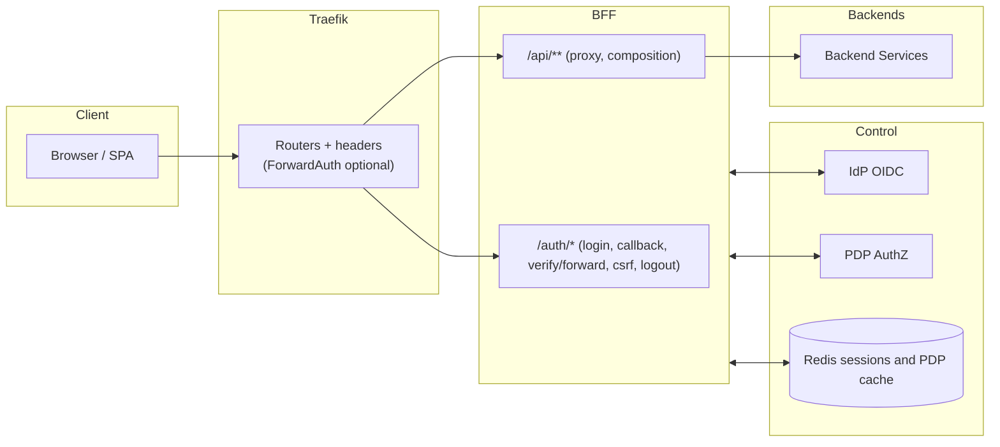
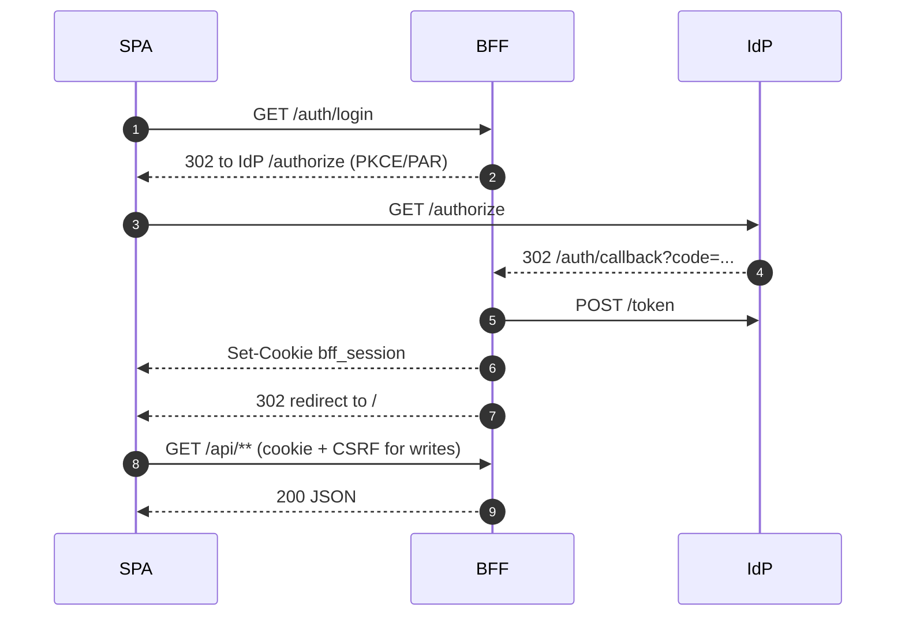
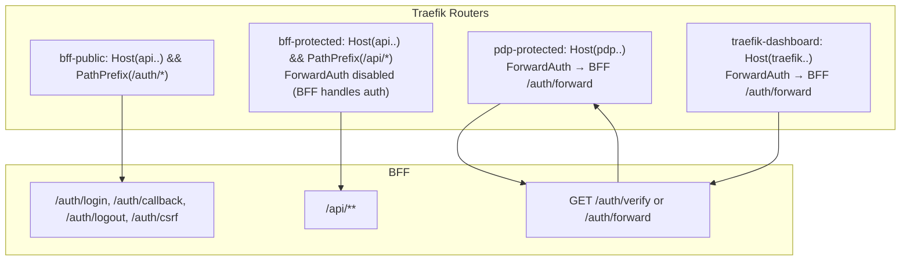
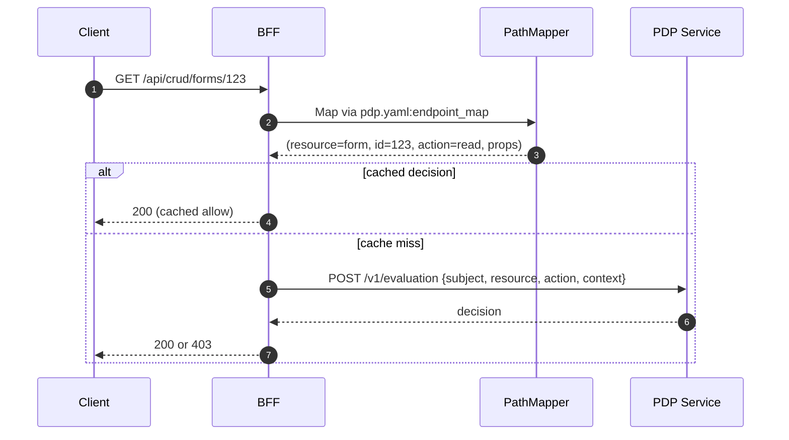
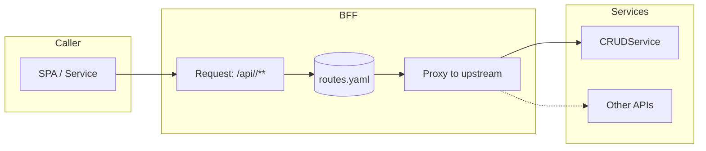
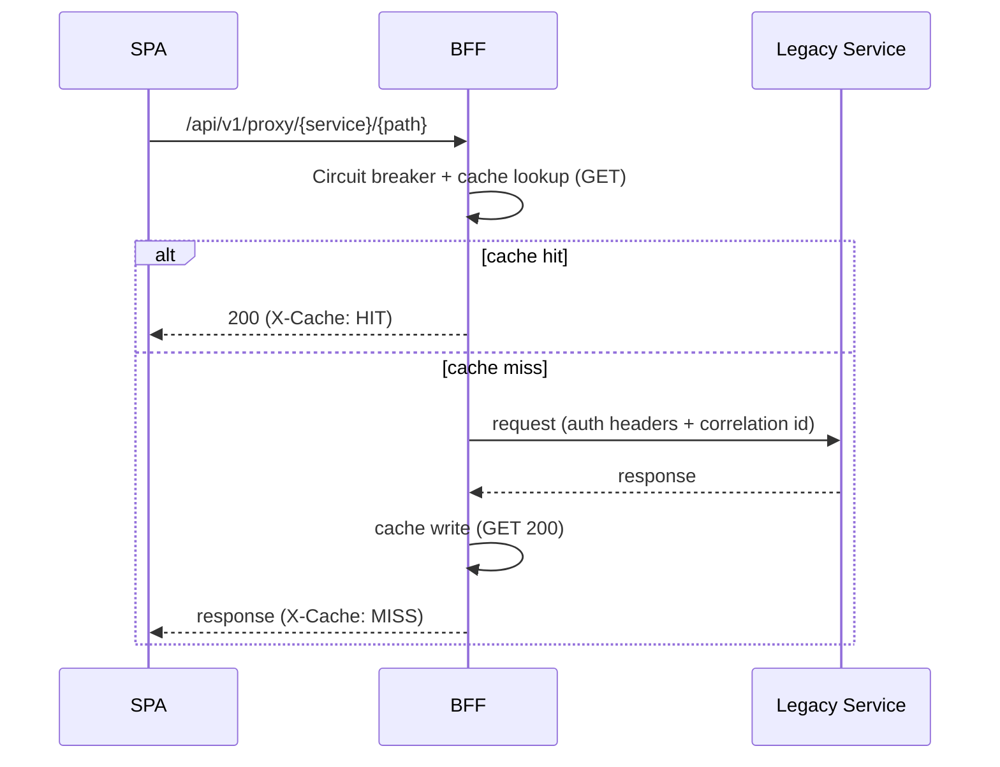
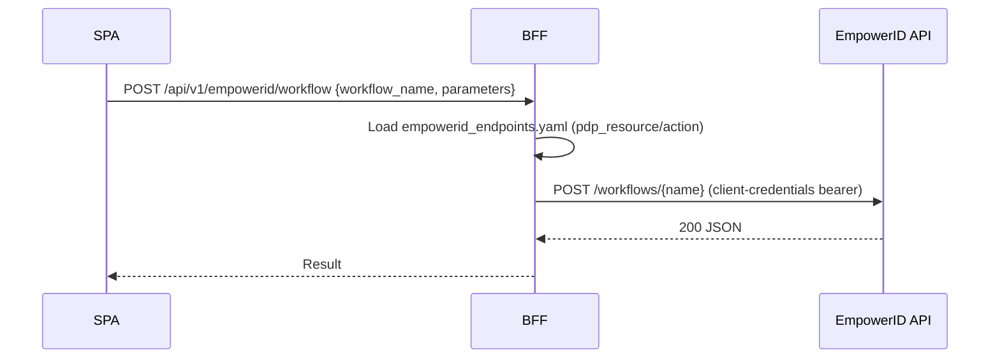
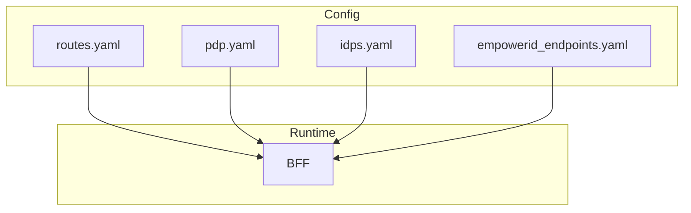
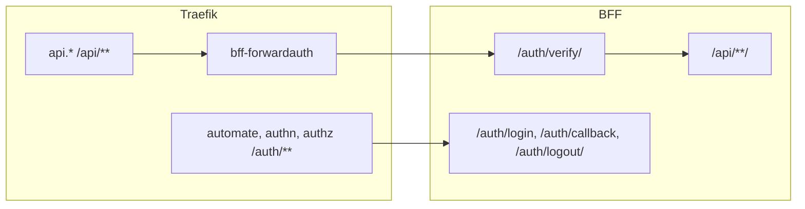

Use this visual guide to explain the BFF to any audience in minutes. Each diagram is presentable as a slide; keep this page open during your talk.

## High‑level architecture



## Golden Path (SPA login + API calls)



## How SPA-local "/api" calls reach the BFF

- SPA calls same-origin paths like `/api/<app>/...`.
- Traefik matches `PathPrefix(/api/*)` and routes to the BFF service.
- The BFF looks up the request in `routes.yaml` (`path` = client path, `upstream_path` = backend path) and proxies to the target service, injecting auth/context headers.

Example

```text
Client → GET /api/myapp/items/123
Traefik → forwards to BFF (rule: PathPrefix(/api/))
BFF → routes.yaml: path "/api/myapp/items/*" → target_service "my_service", upstream_path "/items/{path}"
BFF → calls GET http://my-service:8080/items/123 (+ Authorization, X-Correlation-ID)
BFF → returns JSON to SPA
```

Mini routing diagram

```mermaid
flowchart LR
  UI[SPA] -->|GET /api/myapp/items/123 (cookie)| TR[Traefik]
  TR --> BFF
  subgraph BFF
    R[(routes.yaml)]
  end
  BFF -->|GET /items/123 + Authorization + X-Correlation-ID| SVC[my_service]
  SVC --> BFF --> UI
```

See also: `Reference / YAML proxy (routes.yaml)` and `Reference / Traefik ForwardAuth`.

### Automation Studio (Visual Designer) path examples

- CRUD and SSE: SPA calls `/api/crud/...` → Traefik → BFF → `crud_service`
- PDP (AuthZEN): SPA calls `/access/v1/evaluation` and `/access/v1/evaluations` → Traefik → BFF → `pdp_service` (path preserved)
- Cookies/credentials: fetch `credentials: 'include'`, axios `withCredentials: true`; EventSource sends cookies (use `{ withCredentials: true }` for cross-origin dev)

See also: `Reference / SPA PDP usage` for a per‑SPA inventory of PDP calls and payloads.

## Routing layers (where ForwardAuth applies)



## PDP mapping and decision flow



## YAML proxy (routes.yaml) model

What it defines: `id`, `path`, `target_service`, `upstream_path`, `methods`, `auth` (`session|none`), `streaming`, `preserve_path`.



## Legacy services proxy



## EmpowerID direct endpoints



Endpoints quick list:

- POST `/api/v1/empowerid/workflow`
- POST `/api/v1/empowerid/webui`
- GET `/api/v1/empowerid/workflows`
- GET `/api/v1/empowerid/webui/types`
- GET `/api/v1/empowerid/webui/types/{type}/methods`

## Config sources at a glance



## Local/dev stack (compose)



---

### Presenter notes (grab-and-go)

- Start with the architecture slide and emphasize: tokens stay server‑side; SPAs use cookies.
- Golden Path: PKCE/PAR redirect; cookie set; CSRF required for writes.
- Routing: ForwardAuth only on edge hosts like PDP and dashboard; disabled for same‑origin `/api/**`.
- PDP: show how a path maps to resource/action; caching reduces latency.
- routes.yaml: canonical `/api/<app>/**` families; use custom endpoints for composition/transformations.
- Legacy proxy: bridge with circuit breaker and cache; not for new greenfield.
- EmpowerID: catalog‑driven; workflows via client‑credentials; WebUI per catalog.


