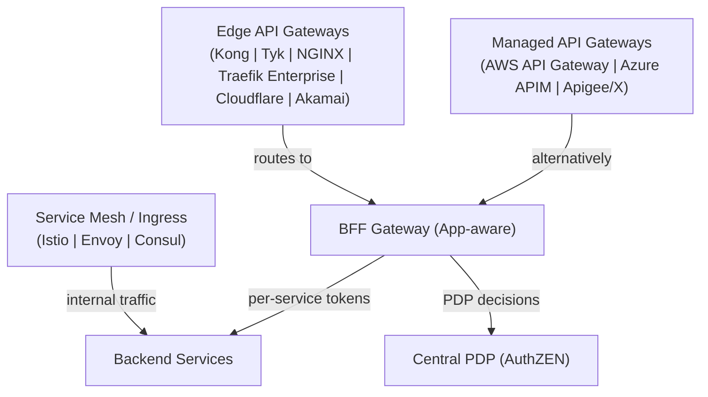
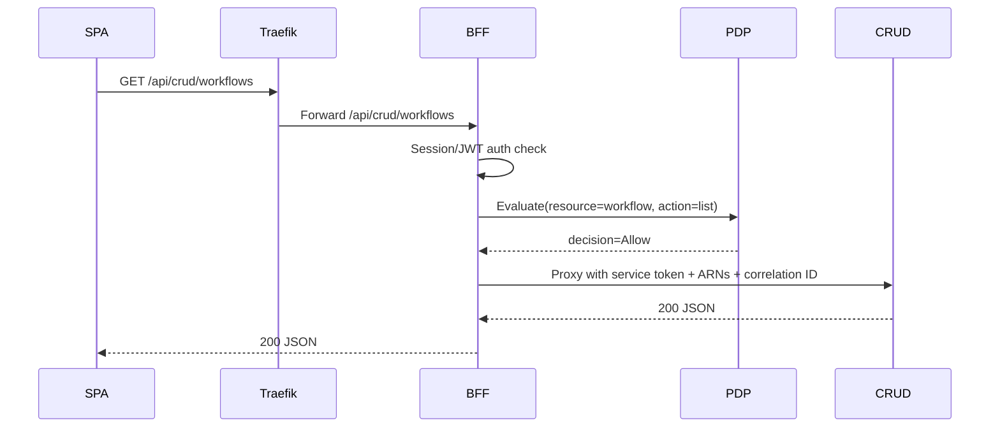
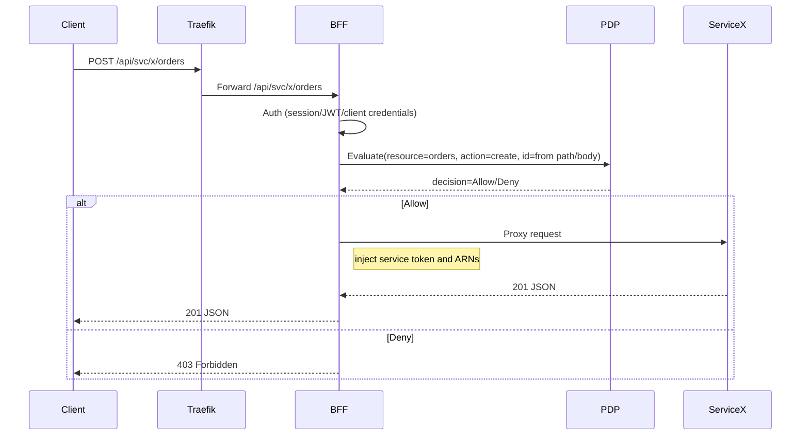
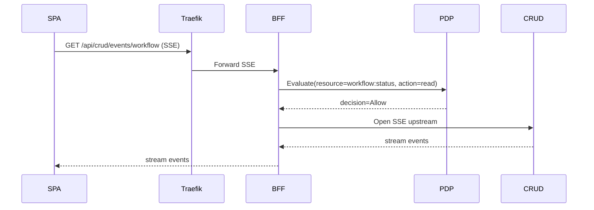

### BFF Gateway Architecture: Scenarios, Capabilities, and Comparison

#### Executive summary
- The BFF operates as an application-aware API gateway behind Traefik. It handles session-based auth, per-service token brokering, PDP authorization with rich business context, SSE streaming checks, and Kafka-structured business audit.
- Traefik fronts TLS/routing; the BFF provides domain-aware policy enforcement and orchestration. The same model supports external callers (BFF as the public API endpoint) and SPA same-origin calls.

---

### Who it's for

- **Platform/Infrastructure engineers**: need an application-aware policy layer behind Traefik/Kong with observability and central PDP integration.
- **Backend service owners**: want consistent auth/authz, per-service token brokering, canonical ARNs/correlation headers, and audit out-of-the-box.
- **Frontend/SPA teams**: same-origin API with session UX (return_to), SSE-aware authorization, and zero bespoke auth code per page.
- **Security/Identity teams**: centralized PDP enforcement with business context and structured Kafka audit to verify policy outcomes.

### When to use the BFF

- **Domain-aware authorization is required**: decisions depend on resource/action/id extracted from path/body, not only on generic scopes.
- **Per-service token brokering**: user session → audience/scope-mapped tokens per upstream service.
- **SSE/streaming authorization**: PDP pre-check before opening long-lived connections.
- **Enterprise observability**: Prometheus metrics plus standardized Kafka business events (`AUTHZ_DECISION`).
- **Config-first, code-centric extensions**: `routes.yaml`/`pdp.yaml` with the option to extend behavior in code when needed.

Not a fit for:
- **Global edge concerns**: WAF/bot/DDOS, geo routing/CDN, API productization/monetization – keep these at the edge (Traefik/Kong/Cloudflare/Akamai).
- **Non-HTTP multi-protocol** or global control planes – use specialized gateways/meshes.

### Quickstart

1) Define a route with session/bearer auth and PDP on:
```yaml
- id: "crud-execute"
  path: "/api/crud/execute"
  target_service: "crud_service"
  upstream_path: "/execute"
  methods: ["POST"]
  auth: "session"   # or "bearer" for machine-to-machine
  authz: "pdp"
```

2) Map the endpoint to policy inputs in `pdp.yaml`:
```yaml
endpoint_map:
  /api/crud/execute:
    POST:
      resource: "crud:command"
      action: "execute"
      props:
        system: "$.system"
        object_type: "$.object_type"
        command: "$.action"
        SystemIdentifier: "$.params.SystemIdentifier"
        id: "$.params.id"
```

3) Ensure PDP is globally enabled:
```python
authz_enabled: bool = True
```

4) Deploy and test:
- Send a POST to `/api/crud/execute` with a valid session/JWT; expect 200 from upstream if PDP allows, or 403 if denied.
- For SSE routes, add `authz: pdp` and a corresponding `endpoint_map`; the BFF denies early when unauthorized.

### Market landscape overview

#### What API gateways solve (common challenges)
- Security and access: TLS/mTLS termination, OAuth2/OIDC, WAF, rate limiting, IP reputation.
- Traffic management: routing, retries, timeouts, canary/blue‑green, global anycast/CDN edge.
- API productization: developer portals, keys/quotas/monetization, versioning and lifecycle.
- Observability: metrics/tracing/logging, audit, anomaly detection.
- Transformation and mediation: headers/body transformation, protocol bridging, schema validation.

#### Vendor categories (representative examples)
- Managed cloud gateways: AWS API Gateway / API GW + ALB, Azure API Management, Google Apigee/X.
- Self‑managed/commercial & OSS: Kong (Gateway/Enterprise), Tyk, NGINX, Traefik Enterprise, WSO2.
- Security/perimeter/CDN: Cloudflare, Akamai (incl. WAF/bot protection), F5.
- Integration/iPaaS platforms: MuleSoft/Anypoint, Boomi, SnapLogic (API mgmt modules).

#### Architectural approaches and flavors
- Edge API gateways (L7 at perimeter) focusing on scale, security, traffic control.
- Internal/BFF gateways (app‑aware) close to services/UI, adding session UX, business context.
- Service mesh & gateways: Istio/Envoy/Consul for east‑west traffic; ingress/egress gateways.
- Policy engines: OPA/Rego (embedded/sidecar) vs. centralized PDP (AuthZEN/XACML/ABAC).
- Extension models: plugin‑based (Lua/Go/JS), config‑driven (YAML/CRDs), or code‑centric (BFF).

#### How our BFF aligns and differs
- Aligns with gateways on: L7 routing/proxy, OAuth2/OIDC authentication, PDP‑backed authorization, metrics and logging.
- Differs by being application‑aware:
  - Session UX and return_to handling, SSE‑aware authorization.
  - Per‑service token brokering from a user session; audience/scope mapping.
  - Business‑context PDP via `endpoint_map` (resource/action/id from path/body), not just generic edge checks.
  - Kafka‑structured business audit (`AUTHZ_DECISION` with ARNs, route_id, correlation) and Prometheus metrics tailored to decisions/latency.
  - First‑party plugin allow‑listing and domain‑specific headers (canonical ARNs) propagation.
- What we intentionally do not replace: WAF/bot protection at global edge, multi‑tenant API productization (dev portal/monetization), TCP/UDP L4, global control planes—delegate to Traefik/Kong/Cloudflare/Akamai as needed.

#### Where they fit together (reference map)


---

### Supported scenarios

#### SPA same-origin API (current)
- Flow: SPA → /api/* → Traefik → BFF → internal service
- Features: session auth, PDP per-route (authz: pdp), per-service tokens, SSE pre-checks, correlation, ARNs, Kafka audit, Prometheus metrics



#### External API endpoint (BFF as API)
- Flow: External Client → api.example.com → Traefik → BFF → upstreams
- Additions: edge TLS/WAF/rate-limit at Traefik; BFF remains policy and orchestration engine



#### SSE/Streaming
- PDP enforced before opening stream; deny early if unauthorized. Origin checks applied.



---

### Capabilities by scenario

- **Authentication**
  - Session-based and JWT; route-level auth types from `ServiceConfigs/BFF/config/routes.yaml` (`auth: session|none|bearer`).
  - Global PDP toggle: `authz_enabled` in `ms_bff/src/core/config.py` (can be driven by env via settings loader).

- **Authorization (PDP)**
  - Route-level `authz: pdp` in `ServiceConfigs/BFF/config/routes.yaml`.
  - Mapping for resource/action/id via `ServiceConfigs/BFF/config/pdp.yaml` `endpoint_map` (supports path params `{id}` and `$.json.paths`).
  - Global kill-switch: `settings.authz_enabled`.
  - Authorization enforced for both regular and streaming routes before proxying.

- **Token brokering**
  - Session manager issues per-service access tokens and injects them per call.

- **Observability**
  - Prometheus: `bff_authz_requests_total{decision,resource}`, `bff_authz_latency_seconds`, service request/error/latency, cache metrics.
  - Kafka-structured business logs:
    - `AUTHZ_DECISION`: Allow|Deny|NoMapping with `route_id`, `subject`, `resource`, `action`, `resource_id`, `principal_arn`, `actor_arn`, `correlation_id`.
    - PDP client logs for token fetch, request success/error, cache.
  - Dashboard + alerts (provided):
    - `observability/grafana/dashboard_bff_authz.json` (deny rates, PDP errors, latency)
    - `observability/grafana/alerts_bff_authz.yaml` (deny rate high, PDP error spike, NoMapping events)

- **SSE specifics**
  - PDP pre-check before opening stream; deny early.
  - CORS/origin enforcement in middleware.

---

### Configuration quick reference

- **Route security and PDP** (`ServiceConfigs/BFF/config/routes.yaml`)
```yaml
- id: "crud-execute"
  path: "/api/crud/execute"
  target_service: "crud_service"
  upstream_path: "/execute"
  methods: ["POST"]
  auth: "session"
  authz: "pdp"
```

- **Endpoint mapping (PDP)** (`ServiceConfigs/BFF/config/pdp.yaml`)
```yaml
endpoint_map:
  /api/crud/execute:
    POST:
      resource: "crud:command"
      action: "execute"
      props:
        system: "$.system"
        object_type: "$.object_type"
        command: "$.action"
        SystemIdentifier: "$.params.SystemIdentifier"
        id: "$.params.id"
  /api/crud/workflow/resume/{task_id}:
    POST:
      resource: "workflow"
      id_from: "{task_id}"
      action: "resume"
```

- **Global toggle** (`ms_bff/src/core/config.py`)
```python
authz_enabled: bool = True  # set False to disable PDP globally
```

---

### BFF vs Kong/Apigee: clear differentiation

- **What the BFF offers (application-aware)**
  - Session flows (login redirects, return_to), SSE-aware authorization, per-service token brokering, domain-aware authorization (resource/action/id) via body/path extraction, enterprise audit (Kafka `AUTHZ_DECISION` with ARNs), Prometheus metrics tailored to business auth decisions, SDK integration (FIPS-friendly clients), plugin enforcer for internal plugin calls.
  - Config-driven: `routes.yaml` for routing; `pdp.yaml` for policy mapping; `authz_enabled` for global control.

- **What the BFF doesn’t attempt to replace**
  - At-scale edge/WAF/DDOS, API productization (dev portal, monetization, per-consumer plans), L4/L7 multi-protocol, global control planes. Use Traefik/Kong for those outer-edge concerns if needed.

- **Complementary model**
  - Traefik/Kong at the edge; BFF inside as the application-aware policy gateway.

---

### New enhancements (gateway PDP & business logging)

- Generic PDP pre-check for regular and streaming routes based on `authz: pdp` with a global `authz_enabled` switch.
- `AuthzResolver` for body/path → resource/action/id mapping per `pdp.yaml` endpoint_map.
- Standardized Kafka `AUTHZ_DECISION` events (Allow/Deny/NoMapping) including route_id, subject, ARNs, correlation ID.
- Prometheus metrics and dashboard/alerts for deny rate and PDP errors.
- Workflow endpoint consolidated to rely on generic PEP.

---

### Ops playbook (high level)
- Rollout: enable PDP per route via `authz: pdp`; keep `authz_enabled=True`; staged rollout by route groups; fallback: set toggle to false.
- Monitoring: import Grafana dashboard and alerts; watch deny rate, PDP errors, latency p95.
- Tuning: adjust PDP cache TTLs, retry/backoff, circuit-breaker in `pdp.yaml`.


