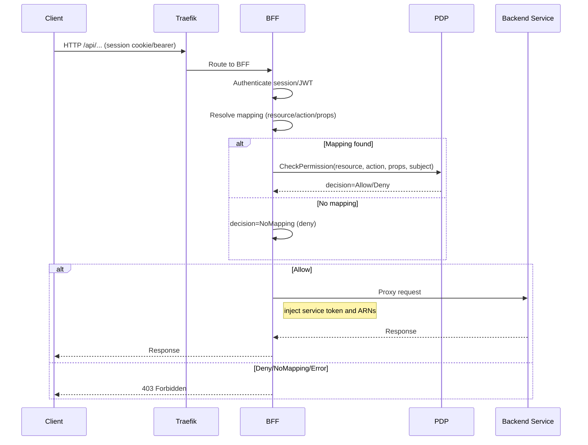

### BFF Gateway Authorization and Kafka Business Logging – Technical Guide

This document provides detailed, production-focused guidance for configuring, operating, and validating the BFF’s gateway authorization (PDP) and Kafka business logging. It is written for DevOps, Security Administrators, and QA.

---

## 1) Overview

- Purpose: Centralize policy enforcement at the BFF layer for all routed APIs, with rich business context and auditable decisions.
- Key capabilities
  - Route-level authorization via `authz: pdp` in `routes.yaml`.
  - Request-to-policy mapping via `endpoint_map` in `pdp.yaml` (supports JSONPath and path params).
  - Fail-secure enforcement (errors → deny), with structured Kafka audit events and Prometheus metrics.
  - SSE-aware checks before opening streams.
  - Global toggle to enable/disable BFF authz enforcement.

---

### Audience

- Platform/Infrastructure engineers operating gateway, routing, and observability stacks.
- Backend service owners adopting centralized authorization and audit.
- Security/Identity administrators responsible for policy enforcement and audit readiness.
- QA/Release engineering validating behavior, rollouts, and monitoring.

### Prerequisites

- Central PDP reachable by the BFF and policies defined for your resources.
- Routes declared in `ServiceConfigs/BFF/config/routes.yaml` and mappings in `ServiceConfigs/BFF/config/pdp.yaml`.
- Authentication configured per route (`auth: session|bearer|none`) and session/JWT issuance working.
- Optional: Kafka and Prometheus configured via `settings` (for audit and metrics).

---

## 2) Configuration surfaces

### 2.1 Global toggle

- File: `ms_bff_spike/ms_bff/src/core/config.py`
- Setting: `settings.authz_enabled` (default `True`)
- Env override: `MS_BFF_AUTHZ_ENABLED=false` to disable checks globally (useful during migration or emergency).

Example (YAML settings):
```yaml
feature_flags:
  authz_enabled: true
```

### 2.2 Route-level enablement

- File: `ServiceConfigs/BFF/config/routes.yaml`
- Add `authz: pdp` to any route that must be authorized at the BFF.

Example:
```yaml
- id: "crud-execute"
  path: "/api/crud/execute"
  target_service: "crud_service"
  upstream_path: "/execute"
  methods: ["POST"]
  auth: "session"
  authz: "pdp"
```

### 2.3 Request mapping to PDP inputs

- File: `ServiceConfigs/BFF/config/pdp.yaml`
- Section: `endpoint_map`
  - Keys are request paths (exact) or templated (e.g., `/api/workflows/{workflow_id}/start`).
  - Methods under each key map to `resource`, `action`, and `props` extracted from body/path.
  - JSONPath-style lookups supported: `$.a.b.c`.

Examples:
```yaml
endpoint_map:
  /api/crud/execute:
    POST:
      resource: "crud:command"
      action: "execute"
      props:
        system: "$.system"
        object_type: "$.object_type"
        command: "$.action"
        id: "$.params.id"

  /api/workflows/{workflow_id}/start:
    POST:
      resource: "workflow"
      action: "execute"
      props:
        workflow_id: "{workflow_id}"
```

Behavior when no mapping is found:
- Authorization is denied with a structured audit log (decision=`NoMapping`). This is fail-secure by default.

---

### 2.4 Environment variables reference

Note: Exact names depend on your settings loader. Examples below illustrate common mappings to `settings` fields.

- `MS_BFF_AUTHZ_ENABLED`: Enables/disables BFF authorization globally (`true`/`false`).
- `KAFKA_ENABLED`: Turns Kafka business logging on/off.
- `KAFKA_BOOTSTRAP_SERVERS`: Comma-separated brokers for Kafka producer.
- `KAFKA_TOPIC_PREFIX` or `KAFKA_AUDIT_TOPIC`: Topic naming; aligns with your Kafka conventions.
- `PDP_BASE_URL`: Base URL of the PDP service.
- `PDP_TIMEOUT_MS`: PDP request timeout.
- `PDP_CACHE_TTL`: Cache time-to-live for PDP decisions (if enabled).
- `LOG_LEVEL`: Application log level.

---

## 3) Enforcement flow

### 3.1 Standard HTTP routes



### 3.2 SSE/Streaming routes

- Same as standard, but the PDP check runs before opening the stream. On deny, the stream is not opened and a 403 is returned.

---

### 3.3 Failure modes and decision mapping

- Mapping not found (`endpoint_map`): decision=`NoMapping`, HTTP 403. Kafka emits `AUTHZ_DECISION` with `reason=NoMapping`; `bff_authz_requests_total{decision="NoMapping"}` increments.
- PDP returns Deny: decision=`Deny`, HTTP 403. Kafka includes `reason` if available.
- PDP unavailable/timeout/error: fail-secure decision=`Deny`, HTTP 403. `service_errors_total{service="pdp"}` increments; latency observed in `bff_authz_latency_seconds`.
- Resolver error/missing required props: decision=`Deny`, HTTP 403 with `reason=ResolverError` (or equivalent short reason).
- Global toggle off (`authz_enabled=false`): PDP check is bypassed for all routes; requests proxy without emitting `AUTHZ_DECISION`.
- SSE routes: deny occurs before opening the stream; no connection is established on unauthorized.

---

## 4) Structured business logging (Kafka)

### 4.1 Event: AUTHZ_DECISION

Emitted for every protected route (`authz: pdp`) with decision context.

Core fields (typical):
- `event`: `AUTHZ_DECISION`
- `decision`: `Allow` | `Deny` | `NoMapping`
- `resource`, `action`, `resource_id` (if derived)
- `props`: flattened subset of authorization context (safe keys)
- `route_id`, `path`, `method`, `target_service`
- `user_id`, `principal_arn`, `actor_arn` (when available)
- `correlation_id`, `session_id` (if available)
- `latency_ms` (PDP time)
- `reason`: short text for deny/no mapping/errors

Enablement:
- `init_enterprise_logging()` in startup wiring routes structured logs to Kafka when Kafka is enabled.
- Kafka settings in `settings`:
  - `kafka.enabled`, `kafka.bootstrap_servers`, `kafka.topic_prefix` or service-level `kafka.audit_topic`.

### 4.2 Topics

- Default pattern: `bff.audit` or `empowernow.bff.audit` (depending on your Kafka config module).
- Align with your enterprise Kafka topic conventions; the logger will use configured topic names.

---

### 4.3 Example AUTHZ_DECISION payload

```json
{
  "event": "AUTHZ_DECISION",
  "decision": "Allow",
  "resource": "crud:command",
  "action": "execute",
  "resource_id": "12345",
  "props": {
    "system": "hr",
    "object_type": "user",
    "command": "create"
  },
  "route_id": "crud-execute",
  "path": "/api/crud/execute",
  "method": "POST",
  "target_service": "crud_service",
  "user_id": "u-9ab8c7",
  "principal_arn": "arn:emp:user:u-9ab8c7",
  "actor_arn": "arn:emp:app:web",
  "correlation_id": "c-3a1b-5d6e",
  "session_id": "s-2f4c-7e8a",
  "latency_ms": 42,
  "reason": null
}
```

---

## 5) Prometheus metrics and dashboards

Metrics emitted (non-exhaustive):
- `bff_authz_requests_total{resource,action,decision}`
- `bff_authz_latency_seconds_bucket{resource,...}` (histogram)
- `service_requests_total{service="pdp"}` and `service_errors_total{service="pdp",error_type=...}`

Provided assets:
- Dashboard: `observability/grafana/dashboard_bff_authz.json`
- Alerts: `observability/grafana/alerts_bff_authz.yaml`

Key visuals:
- Deny rate (5m): `sum(rate(bff_authz_requests_total{decision="Deny"}[5m])) / sum(rate(bff_authz_requests_total[5m]))`
- Decision volume by decision/resource
- PDP error rate and latency
- AuthZ P95 latency by resource

Alerts include:
- High deny rate, PDP errors spike, NoMapping anomalies

---

### 5.1 Example PromQL queries

```
# Deny rate (5m)
sum(rate(bff_authz_requests_total{decision="Deny"}[5m]))
  / sum(rate(bff_authz_requests_total[5m]))

# NoMapping rate (5m)
sum(rate(bff_authz_requests_total{decision="NoMapping"}[5m]))
  / sum(rate(bff_authz_requests_total[5m]))

# PDP p95 latency (5m)
histogram_quantile(
  0.95,
  sum(rate(bff_authz_latency_seconds_bucket[5m])) by (le)
)

# PDP error rate (5m)
sum(rate(service_errors_total{service="pdp"}[5m]))
  / sum(rate(service_requests_total{service="pdp"}[5m]))

# Top resources by decision volume (5m)
topk(10, sum(rate(bff_authz_requests_total[5m])) by (resource))
```

### 5.2 Suggested SLOs (tune per service)

- AuthZ p95 latency: ≤ 150 ms.
- PDP availability: error rate ≤ 0.1% over 1h.
- NoMapping rate: < 0.5% of total authorized traffic (production steady state).
- Alert when deny rate deviates >3× baseline for ≥15m.

---

## 6) DevOps: deployment and operations

### 6.1 Minimal steps to enable BFF authorization
1) Mark protected routes with `authz: pdp` in `ServiceConfigs/BFF/config/routes.yaml`.
2) Define mappings in `ServiceConfigs/BFF/config/pdp.yaml` under `endpoint_map` for those routes.
3) Ensure `MS_BFF_AUTHZ_ENABLED=true` (default is true).
4) Verify PDP service reachability and credentials (`settings.pdp.*`).
5) Deploy; monitor metrics and Kafka events.

### 6.2 Migration from CRUDService authorization
1) Ensure BFF routes covering CRUD endpoints have `authz: pdp` and proper `endpoint_map` entries.
2) Disable CRUDService-side authorization (e.g., set `enable_authorization: false` in `ServiceConfigs/CRUDService/config/pdp.yaml` or equivalent flag). Confirm exact setting name in that service’s config.
3) Roll out BFF changes first in staging; validate allow/deny parity.
4) Enable Kafka and import Grafana dashboard; verify AUTHZ_DECISION stream.
5) Cut over traffic; keep an eye on deny rates and PDP error rates.

### 6.3 Rollback plan
- Flip `MS_BFF_AUTHZ_ENABLED=false` to bypass BFF checks temporarily.
- Re-enable CRUDService authorization if needed while investigating.

### 6.4 Tuning
- PDP cache TTL: `settings.pdp.cache_ttl`.
- Retry/circuit-breaker at HTTP client level for PDP.
- Metrics-based SLOs: AuthZ latency and PDP error rate.

---

### 6.5 Blue/green rollout checklist
1) Enable metrics and (optionally) Kafka in lower environments; import dashboard and alerts.
2) Add `authz: pdp` to a small, low-risk route group; verify mappings exist for all paths.
3) Compare allow/deny parity with legacy authorization in staging.
4) Deploy to production behind a small canary (5–10%) and monitor deny rate, NoMapping, PDP errors, and p95 latency.
5) Gradually increase traffic allocation; keep rollback ready (see 6.3).

### 6.6 Security hardening checklist
- Enforce TLS to PDP and Kafka; prefer mTLS where available.
- Limit and rotate credentials for PDP and Kafka producers.
- Emit only safe `props` fields; avoid logging secrets or PII.
- Restrict CORS and enforce strict origin checks (especially for SSE routes).
- Use `auth: bearer` for service-to-service; scope tokens to least privilege.
- Rate-limit and protect at the edge (Traefik/Kong) for volumetric attacks.

---

## 7) Security administrators: policy mapping and validation

### 7.1 Resource/action mapping
- Use `endpoint_map` to translate API shape to policy inputs.
- Prefer stable resource kinds: e.g., `crud:command`, `workflow`.
- Include key props: `system`, `object_type`, `command`, `id`, `workflow_id`.
- Use path params via `{param}` and request body via JSONPath `$.field.nested`.

### 7.2 Validation workflow
1) For a given API, confirm a mapping exists (grep `endpoint_map`).
2) Exercise an allow case; verify `decision=Allow` in Kafka and `bff_authz_requests_total{decision="Allow"}` increments.
3) Exercise a deny case; verify `decision=Deny` with `reason` populated.
4) Remove mapping temporarily to confirm `decision=NoMapping` events are visible (optional test-only).

### 7.3 Audit readiness
- Kafka payloads contain principal identifiers (user_id, ARNs where available), route_id, resource/action, and props—sufficient for forensics.
- Correlate via `correlation_id` end-to-end.

---

## 8) QA: test plans

### 8.1 Unit/integration tests (in-repo)
- Unit tests cover parsing (`authz` in routes loader) and resolver mapping.
- Router integration tests cover allow/deny, toggle-off bypass, SSE pre-check.

### 8.2 Manual verification checklist
- Allow case: valid subject, policy grants → 200 from backend, Kafka `Allow` event.
- Deny case: subject lacks permission → 403 from BFF, Kafka `Deny` event.
- No mapping: remove route mapping → 403, Kafka `NoMapping` (staging only).
- SSE route: pre-check denies stream opening when unauthorized.
- Toggle-off: set `MS_BFF_AUTHZ_ENABLED=false` → traffic proxies without PDP calls.

### 8.3 Negative paths
- PDP unavailable/timeouts: verify fail-secure deny and `service_errors_total{service="pdp"}` increments.
- Malformed bodies: resolver handles gracefully; if required props missing, deny with reason.

---

## 9) Code touchpoints

- Route loader: accepts `authz` field and validates it.
- Dynamic router: performs PDP pre-check for `authz: pdp`, including SSE.
- AuthZ resolver: derives `resource/action/props` via `endpoint_map` (JSONPath/path params).
- Policy client: invokes PDP and records latency/decision metrics.
- Logging: emits `AUTHZ_DECISION` with business context; Kafka configuration controlled via settings.

Key files:
- `ms_bff_spike/ms_bff/src/routing/yaml_loader.py`
- `ms_bff_spike/ms_bff/src/routing/dynamic_router.py`
- `ms_bff_spike/ms_bff/src/services/authz_resolver.py`
- `ServiceConfigs/BFF/config/routes.yaml`
- `ServiceConfigs/BFF/config/pdp.yaml`
- `ms_bff_spike/ms_bff/src/core/config.py`
- `ms_bff_spike/observability/grafana/dashboard_bff_authz.json`
- `ms_bff_spike/observability/grafana/alerts_bff_authz.yaml`

---

## 10) Known scope and non-goals

- Edge security (WAF/bot detection, global anycast/CDN) handled by Traefik or edge providers.
- Non-HTTP protocols are out of scope.
- Policy definitions reside in the central PDP, not in the BFF.

---

## 11) Quickstart examples

### Protect a new route
1) Add to `routes.yaml`:
```yaml
- id: "orders-exec"
  path: "/api/orders/execute"
  target_service: "orders_service"
  upstream_path: "/execute"
  methods: ["POST"]
  auth: "session"
  authz: "pdp"
```
2) Map in `pdp.yaml`:
```yaml
endpoint_map:
  /api/orders/execute:
    POST:
      resource: "orders:command"
      action: "execute"
      props:
        command: "$.action"
        order_id: "$.params.id"
```
3) Deploy and verify: 200 on allow, 403 on deny; Kafka `AUTHZ_DECISION` and Prometheus metrics update.

---

## 12) Troubleshooting

- Unexpected 403 with `NoMapping`: confirm the exact path/method has an `endpoint_map` entry; check JSONPath expressions resolve on your payload.
- Unexpected 403 with `Deny`: verify subject identity and PDP policy; inspect Kafka `reason` and PDP client logs.
- High PDP latency: check PDP health, network, and timeouts; consider adjusting `PDP_TIMEOUT_MS` and client retry budgets.
- No Kafka events: ensure `KAFKA_ENABLED=true`, brokers reachable, and topic configured; check producer errors in logs.
- Metrics missing: verify Prometheus scraping for the BFF and that metrics endpoint is exposed.
- SSE not opening: verify pre-check passes; confirm CORS/origin settings and that the route is marked with `authz: pdp` and mapped.

---

## 13) FAQ

- Do we call PDP on every request? Only for routes with `authz: pdp` and when `authz_enabled=true`. PDP caching may reduce call volume depending on configuration.
- How do we bypass BFF authorization temporarily? Set `MS_BFF_AUTHZ_ENABLED=false` and redeploy. Use only for emergency rollback.
- How do we handle machine-to-machine calls? Mark routes with `auth: bearer`; the BFF will validate tokens and still enforce PDP if `authz: pdp` is set.
- How do we add SSE protection? Mark route with `authz: pdp` and provide an `endpoint_map`; the BFF runs the check before opening the stream.
- Where do I correlate decisions with requests? Use `correlation_id` and `route_id` in Kafka events and propagate them in logs/traces end-to-end.

---
For questions or escalation paths, include this doc in change tickets and link the dashboard and alert rules to your monitoring runbooks.


