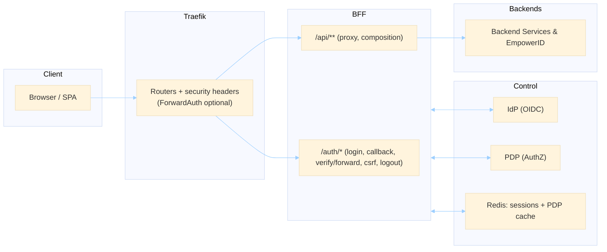

This is the business‑level overview of the EmpowerNow BFF (Backend for Frontend). Use it to explain the value to non‑technical stakeholders and why we standardized on this pattern.

## One‑sentence summary

The BFF is a safe, simple front door for our web apps: SPAs talk to one origin, while the BFF handles login, sessions, authorization, routing, and legacy integration — so sensitive tokens never live in the browser.

## What problem it solves (and why customers need it)

- **Security & compliance**: OAuth tokens remain server‑side. The browser uses an HttpOnly session cookie with built‑in CSRF protection. Consistent PDP authorization per endpoint.
- **Velocity & reliability**: 1 ms session lookups; cached authorization decisions; fewer cross‑origin hops and CORS issues.
- **Simplicity for product teams**: a single base URL (`/api/**`) for SPAs; uniform errors, headers, and observability. Works the same in dev and prod.
- **Modernization with continuity**: façade over legacy C# services and first‑class EmpowerID endpoints so teams can ship features without big‑bang rewrites.

## Alternatives teams try (and trade‑offs)

- **OAuth in the browser to many APIs**
  - Pros: quick to start.  
  - Cons: tokens in JS, CORS per service, inconsistent authorization, audit gaps.
- **Gateway‑only (Traefik/Kong/Apigee) without a BFF**
  - Pros: excellent L7 routing, TLS, rate limits.  
  - Cons: gateways don’t own SPA sessions/CSRF or per‑user composition; still need app logic.
- **Per‑service bespoke proxies**
  - Pros: localized optimizations.  
  - Cons: duplicated logic and policy drift; costly to operate.
- **GraphQL only**
  - Pros: flexible data shaping.  
  - Cons: still needs secure sessions, PDP, CSRF, and legacy integration — which the BFF provides.

## Why our BFF is better

- **Central session boundary**: secure HttpOnly cookie; CSRF enforced; tokens never enter the browser.
- **Consistent authorization**: path/method → resource/action mapping via PDP with decision caching.
- **Pragmatic routing**: canonical `/api/<app>/**` via `routes.yaml`; optional edge ForwardAuth where it belongs; legacy proxy when needed.
- **EmpowerID first‑class**: catalog‑driven workflows/WebUI with server‑side client‑credentials.

## At a glance (visual)

## What ships with the BFF

- **Auth router**: `/auth/login`, `/auth/callback`, `/auth/verify` (alias `/auth/forward`), `/auth/logout`, `/auth/csrf`, `/auth/health`.
- **SPA APIs**: same‑origin `/api/**` handled by the BFF; JSON 401/403 with CORS for friendly UX.
- **Legacy proxy**: `/api/v1/proxy/{service}/{path}` with circuit breaker, caching, and limits.
- **EmpowerID direct**: `/api/v1/empowerid/workflow`, `/api/v1/empowerid/webui`, plus discovery endpoints.

## When to use what

- Use **`routes.yaml`** for canonical `/api/<app>/**` proxies.
- Add a **custom BFF endpoint** when you need composition, token transformations (e.g., DPoP), body validation/reshaping, streaming, or background jobs.
- Use the **legacy proxy** for existing C# services you are migrating.
- Use **EmpowerID direct** for workflows/WebUI calls; manage catalog in `empowerid_endpoints.yaml`.

---

### Talk track (2 minutes)

Start with the one‑sentence summary. Frame the problem (security + complexity + speed). Show the diagram and call out: one origin for SPAs, server‑side OAuth, PDP at the boundary, pragmatic routing, and room for legacy + EmpowerID. Close with the “what ships” list so stakeholders know what’s ready‑to‑use today.

