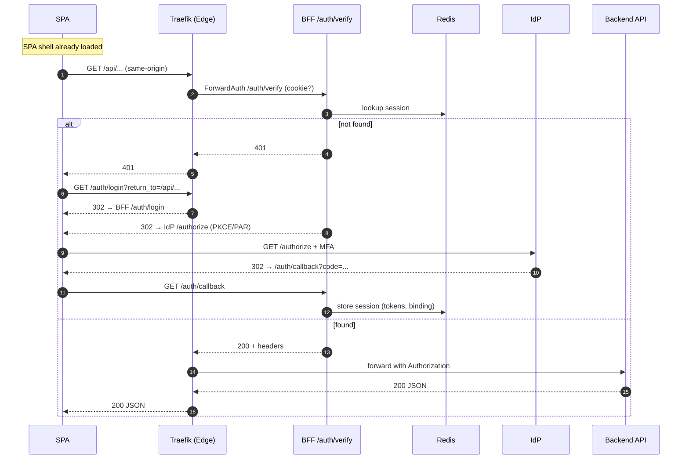

---
title: Golden Path
---

The verified request flow for the Edge → BFF → Services model.

```mermaid
sequenceDiagram
  autonumber
  participant Browser as SPA
  participant Traefik as Traefik (Edge)
  participant BFF as BFF /auth/verify
  participant Redis as Redis
  participant IdP as IdP
  participant API as Backend API
  Note over Browser: SPA shell already loaded
  Browser->>Traefik: GET /api/... (same-origin)
  Traefik->>BFF: ForwardAuth /auth/verify (cookie?)
  BFF->>Redis: lookup session
  alt not found
    BFF-->>Traefik: 401
    Traefik-->>Browser: 401
    Browser->>Traefik: GET /auth/login?return_to=/api/...
    Traefik-->>Browser: 302 → BFF /auth/login
    BFF-->>Browser: 302 → IdP /authorize (PKCE/PAR)
    Browser->>IdP: GET /authorize + MFA
    IdP-->>Browser: 302 → /auth/callback?code=...
    Browser->>BFF: GET /auth/callback
    BFF->>Redis: store session (tokens, binding)
  else found
    BFF-->>Traefik: 200 + headers
    Traefik->>API: forward with Authorization
    API-->>Traefik: 200 JSON
    Traefik-->>Browser: 200 JSON
  end
```
