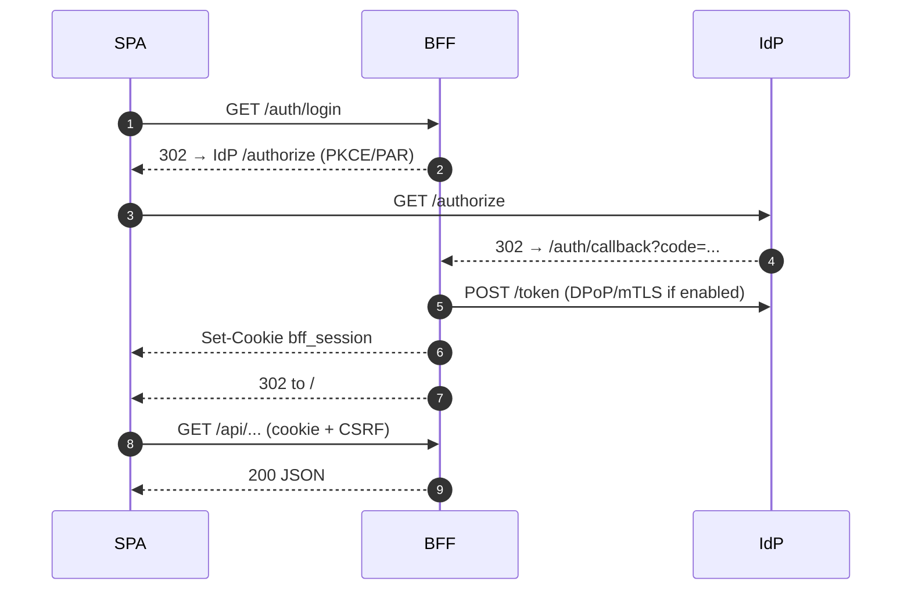
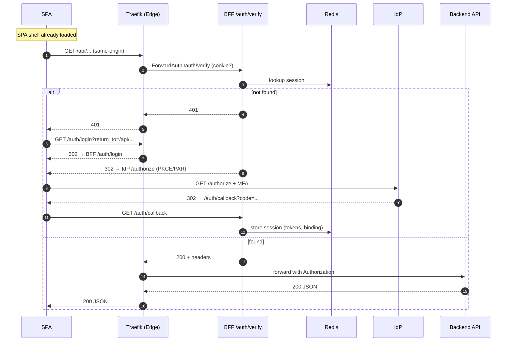

---
title: Golden Path
---

Mini flow

See also: `../how-to/spa-auth-flows`, `../how-to/spa-with-bff`

The “golden path” is our recommended, production‑grade way for SPAs to access backend APIs through the BFF. It optimizes security, performance, and developer experience:

- Security: tokens never reach the browser; Traefik or the BFF validates the session on every request
- Performance: most requests short‑circuit on a 1ms session lookup; only auth transitions hit the IdP
- Simplicity: SPAs call `/api/**` on the same origin; no token‑plumbing in the frontend

Why this path is golden

- Least surprise for frontend teams (same‑origin APIs, cookie auth)
- Edge filters most unauthenticated traffic quickly; BFF handles OAuth and PDP authZ
- Works equally well on localhost (CORS allowlist) and prod (same‑origin)

Where it’s configured

- Traefik dynamic config: ForwardAuth middleware and SPA routers
- BFF config: `routes.yaml` (canonical `/api/...`), `pdp.yaml` (authZ mapping), `idps.yaml` (IdP audiences)
