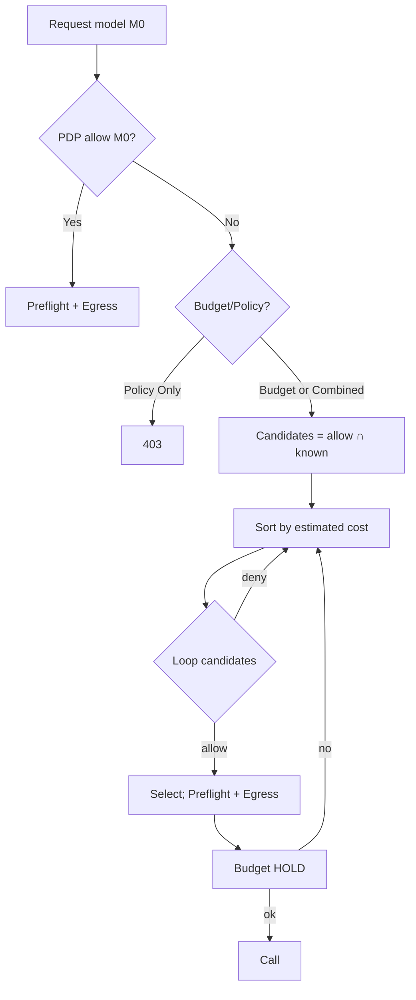

## Overview

Dynamic Model Routing lets the BFF transparently select an allowed, affordable LLM model when the requested model is disallowed by policy or unaffordable given live budgets. v1 covers model selection within one provider (OpenAI); v2 adds provider switching.

## How it works (v1)

1) BFF receives a chat request with `model`.
2) PDP returns `constraints` (model/tokens/egress) and optional `spend_snapshot`.
3) Preflight applies prompt guard, masking, token clamps.
4) Budget hold based on estimated cost.
5) If denied (policy/budget), BFF tries allowed candidates cheapest-first, re-evaluating PDP with `estimated_cents` until one is allowed.
6) Egress is re-pinned; request proceeds; receipt emitted.

## Key properties

- PDP-first: BFF never bypasses policy
- Budget-aware: evaluates candidates against live budgets
- Transparent: `x-aria-model-selected`, `x-aria-model-rerouted` headers

## Real scenarios

- Hit monthly cap on `gpt-4.1` → reroute to `gpt-4o-mini`
- Tenant allows only `gpt-4o-mini` → requests for `gpt-4.1` are routed to `gpt-4o-mini`

## Algorithm details (v1)

## Roadmap (v2)

- Provider switching (OpenAI ⇄ Anthropic ⇄ Ollama) with PDP Search shortlist, ranking, and receipts.

See also: Tutorials → LLM Routing Quickstart; Reference → LLM Routing Config, LLM Routing PDP.

