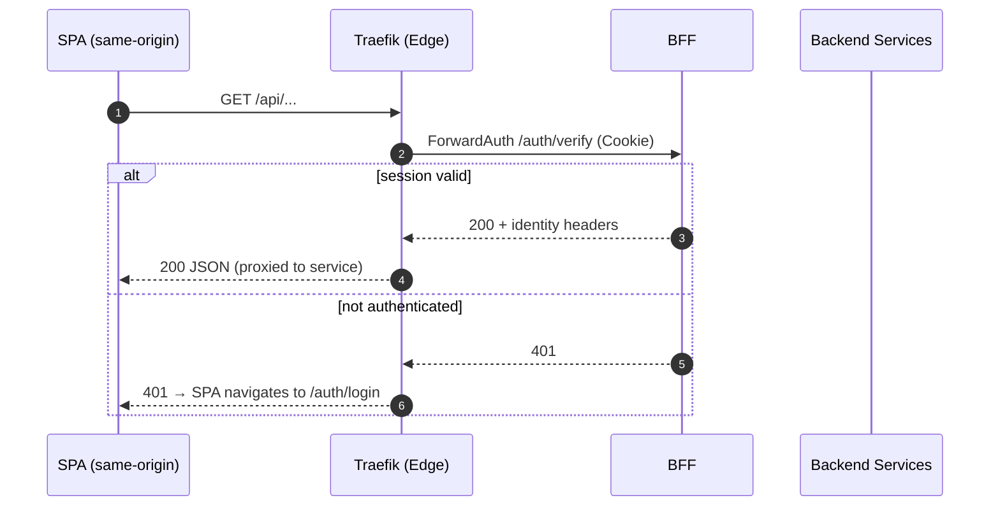

Not Your Typical BFF: in our context, a Backend for Frontend is a dedicated service layer that sits between the SPA and downstream services. It optimizes UX, consolidates security, and prevents tokens from ever reaching the browser.

Executive summary

- Single, secure session cookie for the browser
- Multiple service‑specific tokens managed server‑side
- Zero token exposure to the browser/client
- Fine‑grained access control per service/route
- Same‑origin SPA calls to `/api/**`; edge performs ForwardAuth

What it is

- An edge‑adjacent web service that owns login, callback, session verification, and logout
- A security boundary that validates sessions at the edge (Traefik ForwardAuth → `/auth/verify` or `/auth/forward`)
- A server‑side token broker: obtains/refreshes per‑service tokens and injects only required headers to backend services
- A simplifier for frontends: SPA uses cookie‑based session and CSRF token, no OAuth dance in the browser

What it is not

- Not a generic API Gateway replacement for east‑west traffic
- Not a place to expose OAuth/DPoP/PKCE artifacts to the browser
- Not a monolith; it orchestrates, it does not absorb all domain logic

When to use it

- Multiple SPAs need consistent login/session handling and secure same‑origin API access
- You require strict control against token theft and browser exposure
- Per‑service authorization differs (audiences/scopes) and must be enforced centrally

When not to use it

- Pure machine‑to‑machine traffic without a browser client
- A single UI directly coupled to a single backend where an API gateway already enforces all concerns

Verified request model

EmpowerNow specifics (code‑verified)

- Endpoints: `/auth/login`, `/auth/callback`, `/auth/verify` (alias `/auth/forward`), `/auth/logout`, `/api/auth/session`, `/auth/health`
- Cookie: `bff_session` (HttpOnly, Secure, SameSite=Lax, domain per env)
- Edge: Traefik ForwardAuth configured to call BFF; response/request headers include identity/session info
- Tokens: acquired server‑side, per‑service; never stored in or exposed to the browser

