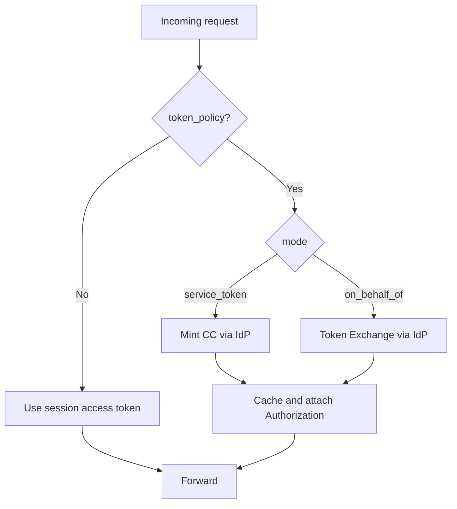

BFF routes can declare a `token_policy` to control which token is attached to upstream calls:

- `session_passthrough` (default): forward the user's session token as a bearer to upstream
- `service_token`: mint OAuth2 Client Credentials (CC) and attach server‑side
- `on_behalf_of`: perform OAuth 2.0 Token Exchange (OBO) and attach per‑session token

Security
- Audience allow‑list prevents unsafe overrides
- No token values in logs; only metadata (service, audience host, scopes count)
- Fail‑closed on issuance errors (no silent downgrade)

See also
- How‑to: `services/bff/how-to/configure-per-route-token-policy.md`
- Reference: `services/bff/reference/routes-reference.md`
- IdP: `services/idp/explanation/rfc8707-resource-indicators.md`

