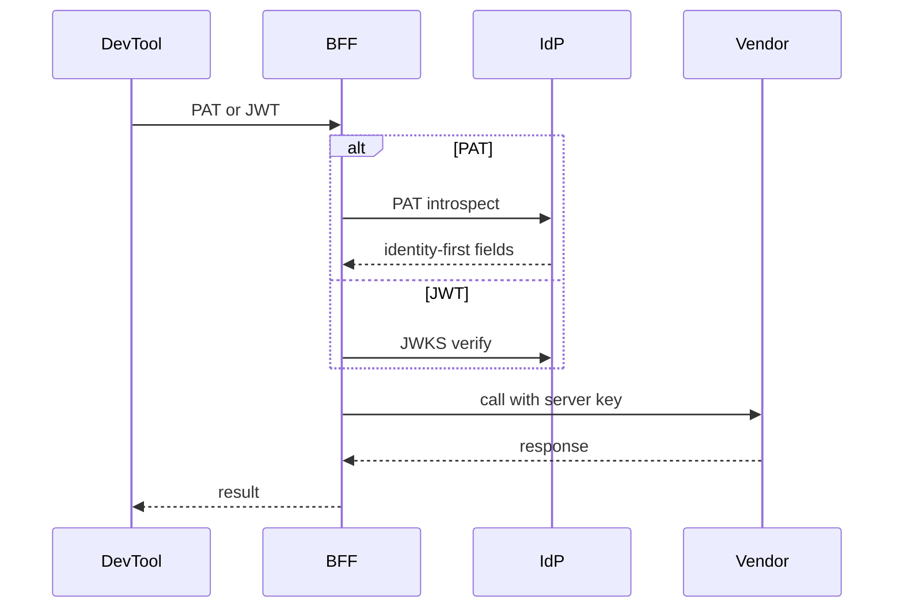

The BFF accepts EmpowerNow PATs or JWTs on vendor proxy routes (e.g., OpenAI/Anthropic), resolves identity, enforces PDP/budgets, and emits receipts.

Flow
- Extract token from vendor‑native headers (e.g., `Authorization`, `x-api-key`)
- Classify: JWT (verify via IdP JWKS) vs PAT (introspect at IdP)
- Build identity‑first subject: `user_arn` and `agent:devtool:{client_id|generic}:{pairwise}`
- Enforce scopes (`llm:proxy:*`), PDP decision, egress allowlists, budget hold/settle
- Strip inbound secrets; use server‑held vendor keys

See also
- PATs overview: `services/idp/explanation/pats-overview.md`
- PATs API: `services/idp/reference/pats-api.md`
- Troubleshooting: `Troubleshooting_PAT_Proxy.md`
- Dev tools setup: `Using_PAT_with_DevTools.md`

