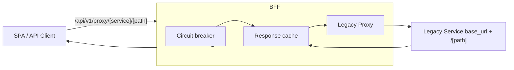

Goal: register a new legacy C# service behind `/api/v1/proxy/{service}`.

Steps
1) Edit `ServiceConfigs/BFF/config/legacy_services.yaml`
   - Add entry under `legacy_services:`
   ```yaml
   legacy_services:
     my-service: "https://myservice.example.com/api"
   ```
   - Optional per‑service timeout under `legacy_service_timeouts:`
2) Deploy config and restart BFF
3) Test:
```bash
curl -I --cookie "_eid_sid=..." https://.../api/v1/proxy/my-service/health
```

Tips
- Override URL per environment with `LEGACY_SERVICE_MY_SERVICE_URL`
- Watch `/api/v1/proxy/health` for CB/cache status

See also: `../reference/legacy-proxy`


When to use this vs routes.yaml vs custom BFF endpoints

- Use this legacy proxy when you need a compatibility bridge to an existing service and a straight pass‑through is sufficient.
- Prefer `routes.yaml` for canonical `/api/...` routes to modern services. It gives typed mapping, PDP authorization mapping, and streaming flags.
- Create a custom BFF endpoint when you need aggregation/orchestration, token transformations (e.g., DPoP), request/response shaping, uploads, background jobs, or per‑user business limits. See Reference → Amazing FAQ → “When do I need a custom BFF endpoint?”.

Prerequisites

- Your BFF is running with the config volume: `ServiceConfigs/BFF/config` mounted to `/app/config` (already set in compose).
- You are logged in so your browser has the BFF session cookie (`_eid_sid`).

Minimal working example

```yaml
# ServiceConfigs/BFF/config/legacy_services.yaml
legacy_services:
  res-admin: "${LEGACY_SERVICE_RES_ADMIN_URL:-https://api.empoweriam.com/api}"

# Optional per‑service timeouts (seconds)
legacy_service_timeouts:
  res-admin: ${LEGACY_SERVICE_RES_ADMIN_TIMEOUT:-30.0}

# Optional (defaults exist): circuit breaker, cache, request size
circuit_breaker:
  threshold: 5
  reset_time: 60
response_cache:
  enabled: true
  default_ttl: 30
request_limits:
  max_body_size: 10485760
```

Environment overrides

- `LEGACY_SERVICE_<NAME>_URL` overrides the base URL at runtime, e.g. `LEGACY_SERVICE_RES_ADMIN_URL=https://staging.example.com/api`.
- `LEGACY_SERVICE_<NAME>_TIMEOUT` overrides per‑service timeouts.

Flow



Test it

```bash
# HEAD/health check (requires logged‑in session cookie)
curl -I --cookie "_eid_sid=..." \
  https://api.ocg.labs.empowernow.ai/api/v1/proxy/res-admin/health

# GET with query params
curl --cookie "_eid_sid=..." \
  "https://api.ocg.labs.empowernow.ai/api/v1/proxy/res-admin/services/v1/resadmin/resources/people/getsearch?top=25"

# POST example
curl -X POST --cookie "_eid_sid=..." \
  -H "Content-Type: application/json" \
  -d '{"name":"Example"}' \
  https://api.ocg.labs.empowernow.ai/api/v1/proxy/res-admin/services/v1/resadmin/resources/People/create
```

Troubleshooting

- 404 unknown service: the `{service}` segment must match a key in `legacy_services` (e.g., `res-admin`).
- 401/403: ensure you’re logged in (401) and have authorization to call the upstream action (403 via PDP).
- 502/timeout: increase `legacy_service_timeouts.<service>` or fix upstream URL/health.
- Circuit open quickly: tune `circuit_breaker.threshold` and `reset_time`; check upstream errors.
- Large uploads rejected: raise `request_limits.max_body_size` accordingly.
- Cache confusion: temporarily set `response_cache.enabled: false` when debugging.

References

- Reference → Legacy proxy
- Reference → legacy_services.yaml
- Reference → routes.yaml
- How‑to → Tune legacy proxy circuit breaker and cache


