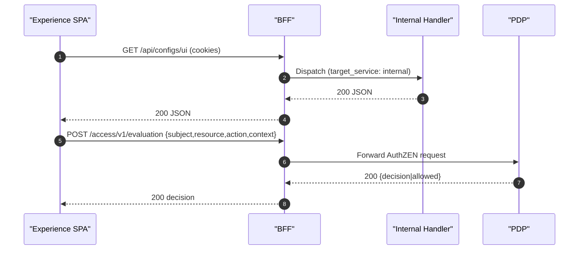

## Source of truth

- `ServiceConfigs/BFF/config/routes.yaml`: defines endpoints, upstream targets, auth, and inline PDP authorization mapping (`authz_map`)
- `ServiceConfigs/BFF/config/settings.yaml`: CORS, allowed origins, redirect origins, and other runtime settings
- `ServiceConfigs/BFF/config/pdp.yaml` (legacy): external endpoint_map. Deprecated once inline `authz_map` is adopted

## Internal routes (target_service: internal)

- Internal endpoints are dispatched directly to FastAPI handlers (no HTTP loopback), preserving session context
- Keep `auth: session` on Experience internal endpoints so they remain cookie/session protected

## Required endpoints for Experience

- PDP:
  - `POST /access/v1/evaluation`
  - `POST /access/v1/evaluations`
- UI Config:
  - `GET /api/configs/ui` (JSON)
  - `GET /api/configs/stream` (SSE)
- Plugins:
  - `GET /api/plugins/manifests`
  - `GET /api/plugins/bundle`

## CORS and redirect origins

- Add `https://experience.ocg.labs.empowernow.ai` to `cors.allow_origins`
- Add `http://localhost:5177` to `cors.dev_origins`
- Add Experience host to `ALLOWED_REDIRECT_ORIGINS`

## Traefik expectations

- Experience SPA router excludes API/auth/stream/PDP routes to avoid intercepting API traffic
- Separate routers on the BFF service for Experience `Host()` that forward `/api/`, `/auth/`, `/access/v1/`, and stream paths to the BFF app

## Payload behavior for AuthZEN

- The BFF does not rewrite SPA AuthZEN payloads
- Minimal normalization only: provide a default `resource.id` for collection-level checks when omitted

## PDP authorization mapping (single source)

- Prefer inline mapping on each route requiring PDP checks:

```yaml
- id: "crud-tasks-exact"
  path: "/api/crud/tasks"
  target_service: "crud_service"
  upstream_path: "/tasks"
  methods: ["GET", "POST"]
  auth: "session"
  authz: "pdp"
  authz_map:
    GET:
      resource: "task_list"
      action: "read"
    POST:
      resource: "task"
      action: "create"
```

- Resolver precedence: inline `authz_map` → external `pdp.yaml` → derived defaults (if enabled)
- Feature flags in settings:
  - `authz_validation_strict`: fail startup when PDP-protected routes lack a mapping
  - `authz_default_mapping_enabled`: allow resolver to derive defaults (GET→read, POST→create, ...)

## Migration from external pdp.yaml

- A helper is provided to migrate exact-path endpoint_map entries into inline `authz_map`:

```bash
python -m ms_bff.src.tools.migrate_pdp_to_routes \
  --routes ServiceConfigs/BFF/config/routes.yaml \
  --pdp ServiceConfigs/BFF/config/pdp.yaml \
  --out ServiceConfigs/BFF/config/routes.migrated.yaml
```

- Review the output, then replace the original or use `--in-place`.
- After migration, enable `authz_validation_strict: true` and consider disabling defaults.

## Observability and troubleshooting

- Inspect logs for PDP forwards to verify payloads
- Common misconfigurations:
  - Experience origin missing from CORS → browser preflight failures
  - Routes missing or not `auth: session` → 404/401
  - ForwardAuth enabled for BFF API paths → cookies stripped (disable for these routers)

## Health checklist

- Internal routes load without validation errors
- CORS origins include Experience
- `/api/configs/ui` and `/api/plugins/manifests` return 200 with a valid session
- PDP responds 200 for allow and deny test cases through BFF

## Routing flows




