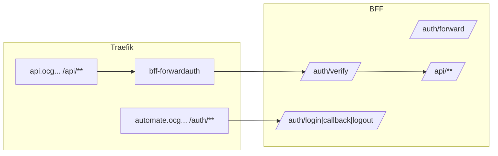

This summarizes the verified BFF-related settings from `CRUDService/docker-compose-authzen4.yml` for local/dev stacks.

## Top services used by BFF
- Traefik (reverse proxy)
  - image: `traefik:v3.4.3`
  - ports: 80, 443, 8080 (dashboard)
  - volumes: `./traefik/traefik.yml`, `./traefik/dynamic.yml`
  - labels: dashboard router protected by `bff-forwardauth@file`
- shared_redis (session store)
  - image: `redis:7-alpine`
  - healthcheck: `redis-cli ping`
- bff (Backend for Frontend)
  - build: `ms_bff_spike/ms_bff/Dockerfile` (target `runtime`)
  - ports: `8000:8000`
  - env_file: `../ms_bff_spike/.env`
  - volumes: `../ServiceConfigs/BFF/config:/app/config:ro`, `bff-keys:/app/keys`
  - depends_on: `shared_redis`, `idp`, `kafka`

## Traefik routers (labels on bff)
- Primary API router (api host)
  - rule: `Host(\`api.ocg.labs.empowernow.ai\`) && (PathPrefix(\`/auth/\`) || PathPrefix(\`/api/\`))`
  - service: `api` → port 8000
- SPA hosts (automate, authz, authn)
  - Streaming routers (priority 100): intercept `/events/`, `/stream/`, etc.
  - OAuth/API routers with security headers & rate limit (priority ~90–95)
  - Public auth router: `/auth/login`, `/auth/callback`, `/auth/forward`, `/auth/logout`, `/health`

## ForwardAuth in Compose
- Traefik dashboard: `traefik.http.routers.traefik-dashboard.middlewares=bff-forwardauth@file`
- Dynamic file must define `bff-forwardauth` pointing to BFF `/auth/forward` or `/auth/verify`.

## BFF environment (selected)
- Core
  - `ENVIRONMENT=development`
  - `HOST=0.0.0.0`, `PORT=8000`
  - `REDIS_URL=redis://shared_redis:6379/5`
- OAuth/IdP
  - `OIDC_ISSUER=http://idp-app:8002/api/oidc`
  - `IDP_PUBLIC_BASE=https://idp.ocg.labs.empowernow.ai/api/oidc`
  - `AUTH_CLIENT_ID`, `AUTH_CLIENT_SECRET` (secrets)
  - `MS_BFF_PAR_ENABLED=true`, `MS_BFF_DPOP_ENABLED=true`
- Cookie/Session
  - `BFF_COOKIE_DOMAIN=.ocg.labs.empowernow.ai`
  - `SESSION_LIFETIME=3600`
- Callback mode
  - `BFF_DYNAMIC_CALLBACK=true`
  - `BFF_CALLBACK_URL=https://api.ocg.labs.empowernow.ai/auth/callback`
  - `BFF_DEFAULT_HOST=api.ocg.labs.empowernow.ai`, `BFF_DEFAULT_SCHEME=https`
- Security & CORS
  - `BFF_ALLOWED_REDIRECT_HOSTS=automate...,authn...,authz...,localhost,127.0.0.1`
  - `CORS__ALLOW_ORIGINS='["https://authn...","https://authz...","https://automate..."]'`
  - `CSRF_SECRET_KEY` (secret)
- Headers & keys
  - `BFF_JWT_SIGNING_KEY=/app/keys/bff-sig-001.pem` (mounted volume)

## Other services commonly present
- `idp` (../IdP), `crud-service` (../CRUDService), `pdp` (../pdp), `membership`, `analytics`, Kafka, ClickHouse, Prometheus/Grafana/Jaeger, etc. Traefik routes are defined by labels per service.

## Request flow (compose stack)

## Bring-up checklist
- Ensure `./traefik/dynamic.yml` defines `bff-forwardauth` middleware targeting BFF `/auth/forward` or `/auth/verify`
- Set secrets (client secrets, salts, keys) via Docker secrets/volumes; do not embed plaintext
- Confirm health endpoints: `GET https://api.ocg.../auth/health`
- Verify session flow: SPAs call same-origin `/api/**`, unauthenticated 401 JSON, then `/auth/login`
