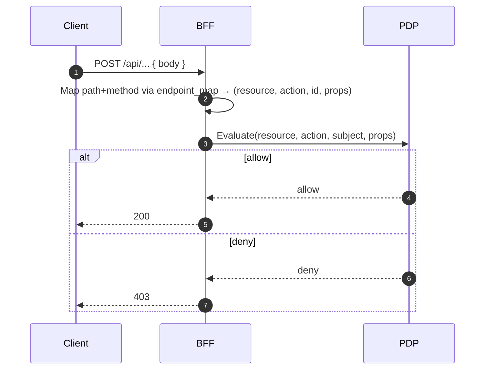

What this file is

- `ServiceConfigs/BFF/config/pdp.yaml` configures the BFF’s connection to the Policy Decision Point (PDP) and defines how API paths map to authorization resources/actions.
- The BFF uses this file to ask the PDP “is user X allowed to perform action Y on resource Z?” for every protected request.

What is supported

- Connection and endpoints: `connection` (base URL, client credentials), `endpoints` (`evaluation`, `batch`, `search_actions`).
- Resilience: `retry` with max retries, backoff, and retryable status codes.
- Performance: `cache` with separate TTLs for allow/deny, max size, and invalidation on policy change.
- Stability: `circuit_breaker` with thresholds and reset times.
- Mapping: `endpoint_map` translating path+method to `resource`, `action`, optional `id_from`, and `props` (simple JSONPath `$.field` extraction from request body).

Example

```yaml
connection:
  base_url: http://pdp-service:8000
  client_id: bff-service
  client_secret: ${PDP_CLIENT_SECRET}
  token_url: http://auth-server:8080/oauth/token
  timeout: 5.0
  verify_ssl: true

endpoints:
  evaluation: v1/evaluation
  batch: v1/evaluations
  search_actions: access/v1/search/actions

cache:
  enabled: true
  ttl_allow: 300
  ttl_deny: 60

endpoint_map:
  /api/v1/membership/people/{person_id}:
    GET:
      resource: membership:people
      id_from: "{person_id}"
      action: read
```

How it’s enforced in the BFF

- Path mapping: `services/path_mapper.py` reads `endpoint_map`, compiles rules, extracts URL params and body fields, and returns `(resource, action, id, props)`.
- Authorization: `core/permissions.py` assembles context (roles/permissions, headers, query/body subset, correlation ID) and calls `services/pdp_client.py`.
- Caching: allow/deny decisions are cached with separate TTLs from `pdp.yaml`.

Flow



Tips

- Start small: add mappings for the endpoints you are enabling; expand iteratively.
- Use canonical prefixes (`/api/crud/**`, preserved AuthZEN `/access/v1/evaluation`).
- Set shorter TTL for deny to reduce false negatives after permissions change.

See also

- Explanation → Authorization Model (PDP, Mapping, Caching)
- Reference → routes.yaml Reference
- How‑to → Validate endpoint_map entries (Quick Checklist)


