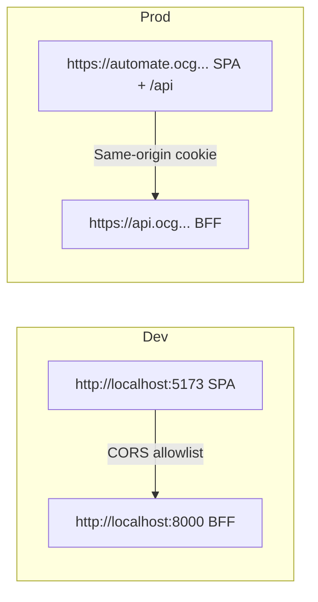

This guide explains how CORS allow‑lists and cookie domains work in the EmpowerNow stack for SPAs using the BFF.

What’s implemented (verified)

- CORS: The BFF parses an allow‑list for origins. Code reads from environment to build a list (see `ms_bff_spike/ms_bff/src/main.py` and `ms_bff_spike/ms_bff/src/utils/proxy.py`, which handle `CORS__ALLOW_ORIGINS` and `ALLOWED_STREAM_ORIGINS` parsing).
- Cookies: The session cookie name is `bff_session` (see security docs). Domain/scope are set by the BFF response and enforced by the browser; in production we recommend a shared parent domain (e.g., `.ocg.labs.empowernow.ai`) so all SPAs can share the session.

Same‑origin SPA vs cross‑origin dev

Steps

1) Dev (cross‑origin)
   - Set `CORS__ALLOW_ORIGINS` to include your dev server (e.g., `http://localhost:5173`).
   - For streaming endpoints, set `ALLOWED_STREAM_ORIGINS` if you use SSE from a different origin.
   - Verify preflights succeed; unauthenticated calls should return JSON with CORS headers.

2) Prod (same‑origin)
   - Serve the SPA and BFF under the same host (e.g., `automate.ocg.labs...` routes `/api/**` to BFF).
   - The browser sends cookies automatically; no CORS preflight is triggered for `/api/**`.

3) Cookie domain
   - Use a shared parent domain at the ingress (Traefik) so the BFF sets the cookie for `.ocg.labs.empowernow.ai`.
   - Ensure `Secure` and `SameSite=Lax` are set; do not expose tokens to the browser.

Validate

- DevTools → Application → Cookies: `bff_session` present for your domain.
- Response headers on unauthenticated API call contain `Access-Control-Allow-Origin` with your dev origin.

