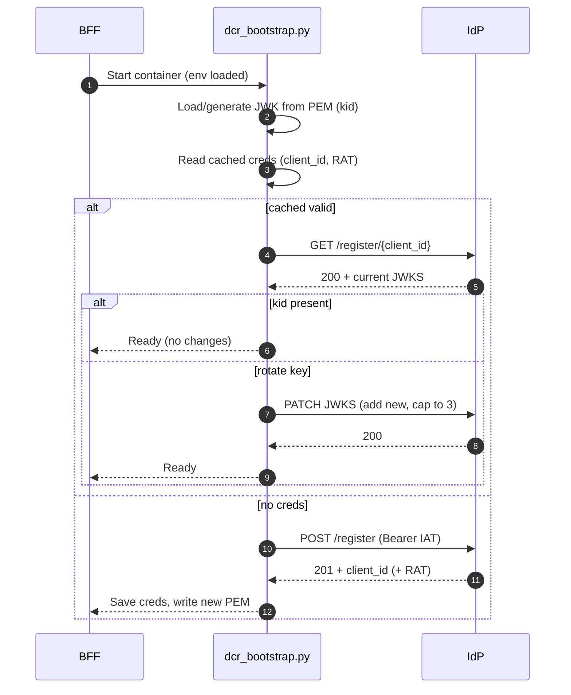

This guide documents the BFF’s built‑in Dynamic Client Registration support and how to enable it in environments. It is based on:

- IdP DCR guide: `IdP/docs/DCR_Guide.md`
- Bootstrap helper: `ms_bff_spike/ms_bff/src/bootstrap/dcr_bootstrap.py`
- Compose wiring: `CRUDService/docker-compose-authzen4.yml` (bff service env)

What DCR does (in our stack)

- Registers/updates the BFF’s OAuth client at the IdP at startup
- Publishes/rotates the BFF’s JWKS (public keys for `private_key_jwt`)
- Caches `client_id` and the `registration_access_token` (RAT) on disk
- Pushes a status metric to Prometheus Pushgateway when configured

High‑level flow (bootstrap)



Prerequisites (IdP side)

- DCR enabled per `DCR_Guide.md` and routes exposed (`/api/oidc/register` CRUD)
- Issue an Initial‑Access‑Token (IAT) for the BFF client

Enable DCR for the BFF

1) Configure environment for the bff container (compose excerpt):

```yaml
environment:
  DCR_ENABLED: "true"                # enable the feature in your entrypoint
  SKIP_DCR_BOOTSTRAP: "false"       # run the bootstrap helper on start
  IDP_BASE_URL: http://idp-app:8002  # internal IdP base (container‑to‑container)
  DCR_IAT: <initial_access_token>    # IAT issued by IdP
  DCR_CLIENT_ID: bff-server          # desired client_id (optional)
  DCR_CLIENT_PROFILE: code-flow-pkjwt # IdP client profile/template
  DCR_REDIRECT_URIS: https://<host>/auth/callback  # space or comma separated
  BFF_JWT_SIGNING_KEY: /app/keys/bff-sig-001.pem   # PEM used for private_key_jwt
  BFF_KID: bff-sig-001              # kid advertised in JWKS
  BFF_CLIENT_CRED_PATH: /app/keys/bff_client.json  # persisted creds JSON
  BFF_JWK_ROTATE_AFTER_DAYS: "30"   # in‑place rotation threshold
  BFF_JWK_RETIRE_AFTER_DAYS: "60"   # drop very old keys
  PROM_PUSHGATEWAY_URL: http://prometheus-pushgateway:9091  # optional metrics
```

2) Run the bootstrap on start. Options:

- Call the module from your entrypoint:

```bash
python -m ms_bff.src.bootstrap.dcr_bootstrap
```

- Or execute the script directly:

```bash
python /app/ms_bff_spike/ms_bff/src/bootstrap/dcr_bootstrap.py
```

3) Verify

- IdP: `GET /api/oidc/register/{client_id}` shows the BFF with the advertised `kid`
- BFF: creds JSON exists at `BFF_CLIENT_CRED_PATH` with `client_id` (+ RAT when applicable)
- Metrics: optionally, `bff_dcr_status{status="success"}=1` is pushed to Pushgateway

Operational notes (from code)

- If cached RAT is invalid/expired, the helper can use `BOOTSTRAP_ADMIN_TOKEN` to renew it via the IdP admin endpoint and retry the PATCH.
- JWKS rotation is additive and capped to 3 keys; very old keys are dropped based on `BFF_JWK_RETIRE_AFTER_DAYS`.
- The helper is idempotent and can be run on every start; it only writes the PEM after a successful JWKS update/registration.

Troubleshooting

- Missing IAT → bootstrap fails fast with a clear admin action message
- 401/403 from IdP → reissue RAT or set `DCR_FORCE_REPLACE=true` to re‑register
- Logs include truncated error bodies and friendly messages from the helper

See also

- IdP DCR Guide: how to turn on DCR and issue IATs — `IdP/docs/DCR_Guide.md`


