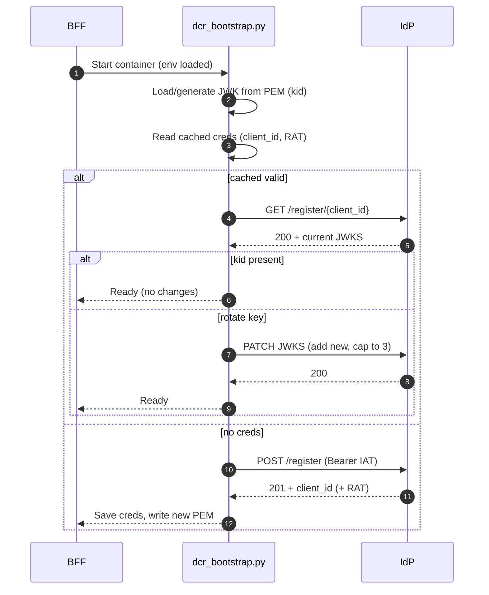

Purpose
- Ensure the BFF registers/updates its OIDC client in the IdP and rotates signing keys safely without clobbering other client settings.

Scope
- Applies to the BFF `private_key_jwt` client managed by `ms_bff/src/bootstrap/dcr_bootstrap.py`.
- Uses inline `jwks` on the client record (not `jwks_uri`). No IdP restart is required.

See also IdP guide: `services/idp/how-to/mint-iat-and-dcr` for minting the Initial Access Token (IAT) and performing DCR.

- IdP DCR guide: `IdP/docs/DCR_Guide.md`
- Bootstrap helper: `ms_bff_spike/ms_bff/src/bootstrap/dcr_bootstrap.py`
- Compose wiring: `CRUDService/docker-compose-authzen4.yml` (bff service env)

Key environment variables
- IDP_BASE_URL: internal IdP base (e.g., `http://idp-app:8002`)
- DCR_ENABLED: "true" to run bootstrap on start
- SKIP_DCR_BOOTSTRAP: set "true" to skip
- DCR_IAT: Initial Access Token for first-time registration
- DCR_CLIENT_ID: Desired client id (e.g., `bff-server`)
- DCR_CLIENT_PROFILE: Template/profile (e.g., `code-flow-pkjwt`)
- DCR_SIGNING_KEY: Path to PEM private key (e.g., `/app/keys/bff-sig-001.pem`)
- BFF_KID: Kid to advertise in JWKS (e.g., `bff-sig-001`)
- DCR_REDIRECT_URIS: Optional list; if set, see redirect update modes below

Rotation controls (non-destructive)
- DCR_ROTATION_SAFE: "true" → enables safe rotation behavior; forces redirect merge
- DCR_REDIRECT_UPDATE_MODE: "auto" | "replace" | "merge" | "none"
  - auto (default): only update if provided and differs
  - replace: use provided values exactly
  - merge: union of existing + provided (order preserved, no dups)
  - none: never modify redirect_uris
- BFF_JWK_ROTATE_AFTER_DAYS: Days after which a new key is generated in-memory (default 30)
- BFF_JWK_RETIRE_AFTER_DAYS: Retire very old keys by kid timestamp (default 60; ≤0 disables)
- BFF_JWK_MAX_KEYS: Cap the number of keys kept (default 3; ≤0 disables cap)

Safe rotation — TL;DR
1) Set env to avoid redirect churn and keep overlap during rotation:
```bash
DCR_ROTATION_SAFE=true
# optional explicit controls
# DCR_REDIRECT_UPDATE_MODE=merge
# BFF_JWK_MAX_KEYS=3
# BFF_JWK_RETIRE_AFTER_DAYS=60
# BFF_JWK_ROTATE_AFTER_DAYS=30
```
2) Deploy/restart the BFF. The bootstrapper will:
   - Generate a new RSA key if the PEM is missing or older than rotate_after_days
   - PATCH the client `jwks` (and `redirect_uris` per mode)
   - Persist the new PEM only after PATCH succeeds

For an immediate rotation
- Temporarily set `BFF_JWK_ROTATE_AFTER_DAYS=0` for one restart, or delete the PEM file so a new one is generated and published.

Redirect URIs
- If you provide `DCR_REDIRECT_URIS`, the update behavior follows `DCR_REDIRECT_UPDATE_MODE`.
- With `DCR_ROTATION_SAFE=true`, merge semantics are used to avoid removing existing values.

RAT/IAT handling
- On first registration, `DCR_IAT` must be present and valid.
- If PATCH returns 401/403, the bootstrapper attempts RAT auto-renew when `BOOTSTRAP_ADMIN_TOKEN` is set; otherwise it raises a clear admin action message.
- To issue a new RAT in the IdP: see the admin DCR endpoints (e.g., `/api/admin/dcr/initial-access-tokens` and `/api/admin/dcr/clients/{client_id}/tokens`).

Operational notes
- No IdP config or compose changes are needed for normal rotations; the IdP uses the stored inline JWKS immediately.
- Update only if any component has statically pinned the public key/kid outside IdP.

Observability
- Logs: look for "JWKS rotated successfully" and optional redirect updates.
- Metrics (when `PROM_PUSHGATEWAY_URL` is set): `bff_dcr_status{status="success|rat_cached|rat_invalid|jwks_rotation_failed"}`.

Errors and fixes
- No cached creds and missing `DCR_IAT` → provision a new IAT in IdP admin, set `DCR_IAT`, restart.
- `invalid_token` or expired IAT/RAT → issue a fresh token via IdP admin; restart.
- PATCH 4xx without auto-renew → confirm permissions/scopes, refresh IAT/RAT, or set `DCR_FORCE_REPLACE=true` and retry registration.

- Registers/updates the BFF’s OAuth client at the IdP at startup
- Publishes/rotates the BFF’s JWKS (public keys for `private_key_jwt`)
- Caches `client_id` and the `registration_access_token` (RAT) on disk
- Pushes a status metric to Prometheus Pushgateway when configured

What DCR does (in our stack)

- Registers/updates the BFF’s OAuth client at the IdP at startup
- Publishes/rotates the BFF’s JWKS (public keys for `private_key_jwt`)
- Caches `client_id` and the `registration_access_token` (RAT) on disk
- Pushes a status metric to Prometheus Pushgateway when configured

High‑level flow (bootstrap)



How to set it up

- One-time bootstrap
  - `DCR_ENABLED: "true"`
  - `SKIP_DCR_BOOTSTRAP: "false"`
  - `DCR_FORCE_REPLACE: "false"`
  - `DCR_IAT: "<fresh IAT>"`
  - Ensure the DCR payload includes `token_endpoint_auth_method: private_key_jwt` and `jwks_uri: https://<your-bff-host>/.well-known/jwks.json`
- After success (and from then on)
  - Remove `DCR_IAT` from environment/config
  - Keep: `DCR_ENABLED: "true"`, `SKIP_DCR_BOOTSTRAP: "false"`, `DCR_FORCE_REPLACE: "false"`
  - Result: on every start the bootstrap is a no-op (client exists). It may PATCH client metadata when needed, but does not consume an IAT.

Prerequisites (IdP side)

- DCR enabled per `DCR_Guide.md` and routes exposed (`/api/oidc/register` CRUD)
- Issue an Initial‑Access‑Token (IAT) for the BFF client

Enable DCR for the BFF

1) Configure environment for the bff container (compose excerpt):

```yaml
environment:
  DCR_ENABLED: "true"                # enable the feature in your entrypoint
  SKIP_DCR_BOOTSTRAP: "false"       # run the bootstrap helper on start
  IDP_BASE_URL: http://idp-app:8002  # internal IdP base (container‑to‑container)
  DCR_IAT: <initial_access_token>    # IAT issued by IdP
  DCR_CLIENT_ID: bff-server          # desired client_id (optional)
  DCR_CLIENT_PROFILE: code-flow-pkjwt # IdP client profile/template
  DCR_REDIRECT_URIS: https://<host>/auth/callback  # space or comma separated
  DCR_SIGNING_KEY: /app/keys/bff-sig-001.pem   # PEM used for private_key_jwt
  BFF_KID: bff-sig-001              # kid advertised in JWKS
  DCR_ROTATION_SAFE: "true"        # non-destructive rotation mode
  DCR_REDIRECT_UPDATE_MODE: auto    # or merge|replace|none
  BFF_CLIENT_CRED_PATH: /app/keys/bff_client.json  # persisted creds JSON
  BFF_JWK_ROTATE_AFTER_DAYS: "30"   # in‑place rotation threshold
  BFF_JWK_RETIRE_AFTER_DAYS: "60"   # drop very old keys
  PROM_PUSHGATEWAY_URL: http://prometheus-pushgateway:9091  # optional metrics
```

2) Run the bootstrap on start. Options:

- Call the module from your entrypoint:

```bash
python -m ms_bff.src.bootstrap.dcr_bootstrap
```

- Or execute the script directly:

```bash
python /app/ms_bff_spike/ms_bff/src/bootstrap/dcr_bootstrap.py
```

3) Verify

- IdP: `GET /api/oidc/register/{client_id}` shows the BFF with the advertised `kid`
- BFF: creds JSON exists at `BFF_CLIENT_CRED_PATH` with `client_id` (+ RAT when applicable)
- Metrics: optionally, `bff_dcr_status{status="success"}=1` is pushed to Pushgateway
- JWKS: BFF serves `/.well-known/jwks.json` and the client’s `jwks_uri` in IdP points to that URL

Operational notes (from code)

- If cached RAT is invalid/expired, the helper can use `BOOTSTRAP_ADMIN_TOKEN` to renew it via the IdP admin endpoint and retry the PATCH.
- JWKS rotation is additive and capped to 3 keys; very old keys are dropped based on `BFF_JWK_RETIRE_AFTER_DAYS`.
- The helper is idempotent and can be run on every start; it only writes the PEM after a successful JWKS update/registration.

Auto-renew vs auto-rotate

- Access tokens: already auto-refreshed by the BFF’s background token refresh. Nothing to change.
- Registration/secret:
  - Don’t use `client_secret` rotation for security; prefer `private_key_jwt` + `jwks_uri`.
  - To “auto-rotate,” rotate the BFF’s signing key and update the JWKS served at `/.well-known/jwks.json`.
  - Best practice: publish both old and new keys in JWKS for a grace period, then drop the old key. The IdP will re-fetch via `jwks_uri` automatically.
  - This achieves continuous key rotation without using DCR again.

Troubleshooting

- Missing IAT → bootstrap fails fast with a clear admin action message
- 401/403 from IdP → reissue RAT or set `DCR_FORCE_REPLACE=true` to re‑register
- Logs include truncated error bodies and friendly messages from the helper

If you must rotate a shared `client_secret` (not recommended)

- The public DCR PATCH endpoint does not support updating `client_secret`.
- Use an admin path or out-of-band update in the IdP instead.
- Prefer `private_key_jwt` with `jwks_uri` to avoid shared secret distribution.

See also

- IdP DCR Guide: how to turn on DCR and issue IATs — `IdP/docs/DCR_Guide.md`


