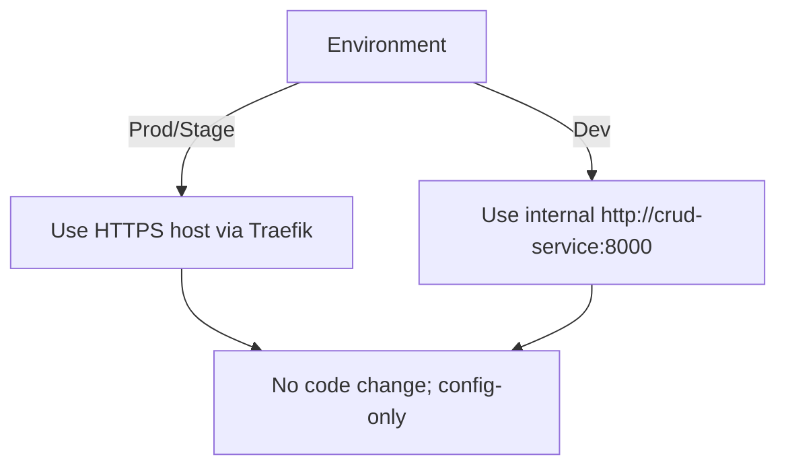

## Overview

Phase 1 switches the BFF→CRUD upstream hop to HTTPS (via Traefik) with no code changes. Phase 2 (optional) adds mTLS when required by security policy.

```mermaid
flowchart LR
  BFF[BFF] -- HTTPS --> TR[Traefik (CRUD router)] -- HTTP(S) --> CRUD[CRUD Service]
  note right of BFF: httpx verifies TLS by default
```



## Audience

DevOps and platform engineers.

## Goal

Make BFF call CRUD over TLS in prod/stage with zero code changes; keep dev simple.

## Scope

- In scope: Switching the BFF upstream to HTTPS via Traefik (config-only).
- Not in scope: App-level TLS on CRUD (covered in CRUD mTLS design), full mutual TLS end-to-end (documented as optional below).

## Current state and constraints

- CRUD is fronted by Traefik at `https://crud.ocg.labs.empowernow.ai` and exposes `/health` over HTTPS.
- BFF reads CRUD base URL from `ServiceConfigs/BFF/config/service_settings.yaml`.
- The BFF `httpx` client verifies TLS by default; no code changes are needed for HTTPS.

## The non‑overengineered approach

- Prod/Stage: BFF calls `https://crud.ocg.labs.empowernow.ai/api` (via Traefik). Rely on standard TLS verification.
- Dev: Keep `http://crud-service:8000/api` (internal Docker network) to minimize local friction.

## Configuration changes (no code edits)

1) Prod/Stage config — file: `ServiceConfigs/BFF/config/service_settings.yaml`

```yaml
services:
  crud_service:
    base_url: "https://crud.ocg.labs.empowernow.ai/api"
    token_audience: "https://crud.ocg.labs.empowernow.ai"
    # retain existing timeouts/caching as-is
```

2) Dev config — keep the internal container URL

```yaml
services:
  crud_service:
    base_url: "http://crud-service:8000/api"
    token_audience: "https://crud.ocg.labs.empowernow.ai"
```

Notes:

- `token_audience` should already match the HTTPS host. Confirm it remains `https://crud.ocg.labs.empowernow.ai`.

## Deployment steps

- Commit the updated `service_settings.yaml` in `ServiceConfigs/BFF/config` (per your environment branching/overlays).
- Restart or redeploy the BFF service.
  - Docker Compose: restart only the BFF container.
  - Kubernetes: roll the BFF deployment to pick up the mounted config/ConfigMap.

Environment variable overrides:

- Ensure the BFF loads settings from the mounted config path (default compose mounts `ServiceConfigs/BFF/config` at `/app/config`).
- If your BFF supports `SETTINGS_FILE`, ensure it points to `/app/config/service_settings.yaml`.

## Validation

- Exercise a BFF endpoint that proxies to CRUD (e.g., list workflows/forms) and confirm 2xx responses.
- Check BFF logs for the upstream base to confirm HTTPS: `https://crud.ocg.labs.empowernow.ai`.
- Optional: `curl -I https://crud.ocg.labs.empowernow.ai/health` should return 200.

Common success indicators:

- BFF responses remain 2xx for routes backed by CRUD.
- No TLS verification errors in BFF logs.
- Dev/local flows unaffected.

## Rollback

Revert `crud_service.base_url` to the previous HTTP value and redeploy:

```yaml
services:
  crud_service:
    base_url: "http://crud-service:8000/api"
```

## Troubleshooting

- 404 after change:
  - Verify you called a BFF endpoint that proxies to CRUD.
  - Ensure Traefik has the CRUD router and the host resolves.
- TLS certificate errors:
  - Confirm the container can resolve and reach `crud.ocg.labs.empowernow.ai` and that system CA trusts the cert chain.
  - If using a private CA in front of Traefik, consider CA pinning (below).
- BFF still calls HTTP:
  - Confirm the running BFF picked up `/app/config/service_settings.yaml`.
  - Ensure no env override is forcing the old URL.

## Optional hardening (enable only when mandated)

CA pinning (private CA in front of Traefik):

```yaml
services:
  crud_service:
    base_url: "https://crud.ocg.labs.empowernow.ai/api"
    tls_verify: "/app/config/ca/prod-ca.crt"   # Mounted CA bundle
```

Mount the CA bundle into the BFF container at `/app/config/ca/prod-ca.crt`.

Mutual TLS (mTLS) — requires matching Traefik/CRUD validation policy:

```yaml
services:
  crud_service:
    base_url: "https://crud.ocg.labs.empowernow.ai/api"
    client_cert_path: "/app/config/certs/bff.crt"
    client_key_path: "/app/config/certs/bff.key"
```

Operational guardrails:

- Do not set `verify: false` in production.
- Keep dev simple and isolate extra security knobs behind environment-specific settings.

## Change control checklist

- Config updated in `ServiceConfigs/BFF/config/service_settings.yaml`
- Dev environment left unchanged (internal HTTP)
- BFF redeployed (config loaded)
- Validation completed (BFF calling CRUD over HTTPS; logs clean)
- Rollback plan documented

## See also

- CRUD Service — mTLS (Design & Guide): ../../crud-service/reference/mtls_design.md
- BFF Security Model: ../explanation/security-model.md

