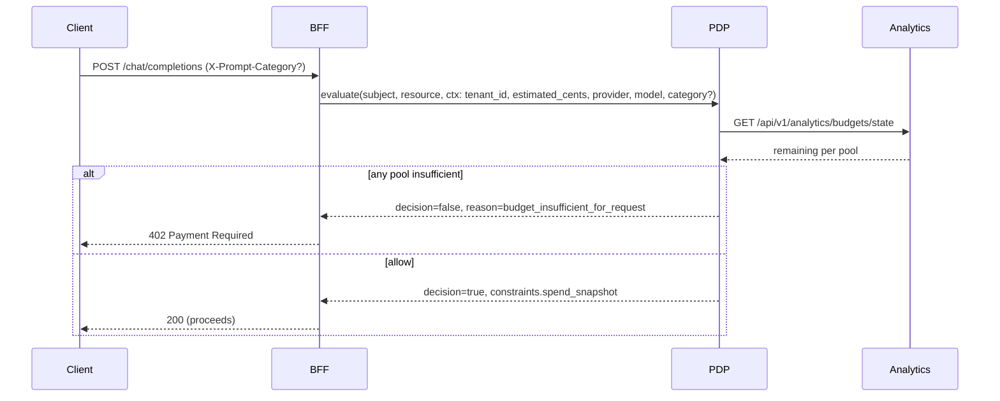

## Budgets

Enable BudgetState in the PDP and return `spend_budget` constraints. BFF includes `estimated_cents` in the PDP context.

```yaml
constraints:
  spend_budget: { scope: "user", period: "monthly", limit_usd: 25.0 }
```

### Budget enforcement modes (BFF)

- `BFF_BUDGET_MODE=redis_authoritative` (default)
  - Order: PDP evaluate first (context includes `estimated_cents`), then Redis HOLD.
  - If HOLD fails (missing/insufficient `budget:{subject}`) → `402 Payment Required`, even if PDP allowed.
  - Keys: `budget:{subject}`, `hold:{call_id}`, `seen:{call_id}`, `budget:refunds` (idempotent via `call_id`).

- `BFF_BUDGET_MODE=pdp_authoritative`
  - If a Redis override exists (`budget:{subject}`) → enforce HOLD (idempotent).
  - If no override → trust PDP allow; do not return 402 on Redis path. Usage is still recorded best‑effort.

Tip: Use `pdp_authoritative` for pilots/sandboxes; prefer `redis_authoritative` for hard monetary enforcement.

## Receipts

The BFF emits tamper‑evident receipts (via Receipt Vault) on completion of non‑stream and stream flows. Receipts include the policy snapshot and usage/estimate but never contain prompt content.

See also: `services/bff/reference/BFF_PDP_Enforcement.md`, `services/aria-shield/receipt-chains.md`.

## Category/provider/model selectors

When available, the BFF can pass optional selectors to PDP for budget evaluation:

- `provider` (e.g., `openai`), `model` (e.g., `gpt-4o-mini`)
- `category` (e.g., `dev`, `entertainment`) — from header (`X-Prompt-Category`), route mapping, or registry tag

PDP evaluates overall/provider/model/category pools and applies most‑restrictive semantics. If any pool is exhausted or insufficient for the estimated request, PDP may deny; the BFF maps budget denials to `402 Payment Required`.



Category pending: when classification is lazy and `category_pending=true` in policy snapshot, PDP skips category‑scoped pools (or uses an `uncategorized` pool when configured). Overall/provider/model limits still apply.

See also: `services/pdp/reference/effective-budgets.md`.

## Category-aware holds

When `guard.actions` is configured in `classifier.yaml`, the BFF preflight returns `budget_hints` and the endpoint uses `hold_with_hints(subject_key, base_estimate_cents, hints, call_id)` to scale holds safely.

Hints support:
- `hold_multiplier` (>0)
- `max_cents` (>0)
- `min_remaining_usd` (>=0)

This reduces spend risk by capping expensive categories and skipping holds when the remaining balance is below a configured floor.

Optional: set `RECEIPT_VAULT_URL` to emit signed receipts with policy snapshot and usage/estimate.

### Links
- PDP Effective Budgets and selectors: `services/pdp/reference/effective-budgets.md`
- Analytics budgets API: `services/analytics/reference/runtime-apis.md`
- Classifier export allowlist (categories to PDP): see BFF classifier docs (internal)
- Prompt classifier admin: `services/bff/how-to/prompt-classifier-admin.md`


