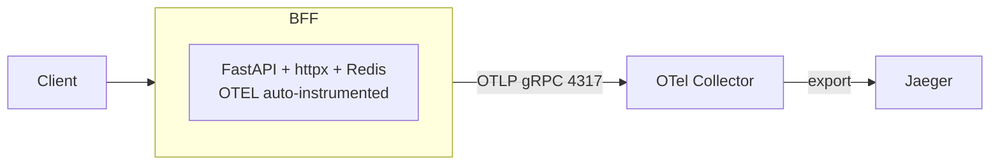

What and where

- Code: `ms_bff_spike/ms_bff/src/observability/telemetry.py` (primary) and `ms_bff_spike/ms_bff/src/observability.py` (compat path) configure OpenTelemetry exporters and auto‑instrumentation for FastAPI, httpx, and Redis.
- Collector: defined in `CRUDService/docker-compose-authzen4.yml` as `otel-collector` exposing OTLP gRPC `4317` and OTLP HTTP `4318`. Vector can forward traces to Jaeger.

How it’s configured

- Enablement: `TELEMETRY_ENABLED=true` (default) turns tracing/metrics on in the BFF when OTEL libs are present.
- Exporter endpoint (BFF picks the first that is set):
  - `OTLP_ENDPOINT` (preferred in `telemetry.py`, e.g., `http://otel-collector:4317`)
  - `OTEL_EXPORTER_OTLP_ENDPOINT` (alternate, supported by `observability.py`)
- Resource attributes: `service.name=bff-auth-service`, plus `service.version` from `BFF_VERSION` and `deployment.environment` from `ENVIRONMENT`.

Minimal setup (compose)

```yaml
# CRUDService/docker-compose-authzen4.yml (excerpt)
otel-collector:
  image: otel/opentelemetry-collector-contrib:0.96.0
  ports: ["4317:4317", "4318:4318"]
  volumes:
    - ./otel-collector-config.yaml:/etc/otelcol/config.yaml:ro

# BFF service (env excerpt)
environment:
  - TELEMETRY_ENABLED=true
  - OTLP_ENDPOINT=http://otel-collector:4317
  - BFF_VERSION=1.0.0
  - ENVIRONMENT=development
```

What gets instrumented

- FastAPI requests (`/auth/*`, `/api/*`), httpx client calls (IdP, PDP, backends), and Redis calls create spans automatically.
- Manual spans and metrics are available via helpers: `start_span`, `record_forwardauth_metrics`, `record_session_metrics`.

Flow



How to verify

- Start the stack with the collector; set `OTLP_ENDPOINT` in the BFF env.
- Hit `/auth/login` then any `/api/**` route; you should see spans in Jaeger.
- Check logs for connection messages from telemetry setup.

References

- Reference → Observability (Metrics, Tracing, Health)
- Explanation → Security Model (correlation ID propagation)
- Code: `ms_bff_spike/ms_bff/src/observability/telemetry.py`, `ms_bff_spike/ms_bff/src/observability.py`


