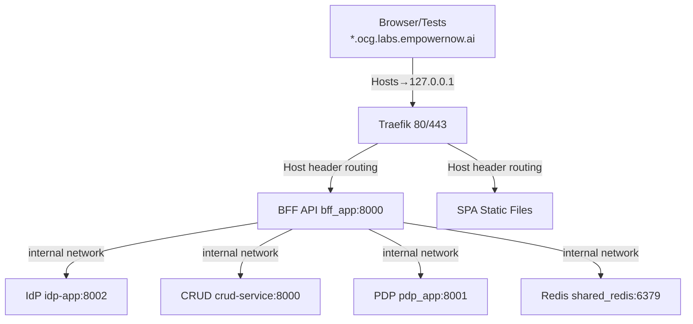

Source of truth: `ms_bff_spike/ms_bff/TEST_EXECUTION_GUIDE.md` (summarized here for quick use).

What this proves

- Traefik ForwardAuth → BFF chain works
- Middleware/routing is correct
- Real user workflows across IdP UI, Visual Designer, and PDP UI work end‑to‑end
- No auth bypass; sessions work across SPAs

Prereqs

- Docker + Compose installed and running
- Hosts file entries for local domains
- Test credentials configured

Hosts entries (required)

```text
127.0.0.1 authn.ocg.labs.empowernow.ai
127.0.0.1 automate.ocg.labs.empowernow.ai
127.0.0.1 authz.ocg.labs.empowernow.ai
127.0.0.1 api.ocg.labs.empowernow.ai
127.0.0.1 idp.ocg.labs.empowernow.ai
127.0.0.1 traefik.ocg.labs.empowernow.ai
```

Local routing (visual)



Start services

```bash
cd CRUDService
docker-compose -f docker-compose-authzen4.yml up -d
```

Quick health checks

```bash
docker-compose -f docker-compose-authzen4.yml ps
curl -f http://localhost:8000/health || echo "BFF health check failed"
curl -f http://localhost:8080/ping || echo "Traefik ping failed"
```

Set credentials (examples)

```bash
export TEST_USERNAME="test"
export TEST_PASSWORD="p@$$w0rd"
```

Run critical tests

```bash
# From ms_bff_spike/ms_bff
python -m pytest tests/integration/test_traefik_forwardauth.py::test_integration_traefik_forwardauth_full_flow -v -s
python -m pytest tests/integration/test_traefik_middleware_config.py::test_integration_traefik_middleware_chain -v -s
python -m pytest tests/e2e/test_real_user_workflows.py::test_real_user_workflow_integration -v -s
```

Expected outcomes

- ForwardAuth integration: PASS (<500ms typical)
- Middleware chain: PASS
- Real user workflows (all 3 SPAs): PASS

Common quick fixes

- 401 loop: ensure hosts entries + valid credentials + BFF up
- DNS errors: hosts file not configured
- Connection refused: stack not running; check compose ps/logs


