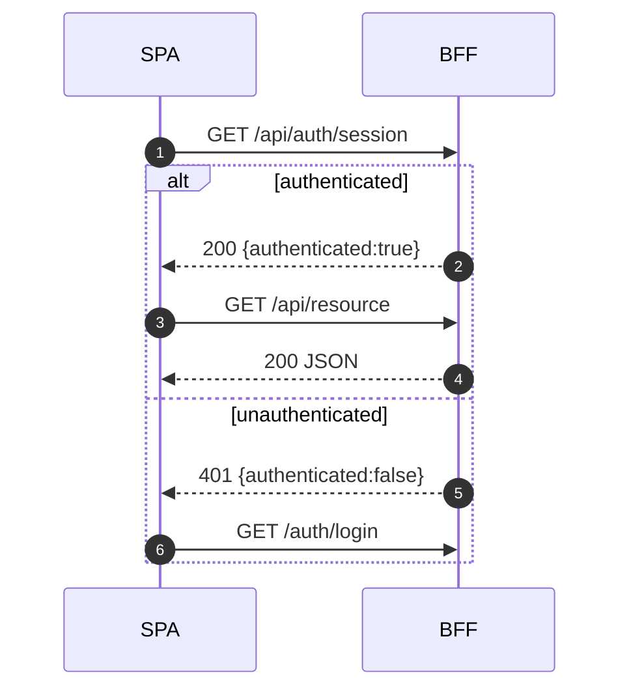

Integration pattern verified in code.

- Use same-origin `/api/**` calls; set constant `API_BASE='/api'` in frontend
- Unauthenticated flows return 401 JSON; SPA should redirect to `/auth/login`
- Session check endpoint: `GET /api/auth/session` → `{ authenticated: boolean, ... }`
- CSRF: `_csrf_token` cookie set on safe GET; send `X-CSRF-Token` for state-changing calls
- CORS allowlist read from `CORS__ALLOW_ORIGINS` / `CORS_ALLOW_ORIGINS`

