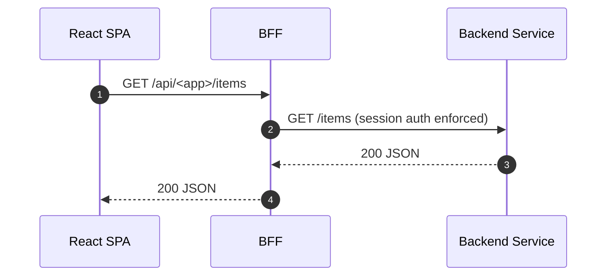

Audience: React SPA developers building a new app or migrating to the BFF.

What you’ll do

- Configure your SPA to talk only to the BFF (no direct service URLs)
- Wire `@empowernow/bff-auth-react` for session-based auth
- Use the shared API client that relies on cookies (no Authorization headers)
- Call canonical `/api/...` routes that the BFF maps to backend services
- Align the Neon Flux UI using `@empowernow/ui`

Environment variables

- `VITE_BFF_BASE_URL`: e.g., `https://bff.ocg.labs.empowernow.ai` or `/api` for same-origin. Both `idp_ui` and `pdp_ui` set this and default to `/api`.
- OIDC values stay in the platform; BFF handles OAuth (no browser SDK needed).

App wiring (verified)

```ts title="src/main.tsx (pattern used in idp_ui and pdp_ui)"
import { AuthProvider, setBaseUrl } from '@empowernow/bff-auth-react'

setBaseUrl(import.meta.env.VITE_BFF_BASE_URL || '/api')

createRoot(document.getElementById('root')!).render(
  <AuthProvider baseUrl={import.meta.env.VITE_BFF_BASE_URL || '/api'} pollIntervalMs={300000}>
    <App />
  </AuthProvider>
)
```

Route guarding (verified)

```tsx title="src/components/auth/AuthGuard.tsx"
import { useAuth } from '@empowernow/bff-auth-react'
// Redirect unauthenticated users to /login, preserve returnUrl
```

Calling APIs (verified)

- Use your app’s `fetchWithAuth` wrapper which delegates to `apiClient` from `@empowernow/bff-auth-react`.
- It strips a leading `/api` and relies on cookies; no Authorization header required.

```ts title="lib/api/base.ts"
import { apiClient } from '@empowernow/bff-auth-react'

// GET
apiClient.get('/crud/forms')

// POST
apiClient.post('/crud/workflows', payload)
```

UI theming (verified)

- Import `@empowernow/ui/dist/index.css` and tokens; use components like `GlassCard`, `HeaderNav`.

```ts
import '@empowernow/ui/dist/index.css'
```

How the BFF routes your calls (verified)

- BFF maps canonical SPA paths to backend services per `routes.yaml`:
  - `/api/crud/forms/*` → `crud_service` (auth: `session`)
  - `/api/idp/admin/*` → `idp_service` (auth: `session`)
  - `/api/v1/analytics/*` → `analytics_service` (auth: `session`)

Snippet from configuration

```yaml
- id: "crud-forms"
  path: "/api/crud/forms/*"
  target_service: "crud_service"
  upstream_path: "/forms/{path}"
  methods: ["GET", "POST", "PUT", "DELETE", "OPTIONS"]
  auth: "session"
```

Add your app’s API surface

1) Add a backend service under `services` with `base_url`.
2) Add route entries under `routes` with your canonical `/api/<app>/*` paths, `auth: session`, and an `upstream_path` to your backend.

Request flow



Do and don’t

- Do: set `VITE_BFF_BASE_URL` and let the BFF handle auth and cookies
- Do: call `/api/...` only; avoid hard-coding service URLs
- Don’t: manually attach `Authorization` headers for same-origin BFF calls

Local development

- When the SPA is hosted separately, set `VITE_BFF_BASE_URL` to the BFF origin (e.g., `http://localhost:3000/api`) and ensure CORS allows your UI origin.

Troubleshooting

- 401/redirect loops: confirm `AuthProvider` is wrapping `<App />` and baseUrl is correct
- 403: PDP denied; verify your account roles/permissions and the route’s `auth: session`
- Network errors: ensure your route exists in `routes.yaml` and upstream service is reachable


